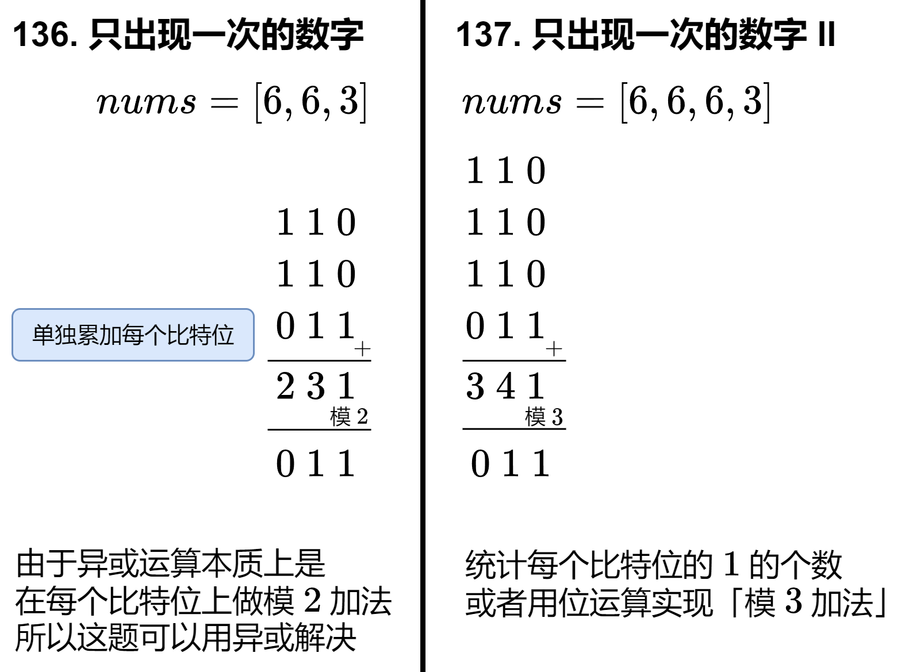

# 基础题

ICS位运算都介绍过了，对于位操作，下面是我总结的一下技巧：

+ 涉及到**翻转**要想到——和1按位异或`^`
+ 涉及到**清除**要想到——和0按位与`&`
+ 涉及到**保留**要想到——和1按位或`|`

上面的技巧一般要结合掩码使用，例如：

+ 将x的第n个bit的值设为v（也就是先将x的第n位清除，然后保留v）

```c++
void set_bit(unsigned * x, unsigned n, unsigned v) {
    unsigned mask = ~(1 << n); // 这个mask与*x做与运算就可以把第n位变成0，其余位不变
    *x = (*x & mask) | (v << n); // 0与任何数做或运算还是这个数
}
```

+ 获取x的第n个bit

```c++
unsigned get_bit(unsigned x, unsigned n) {
    return x >> n & 1;
}
```

# 异或

## 焚诀

异或性质：
$$
A\oplus A = 0 \\ A \oplus 0 = A \\ A \oplus 1 = \sim A(\text{A为1bit,多bit的话就用0xF...}) \\ A \oplus A \oplus B = B
$$
什么时候我们要联想到使用异或呢？

+ **线性时间和常量空间**

+ **找出唯一的元素**

+ **判断一个数字的二进制中是否有奇数个 1**


## 136.只出现一次的数字[简单]

### 链接

+ [136. 只出现一次的数字 - 力扣（LeetCode）](https://leetcode.cn/problems/single-number)

### 题目

给你一个 **非空** 整数数组 `nums` ，除了某个元素只出现一次以外，其余每个元素均出现两次。找出那个只出现了一次的元素。

你必须设计并实现线性时间复杂度的算法来解决此问题，且该算法只使用常量额外空间。

### 思路

如果没有时间复杂度的要求，其实还有哈希表和排序两种思路，也很简单，不做赘述。

**线性时间和常量空间、找出唯一的元素**，这道题是异或操作非常经典也非常简单的应用。把数组的所有元素做异或，出现次数为偶数的元素都会变成0，而出现次数为奇数的元素最后会留下来。

### 解法

```python
class Solution:
    def singleNumber(self, nums: List[int]) -> int:
        return reduce(xor, nums)
```

## 137.只出现一次的数字 II[中等]

### 链接

+ [137. 只出现一次的数字 II - 力扣（LeetCode）](https://leetcode.cn/problems/single-number-ii/description/)
+ [教你一步步推导出位运算公式！]([137. 只出现一次的数字 II - 力扣（LeetCode）](https://leetcode.cn/problems/single-number-ii/solutions/2482832/dai-ni-yi-bu-bu-tui-dao-chu-wei-yun-suan-wnwy/))

### 题目

给你一个整数数组 `nums` ，除某个元素仅出现 **一次** 外，其余每个元素都恰出现 **三次 。**请你找出并返回那个只出现了一次的元素。

你必须设计并实现线性时间复杂度的算法且使用常数级空间来解决此问题。

### 思路

**线性时间和常量空间、找出唯一的元素**，要想到使用异或，但是我们发现这道题好像不能像上一题那样直接应用异或的性质。所以我们要深入分析一下二进制表示：

设只出现一次的那个数为 x。

+ 如果 x 的某个比特是 0，由于其余数字都出现了 3 次，所以 nums 的所有元素在这个比特位上的 1 的个数是 3 的倍数。
+ 如果 x 的某个比特是 1，由于其余数字都出现了 3 次，所以 nums 的所有元素在这个比特位上的 1 的个数除 3 余 1。

这启发我们**统计每个比特位上有多少个** 1。下图比较了 [136. 只出现一次的数字](https://leetcode.cn/problems/single-number/) 与本题的异同：



位运算本质是模2加法，所以这道题不能直接把所有元素异或在一起，但如果是模3加法的话其实是可以的，所以要手动实现一个模3加法。

### 解法

```c++
class Solution {
public:
    int singleNumber(vector<int>& nums) {
        int ans = 0;
        for (int i = 0; i < 32; i++) { // 遍历每个位
            int cnt1 = 0;
            for (int x : nums) {
                cnt1 += x >> i & 1;
            }
            ans |= cnt1 % 3 << i;  // 模3加法
        }
        return ans;
    }
};
```


# 与

## 201.数字范围按位与[中等]

### 链接

+ [201. 数字范围按位与 - 力扣（LeetCode）](https://leetcode.cn/problems/bitwise-and-of-numbers-range)

### 题目

给你两个整数 `left` 和 `right` ，表示区间 `[left, right]` ，返回此区间内所有数字 **按位与** 的结果（包含 `left` 、`right` 端点）。

### 思路

直接把`[left, right]`之间所有的数按位与会超时。


注意到，当把`[left, right]`之间所有数字按位与时，实际求的就是这些数字的公共前缀。

### 解法1：位移

```python
class Solution:
    def rangeBitwiseAnd(self, left: int, right: int) -> int:
        shift = 0
        while left < right:
            left = left >> 1
            right = right >> 1
            shift += 1
        return left << shift
```

### 解法2：Brian Kernighan 算法

Brian Kernighan 算法的关键在于把`number`和`number - 1`按位与运算之后，`number`的二进制表示中**最右边的1(lowbit)会被抹去变成0**，利用这个，也可以快速计算公共前缀。

```python
class Solution:
    def rangeBitwiseAnd(self, left: int, right: int) -> int:
        while left < right:
            right &= right - 1
        return right
```


