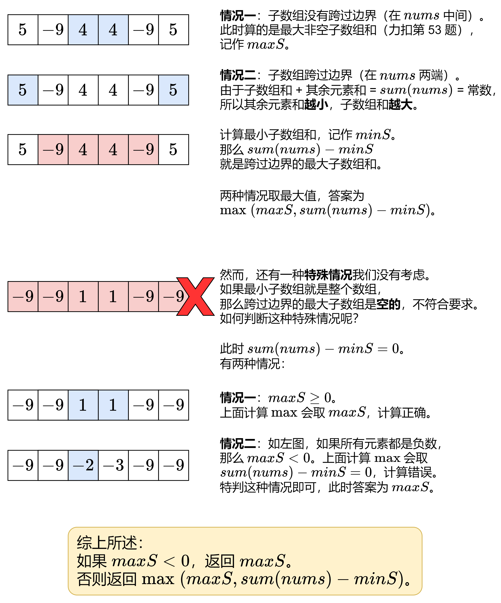
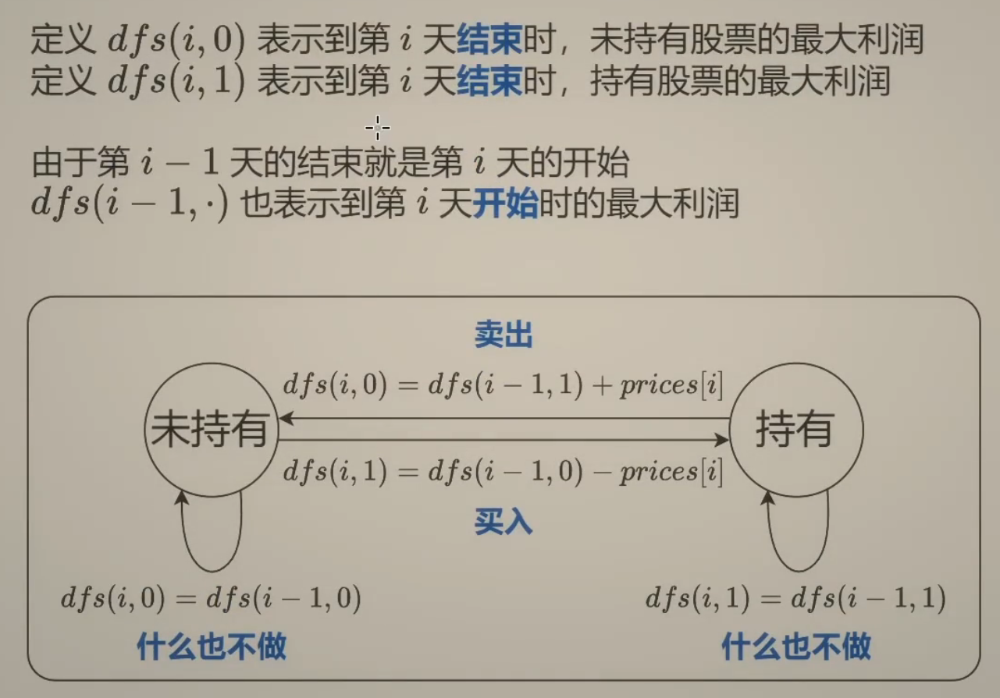
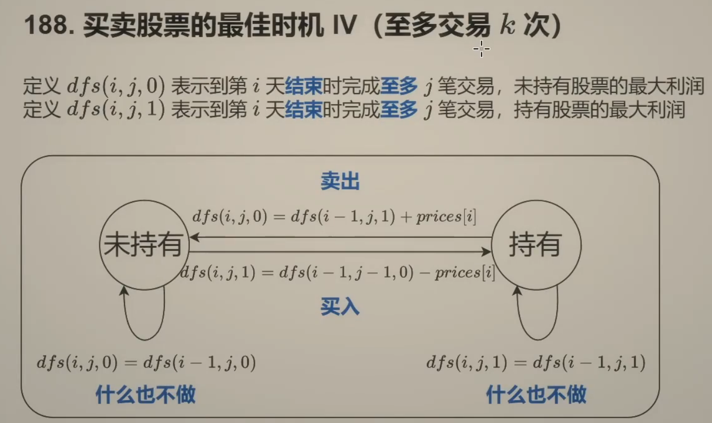
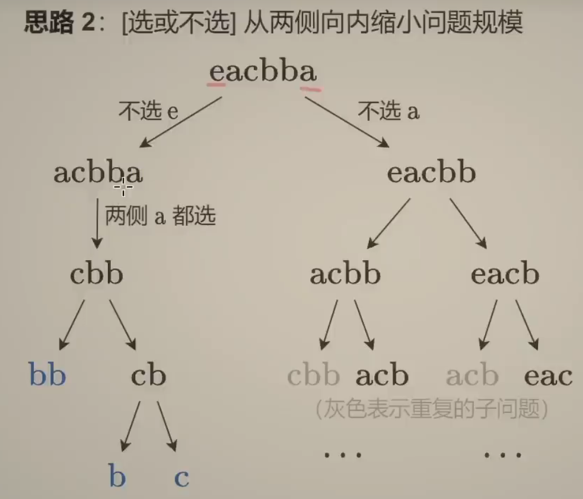
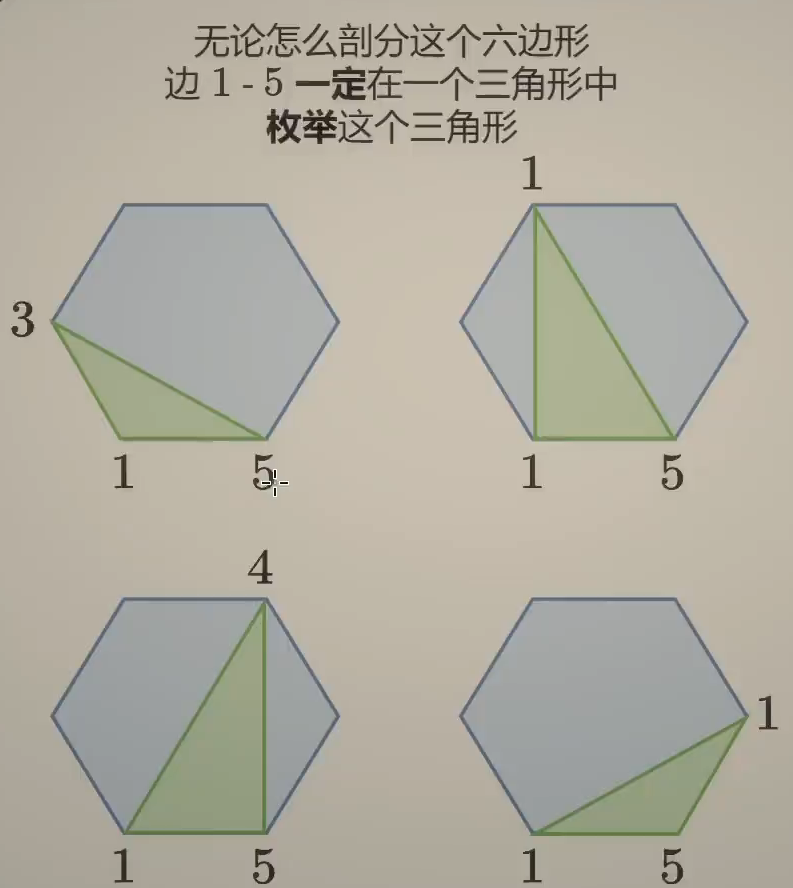
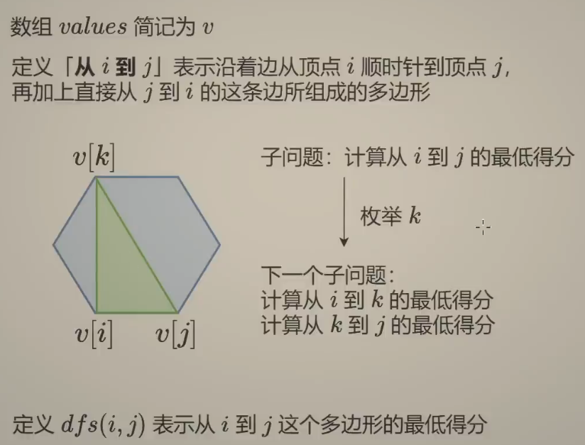

# 焚诀

什么时候我们要联想到使用动态规划呢？

+ 当问题可以通过**拆分成子问题**、并且**存在重叠计算**、并且**子问题之间存在最优选择**时，就应该想到动态规划。

当然这个表述过于抽象了，我们看到题目也不一定能想到那么深，下面是根据经验总结的一些题目特征：

+ **自顶向下递归有重复子问题**
  + 例如求斐波那契数列时我们发现某些`f(i)`被重复调用，这时候可以用记忆化搜索做第一步优化，再进一步优化就是动态规划了
+ **能够抽象成选或不选的问题**
  + 如果原问题可以抽象成**选或不选**的问题，那么大概率都是可以用回溯来做的，如果还满足具有**重叠子问题**和**最优子结构**的特征，那么就可以用动态规划来做。一般而言，如果要**求出所有解的可能，需要使用回溯进行穷举**；而如果是**计数问题**或**子问题的最优解，显然使用动态规划性能更高效**。
+ **求最值或计数**
+ **背包问题**（背包DP）
+ **子序列、子数组、子字符串相关的最值问题**（线性DP）
+ **股票交易最值问题**（状态机DP）
+ **区间最值问题**（区间DP）
+ **树上最值问题**（树形DP）

---

**对于动态规划问题，我将拆解为如下五步曲，这五步都搞清楚了，才能说把动态规划真的掌握了！**

1. 确定dp数组以及下标的含义
2. 确定递推公式
3. dp数组如何初始化
4. 确定遍历顺序
5. 举例推导dp数组（验证过程）

一些同学可能想为什么要先确定递推公式，然后在考虑初始化呢？

**因为递推公式决定了dp数组要如何初始化！**

> 以上步骤摘自代码随想录


# 从记忆化搜索到递推

## 509.斐波那契数[简单]

### 链接

+ [509. 斐波那契数 - 力扣（LeetCode）](https://leetcode.cn/problems/fibonacci-number/description/)

### 题目

**斐波那契数** （通常用 `F(n)` 表示）形成的序列称为 **斐波那契数列** 。该数列由 `0` 和 `1` 开始，后面的每一项数字都是前面两项数字的和。也就是：

```
F(0) = 0，F(1) = 1
F(n) = F(n - 1) + F(n - 2)，其中 n > 1
```

给定 `n` ，请计算 `F(n)` 。

### 思路

典中典的题目了，这里只给出从递归到递推(动态规划)的过程，不考虑使用矩阵快速幂等高阶技巧进一步优化（见leetcode官解）。

### 解法1：记忆化搜索

很经典的问题了，就不放搜索树了。总之，在计算`fib(n)`时某些`fib(1)`、`fib(2)`...呀被重复计算了很多次，而且搜索树是成指数规模增长的，因此直接递归的时间复杂度就为$O(2^N)$。一个很显然的思路就是去缓存这些计算结果来剪枝，从而可以把时间复杂度降到$O(N)$了。而代码层面实现的话，其他语言可能需要一个数组/哈希表来存储所有的中间结果，而高贵的Python大人只需要一个`@cache`！！！

```python
class Solution:
    @cache
    def fib(self, n: int) -> int:
        return n if n < 2 else self.fib(n - 1) + self.fib(n - 2)
```

+ 时间复杂度：$O(N)$
+ 空间复杂度：$O(N)$

### 解法2：动态规划

如果手写了记忆化搜索，不难发现，我们在求一个较大的`fib(n)`时需要先**自顶向下**去把`fib(1)`、`fib(2)`算了填到数组中后面才能求出`fib(n)`，如果换一个视角，考虑**自底向上**去计算，根据递推公式依次算出`fib(2)`、`fib(3)`......，这就是递推了。

```python
class Solution:
    def fib(self, n: int) -> int:
        dp = [-1] * (n + 1)
        dp[0] = 0
        dp[1] = 1
        for i in range(2, n + 1):
            dp[i] = dp[i - 1] + dp[i - 2]
        return dp[n]
```

+ 时间复杂度：$O(N)$
+ 空间复杂度：$O(N)$

### 优化

解法2使用了动态规划，但是时间复杂度和空间复杂度和解法1其实是一样的。注意到`fib(n)`其实只依赖于它前面两个元素，那么我们只需要保存这两个值就可以了。每次计算时产生一个临时的`[dp0, dp1, sum]`，然后将`dp0`、`dp1`往右都挪一位，那么`dp0=dp1`、`dp1=sum`，恢复成`[dp0, dp1]`。如果不清楚最终结果到底返回`dp0`还是`dp1`，直接运行都试一下就可以了。或者从上面的分析也能知道`sum=fib(n)`，在计算完后`dp1=fib(n)`，自然最终结果就是返回`dp1`了。

```python
class Solution:
    def fib(self, n: int) -> int:
        dp0 = 0
        dp1 = 1
        if n <= 1: return n
        for i in range(2, n + 1):
            sum = dp0 + dp1
            dp0 = dp1
            dp1 = sum
        return dp1
```

+ 时间复杂度：$O(N)$
+ 空间复杂度：$O(1)$

## 198.打家劫舍[中等]*

### 链接

+ [198. 打家劫舍 - 力扣（LeetCode）](https://leetcode.cn/problems/house-robber/)
+ [动态规划入门：从记忆化搜索到递推【基础算法精讲 17】](https://www.bilibili.com/video/BV1Xj411K7oF)

### 题目

你是一个专业的小偷，计划偷窃沿街的房屋。每间房内都藏有一定的现金，影响你偷窃的唯一制约因素就是相邻的房屋装有相互连通的防盗系统，**如果两间相邻的房屋在同一晚上被小偷闯入，系统会自动报警**。

给定一个代表每个房屋存放金额的非负整数数组，计算你 **不触动警报装置的情况下** ，一夜之内能够偷窃到的最高金额。

### 思路

这个问题可以抽象成每个房屋**选或不选**的问题，根据回溯部分总结的经验，这类问题是可以用回溯做的。

回溯三问：

+ 当前操作？枚举第`i`个房子选或不选
+ 子问题？从前`i`个房子中得到的最大金额和；
+ 下一个子问题为？不选：从前`i-1`个房子得到的最大金额和；选：从前`i-2`个房子得到的最大金额和。

递推式为`dfs(i) = max(dfs(i - 1), dfs(i - 2) + nums[i])`

### 解法1：记忆化搜索

房子的下标我们这里是从0开始的，所以最后一个房子的下标为`n-1`，那么答案就是`dfs(n-1)`代表最后一个房子选或不选的问题。至于边界条件，递归会对所有负数的`i`返回0，实际有值的`dfs(0)=max(0, nums[0])`。转换成dp数组的话，索引就是从0开始的，因此结果返回`dfs(n-1)`。

```python
class Solution:
    def rob(self, nums: List[int]) -> int:
        n = len(nums)
        @cache
        def dfs(i):
            if i < 0:
                return 0
            return max(dfs(i - 1), dfs(i - 2) + nums[i])
        return dfs(n - 1)
```

### 解法2：动态规划

将递归翻译成递推：

+ dfs $\rightarrow$ dp数组
+ 递归 $\rightarrow$ 循环
+ 递归边界 $\rightarrow$ 数组初始化

```python
class Solution:
    def rob(self, nums: List[int]) -> int:
        n = len(nums)
        if n == 1:
            return nums[0]
        dp = [0] * n
        dp[0] = nums[0]
        dp[1] = max(nums[0], nums[1])
        for i in range(2, n):
            dp[i] = max(dp[i-1], dp[i-2]+nums[i])
        return dp[n-1]
```

+ 时间复杂度：$O(N)$
+ 空间复杂度：$O(N)$

### 优化

```python
class Solution:
    def rob(self, nums: List[int]) -> int:
        # [dp0, dp1, new_dp]
        dp0 = dp1 = 0
        n = len(nums)
        for i, x in enumerate(nums):
            new_dp = max(dp1, dp0 + x)
            dp0 = dp1
            dp1 = new_dp
        return dp1
```

+ 时间复杂度：$O(N)$
+ 空间复杂度：$O(1)$

## 213.打家劫舍 II[中等]

### 链接

+ [213. 打家劫舍 II - 力扣（LeetCode）](https://leetcode.cn/problems/house-robber-ii/description/)

### 题目

与 [198.打家劫舍](#198.打家劫舍[中等]) 基本一致，不过数组是环形的。

### 思路

不要想太复杂，①如果偷了第一家，那么最后一家就不能偷；②如果不偷第一家，那么最后一家就能偷。分成这两种情况分别偷，然后取max即可。

### 解法

```python
class Solution:
    def rob(self, nums: List[int]) -> int:
        def robRange(left, right):
            dp0 = 0
            dp1 = 0
            for i in range(left, right + 1):
                new_dp = max(dp1, dp0 + nums[i])
                dp0 = dp1
                dp1 = new_dp
            return dp1
        n = len(nums)
        if n == 1:
            return nums[0]
        elif n == 2:
            return max(nums[0], nums[1])
        return max(robRange(0, n - 2), robRange(1, n - 1))
```


# 网格图DP

## 焚诀

相对于一些二维DP（例如背包、线性DP），如果把二维dp数组画出来，其实状态转移可以看做在**网格图上的移动**。如果不能理解那些抽象的状态转移过程，不妨看看形象的网格图DP。这类问题一般不难，边界条件处理起来也极为简单。

> 我写这一章节时，已经整理完背包、线性DP等问题了，因此这一节题目看起来非常简单，所以思路分析写得比较简单。

## 62.不同路径[中等]

### 链接

+ [62. 不同路径 - 力扣（LeetCode）](https://leetcode.cn/problems/unique-paths)

### 题目

一个机器人位于一个 `m x n` 网格的左上角 （起始点在下图中标记为 “Start” ）。

机器人每次只能向下或者向右移动一步。机器人试图达到网格的右下角（在下图中标记为 “Finish” ）。

问总共有多少条不同的路径？

**示例 1：**


```
输入：m = 3, n = 7
输出：28
```

### 思路

定义`dp[i][j]`表示到达`grid[i][j]`位置的路径数，因此dp数组大小就是`m x n`。

### 解法1：动态规划

```python
class Solution:
    def uniquePaths(self, m: int, n: int) -> int:
        dp = [[0] * n for _ in range(m)]
        for j in range(n):
            dp[0][j] = 1
        for i in range(m):
            dp[i][0] = 1
        for i in range(1, m):
            for j in range(1, n):
                dp[i][j] = dp[i-1][j] + dp[i][j-1]
        return dp[m-1][n-1]
```

+ 时间复杂度：$O(m n)$
+ 空间复杂度：$O(m n)$

当然也可以增加一行一列来简化初始化过程，`dp[i][j]`对应到网格中`grid[i-1][j-1]`的位置。注意第一个元素`dp[1][1]`需要从`dp[0][1]`和`dp[1][0]`推过来，因此要把这两个其一初始化为1。

```python
class Solution:
    def uniquePaths(self, m: int, n: int) -> int:
        dp = [[0] * (n + 1) for _ in range(m + 1)]
        dp[0][1] = 1
        for i in range(1, m + 1):
            for j in range(1, n + 1):
                dp[i][j] = dp[i-1][j] + dp[i][j-1]
        return dp[m][n]
```

或者把递推式也全部右移一位，for循环条件左移一位。

```python
class Solution:
    def uniquePaths(self, m: int, n: int) -> int:
        dp = [[0] * (n + 1) for _ in range(m + 1)]
        dp[0][1] = 1
        for i in range(m):
            for j in range(n):
                dp[i+1][j+1] = dp[i][j+1] + dp[i+1][j]
        return dp[m][n]
```

### 优化

在计算`dp[i+1]`时，`dp[i-1]`及其之前的行已经没用了，因此我们可以进行空间压缩。虽然压缩之后就没有形象的几何解释了，但是对于了解其他动态规划的滚动数组优化至关重要。

```python
class Solution:
    def uniquePaths(self, m: int, n: int) -> int:
        dp = [0] * (n + 1)
        dp[1] = 1
        for _ in range(m):
            for j in range(n):
                dp[j+1] = dp[j+1] + dp[j]
        return dp[n]
```

+ 时间复杂度：$O(m n)$
+ 空间复杂度：$O(n)$

### 解法2：组合数学

我们只有两种选择，往下走或者往右走，从起点到终点一共要走m+n-2步，往下要走m-1步，往右要走n-1步，把下和右填入这m+n-2个位置表示每一步的动作，总组合数为$C_{m+n-2}^{m-1}=C_{m+n-2}^{n-1}$。
$$
C_{n}^k=\frac{n\times(n-1)\times\ldots\times(n-1+k)}{1\times2\times\ldots\times k}
$$
因为$C_n^k=C_n^{n-k}$，因此只要挑m和n中小的那个数作为k遍历k次就能算出组合数了。

```python
class Solution:
    def uniquePaths(self, m: int, n: int) -> int:
        return comb(m + n - 2, m - 1)
```

+ 时间复杂度：$O(\min(m, n))$
+ 空间复杂度：$O(1)$

## 63.不同路径 II[中等]

### 链接

+ [63. 不同路径 II - 力扣（LeetCode）](https://leetcode.cn/problems/unique-paths-ii)

### 题目

给定一个 `m x n` 的整数数组 `grid`。一个机器人初始位于 **左上角**（即 `grid[0][0]`）。机器人尝试移动到 **右下角**（即 `grid[m - 1][n - 1]`）。机器人每次只能向下或者向右移动一步。

网格中的障碍物和空位置分别用 `1` 和 `0` 来表示。机器人的移动路径中不能包含 **任何** 有障碍物的方格。

返回机器人能够到达右下角的不同路径数量。

测试用例保证答案小于等于 `2 * 109`。

### 思路

与上一题唯一的区别在于，必须在当前位置不是石头时应用递推式，如果当前位置是石头保持dp数组初始化时的0即可。

### 解法

```python
class Solution:
    def uniquePathsWithObstacles(self, obstacleGrid: List[List[int]]) -> int:
        m = len(obstacleGrid)
        n = len(obstacleGrid[0])
        dp = [[0] * (n + 1) for _ in range(m + 1)]
        dp[0][1] = 1
        for i in range(m):
            for j in range(n):
                if obstacleGrid[i][j] == 0:
                    dp[i+1][j+1] = dp[i][j+1] + dp[i+1][j]
        return dp[m][n]
```

## 64.最小路径和[中等]

### 链接

+ [64. 最小路径和 - 力扣（LeetCode）](https://leetcode.cn/problems/minimum-path-sum)

### 题目

给定一个包含非负整数的 `m x n` 网格 `grid` ，请找出一条从左上角到右下角的路径，使得路径上的数字总和为最小。

**说明：**每次只能向下或者向右移动一步。

**示例 1：**


```
输入：grid = [[1,3,1],[1,5,1],[4,2,1]]
输出：7
解释：因为路径 1→3→1→1→1 的总和最小。
```

### 思路

非常简单的题目，因为只能从上面或者从左边递推到当前位置来，我们只要选择这两条路径中的最小值加上当前位置的数字，即可表示到达当前位置的最小路径和。这道题如果dp数组大小定义成和grid一样的话，边界处理

### 解法

```python
class Solution:
    def minPathSum(self, grid: List[List[int]]) -> int:
        m = len(grid)
        n = len(grid[0])
        dp = [[inf] * (n + 1) for _ in range(m + 1)]
        dp[0][1] = 0
        for i in range(m):
            for j in range(n):
                dp[i+1][j+1] = min(dp[i][j+1], dp[i+1][j]) + grid[i][j]
        return dp[m][n]
```


# 0-1 背包

## 问题原型

### 题目

有`n`件物品和一个最多能背重量为`c`的背包。第`i`件物品的重量是`w[i]`，得到的价值是`v[i]` 。**每件物品只能用一次**，求最大价值和。

### 解法1：记忆化搜索

回溯三问：

+ 当前操作？枚举第`i`个物品选或不选：不选，剩余容量不变；选，剩余容量减少`w[i]`
+ 子问题？在剩余容量为`j`时，从前`i`个物品中得到的最大价值和
+ 下一个子问题？不选：在剩余容量为`j`时，从前`i-1`个物品中得到的最大价值和；选：在剩余容量为`j-w[i]`时，从前`i-1`个物品中得到的最大价值和

递推式为`dfs(i, j) = max(dfs(i - 1, j), dfs(i - 1, j - w[i]) + v[i])`

```python
def zero_one_knapsack(c: int, w: List[int], v: List[int]) -> int:
    n = len(w)
    @cache
    def dfs(i, j):
        if i < 0:
            return 0
       	if j < w[i]:
            return dfs(i - 1, j)
        return max(dfs(i - 1, j), dfs(i - 1, j - w[i]) + v[i])
    return dfs(n - 1, c)
```

### 解法2：动态规划

这个问题的递推式有两个参数，如果转成动态规划，最自然的就是使用二维数组记录所有的状态。根据动规五部曲：

+ `dp[i][j]`表示使用前`i`个物品放入容量为`j`的背包里的最大价值和，这里**dp数组中物品的下标从1开始**（对应背包容量的下标也从1开始），dp数组大小为`[n+1][c+1]`.
+ 递推式为`dp[i][j] = max(dp[i - 1][j], dp[i - 1][j - w[i - 1]] + v[i - 1])`，这里 `w[i - 1]` 和 `v[i - 1]` 是因为**数组 `w` 和 `v` 的物品下标从 0 开始，而dp数组中的物品下标从1开始**。
+ 接下来**根据边界条件确定初始化**，dp数组中物品和背包的下标都是从1开始的，计算`dp[1][:]`要用到`dp[0][:]`，0下标可以理解为没有物品和没有背包容量时的最大价值，自然全是0，构造阶段已经完成，就不需要额外去初始化dp数组了。

```python
def zero_one_knapsack(c: int, w: List[int], v: List[int]) -> int:
    n = len(w)
    dp = [[0] * (c + 1) for _ in range(n + 1)] # int[n+1][c+1]
    for i in range(1, n + 1): # 遍历物品
        for j in range(1, c + 1): # 遍历背包容量
            if j < w[i - 1]:
                dp[i][j] = dp[i - 1][j]
            else:
                dp[i][j] = max(dp[i - 1][j], dp[i - 1][j - w[i - 1]] + v[i - 1])
     return dp[n][c]
```

或者我们可以换一种写法，**dp数组的物品下标从0开始**。

+ 那么`dp[i][j]`表示使用前`i+1`个物品时（或者说物品数组中下标为`[0, i]`这个范围的物品）放入容量为`j`的背包里的最大价值和。dp数组大小为`[n][c+1]`。
+ 在上面的写法中，所有的物品都会被遍历（for循环的`i=1`时确实对应第一个物品），但现在为了避免递推式的下标出现负数，下面的写法中在for循环遍历时也只能从1开始，**但这实际是dp数组的第二个物品了**。所以我们在for循环递推之前要进行一次初始化处理第一个物品。另外最后返回结果是也是从dp数组的第`n-1`行取值，对应当前处理第n个物品。
+ 虽然从`w`和`v`中取物品时用的下标和dp数组的下标都是`i`了，也更符合动规五部曲提到的按部就班的顺序，但前面那个初始化我感觉还是太丑了，而且明明对第一个物品的处理是可以纳入递推的操作过程的，所以感觉上面那种写法会更优雅一点。

```python
def zero_one_knapsack(c: int, w: List[int], v: List[int]) -> int:
    n = len(w)
    dp = [[0] * (c + 1) for _ in range(n)] # int[n][c+1]
    for j in range(w[0], c + 1): # 初始化第一行
        dp[0][j] = v[0]
    for i in range(1, n): # 遍历物品
        for j in range(1, c + 1): # 遍历背包容量
            if j < w[i]:
                dp[i][j] = dp[i - 1][j]
            else:
                dp[i][j] = max(dp[i - 1][j], dp[i - 1][j - w[i]] + v[i])
     return dp[n-1][c]
```

如果还想再优雅一点，我们可以整体移动递推式中数组的下标，保证数组的索引都是正数。**这种写法dp数组物品下标还是从1开始**。

+ `dp[i + 1][j] = max(dp[i][j], dp[i][j - w[i]] + v[i])`，注意for循环的终止条件要相应的往左挪一位来避免数组越界。

```python
def zero_one_knapsack(c: int, w: List[int], v: List[int]) -> int:
    n = len(w)
    dp = [[0] * (c + 1) for _ in range(n + 1)] # int[n+1][c+1]
    for i in range(n): # 遍历物品
        for j in range(c): # 遍历背包容量
            if j < w[i]:
                dp[i + 1][j] = dp[i][j]
            else:
                dp[i + 1][j] = max(dp[i][j], dp[i][j - w[i]] + v[i])
     return dp[n][c]
```

### 优化：滚动数组

注意到在算第`i`层的数据时，我们只会用到第`i-1`层的数据，再前面的数据实际不会再用了，那么自然也没必要用二维数组去维护所有的数据，优化成用一个一维滚动数组记录当前的状态。**这里唯一要注意的是，遍历背包容量时必须从后往前遍历，否则当前层还没有处理完，上一层的数据就被覆盖了，这会导致一个物品被重复添加多次**。

```python
def zero_one_knapsack(c: int, w: List[int], v: List[int]) -> int:
    n = len(w)
    dp = [0] * (c + 1) # int[c+1]
    for i in range(n): # 遍历物品
        for j in range(c, w[i] - 1, -1): # 遍历背包容量(倒序遍历!)
            dp[j] = max(dp[j], dp[j - w[i]] + v[i])
     return dp[c]
```

因为不需要保证`i-1`的下标不为负数了，我们可以直接采用从0开始的物品索引方式了，递推公式中对`w`和`v`的访问也与dp数组一致了。

---

动规五部曲第四步是确定遍历顺序，其实0-1背包和完全背包的**二维dp数组实现**既可以先遍历物品，再遍历背包；也可以先遍历背包，再遍历物品。核心在于**每个物品的选择不会回溯修改之前物品选择的背包容量的状态**，并且**子问题被完全计算完了**。既然都可以颠倒，为什么还要额外说明呢？因为如果题目稍稍有点变化，就会体现在遍历顺序上。如果问装满背包有几种方式的话？ 那么两个for循环的先后顺序就有很大区别了，而leetcode上的题目都是这种稍有变化的类型。

其实弄清楚遍历顺序比递推式还要更难一点，虽说弄清楚可以理解得更深刻一点，但容易把头弄晕，我们就使用最符合直觉的，**先遍历物品再遍历背包**即可。

二维数组如果先遍历物品后遍历背包，背包的遍历顺序（正序或者倒序）是无所谓的，但是使用滚动数组进行状态压缩时有严格限制：

+ **0-1 背包**：**倒序遍历背包容量**，确保当前物品只能被选择一次。
+ **完全背包**：**正序遍历背包容量**，确保当前物品可以被多次选择。
+ 一般地，根据递推公式，**如果下一行需要用到上一行的前面和这一行的后面，那么用倒序；如果下一行需要用到这一行的前面和上一行的后面，那么用正序。**

---

## ==问题变形及经验总结==

**0-1背包的常见变形**：（完全背包如出一辙）

+ 至多装capacity，求方案数/最大价值和/能否构成
+ 恰好装capacity，求方案数/最大/最小价值和/能否构成
+ 至少装capacity，求方案数/最小价值和/能否构成

**经验总结**：（举例的dp数组大小为一维`[c+1]`）

+ 求最大价值和，那么递推式中用`max`
+ 求最小价值和，那么递推式中用`min`
+ 求方案数，那么递推式直接累加子问题的解
+ 求能否构成，那么递推式中用`||`（似乎只有恰好装问题）
+ 至多装
  + `dp[0:c]`全为合法值（方案数为`1`，价值和为`0`）
  + 结果取`dp[0:c]`对应最值/总和/是否有`True`
+ 恰好装
  + 仅`dp[0]`为合法值（方案数为`1`，价值和为`0`，能否构成设为`True`），`dp[j>0]`设为非法值（方案数为`0`，最大价值为`-inf`，最小价值为`+inf`，能否构成为`False`）
  + 结果仅看`dp[c]`（需要额外判断`dp[c]`是否合法）
+ 至少装
  + 仅`dp[0]`为合法值（方案数为`1`，价值和为`0`），`dp[j>0]`设为非法值（方案数为`0`，最小价值为`+inf`）
  + 结果为`dp[c:]`对应最值/总和/是否有`True`

---

0-1背包和完全背包的问题原型都属于至多装，求最大价值和的问题，所以我们看到初始化全设为`0`，不过由于物品的价值都是正数，因此在`dp[0:c]`中取最大值其实就等价于取`dp[c]`了。

+ [494.目标和](#494.目标和[中等])属于恰好装，求方案数的问题，因此初始化时`dp[0]`为`1`，`dp[j>0]`为`0`

+ [322.零钱兑换](#零钱兑换[中等])属于恰好装，求最小价值和的问题，因此初始化时`dp[0]`为`0`，`dp[j>0]`为`inf`

---

一般地，如果在`dp[i]`的状态转移方程中要用到`dp[i]`，那么`dp[0]`为合法值，`dp[j>0]`必须为非法值；如果不会用到`dp[i]`，那么只要保证`dp[0]`合法即可。

一维数组比较好判断用没有`dp[i]`，如果是二维数组，只要状态转移方程中有`dp[i][x]`或`dp[x][j]`，那么就可以认为是用到了。


## 494.目标和[中等]*

### 链接

+ [494. 目标和 - 力扣（LeetCode）](https://leetcode.cn/problems/target-sum/description/)
+ [0-1背包 完全背包【基础算法精讲 18】](https://www.bilibili.com/video/BV16Y411v7Y6)

### 题目

给你一个非负整数数组 `nums` 和一个整数 `target` 。

向数组中的每个整数前添加 `'+'` 或 `'-'` ，然后串联起所有整数，可以构造一个 **表达式** ：

- 例如，`nums = [2, 1]` ，可以在 `2` 之前添加 `'+'` ，在 `1` 之前添加 `'-'` ，然后串联起来得到表达式 `"+2-1"` 。

返回可以通过上述方法构造的、运算结果等于 `target` 的不同 **表达式** 的数目。

### 思路

看到这个题目第一眼应该可以想到，将其转换成对某个位置选`+`或选`-`的问题，而结果又是求表达式的数目而非所有可能的表达式，那么就要想到使用动态规划。

根据 [焚诀](#焚诀) 的经验，能转换成选或不选的问题就能用回溯做，虽然性能差劲，但由于是第一道实战题，所以这里就做一下吧。

### 解法1：回溯

```python
class Solution:
    def findTargetSumWays(self, nums: List[int], target: int) -> int:
        n = len(nums)
        res = 0
		def dfs(i, sum):
            if i == n:
                if sum == target:
                    res += 1
                return
            dfs(i + 1, sum + nums[i]) # 选+
            dfs(i + 1, sum - nums[i]) # 选-
        dfs(0, 0)
        return res
```

+ 时间复杂度：$O(2^N)$，如果是Python版的代码会超时，这或许是官解有其他语言代码没有Python的原因吧哈哈哈
+ 空间复杂度：$O(N)$，栈空间

### 解法2：动态规划

接下来正经考虑动态规划，假设选为正数的数字的和为`p`，`nums`中所有数字的和为`s`，那么选为负数的数字的和就为`s-p`，要满足`p-(s-p)=t`，那么`p=(s+t)/2`，这个问题就变成了`nums`中选出若干个数字，要求和为`p`。

这是**0-1背包的常见变形**：

+ 至多装capacity，求方案数/最大价值和
+ **恰好**装capacity，求**方案数**/最大/最小价值和
+ 至少装capacity，求方案数/最小价值和

`dp[i][j]`表示在数组 `nums`的前 `i` 个数中选取元素，使得这些元素之和等于 `j` 的方案数。(物品下标从1开始)

对于第`i`个元素，既可以选也可以不选

+ 如果不选，方案数就为`dp[i - 1][j]`
+ 如果选，那么我们就要先知道前`i - 1`个元素中元素之和为`j - nums[j]`的方案数，也就是`dp[i - 1][j - nums[j]]`

因此递推式为`dp[i][j] = dp[i - 1][j] + dp[i - 1][j - nums[i]]`。

当没有任何元素可以选取时，元素和只能为0，对应的方案数为1，而不选元素根本无法凑出其他元素和，对应的方案数都为0：
$$
dp[0][j] = \begin{cases}1& j = 0 \\ 0& j \ge 1 \end{cases}
$$

```python
class Solution:
    def findTargetSumWays(self, nums: List[int], target: int) -> int:
        target += sum(nums)
        if target < 0 or target % 2 != 0:
            return 0
        target //= 2
        n = len(nums)
        dp = [[0] * (target + 1) for _ in range(n + 1)]
        dp[0][0] = 1
        for i in range(1, n + 1):
            for j in range(target + 1): # 背包容量为0时不能塞东西，但是元素和是可以为0的，因此从0开始遍历
                num = nums[i - 1]
                if j < num:
                    dp[i][j] = dp[i - 1][j]
                else:
                    dp[i][j] = dp[i - 1][j] + dp[i - 1][j - num]

        return dp[n][target]
```

### 优化

```python
class Solution:
    def findTargetSumWays(self, nums: List[int], target: int) -> int:
        target += sum(nums)
        if target < 0 or target % 2 != 0:
            return 0
        target //= 2
        n = len(nums)
        dp = [0] * (target + 1)
        dp[0] = 1
        for i, num in enumerate(nums):
            for j in range(target, num-1, -1): # 倒序遍历,每个元素只能选一次
                dp[j] = dp[j] + dp[j - num]
        return dp[target]
```

## 416.分割等和子集[中等]

### 链接

+ [416. 分割等和子集 - 力扣（LeetCode）](https://leetcode.cn/problems/partition-equal-subset-sum)

### 题目

给你一个 **只包含正整数** 的 **非空** 数组 `nums` 。请你判断是否可以将这个数组分割成两个子集，使得两个子集的元素和相等。

### 思路

假设`nums`的元素和为`s`，那么原问题等价于从`nums`中选出若干个元素，每个元素只能选一次，元素和为`s/2`，这就是典型的**0-1背包问题**。对于**恰好装**的问题，dp数组初始化`dp[0]`合法，`dp[j>0]`非法；0-1背包倒序遍历保证物品可以只取一次。

### 解法

```python
class Solution:
    def canPartition(self, nums: List[int]) -> bool:
        s = sum(nums)
        if s % 2 == 1:
            return False
        s //= 2
        dp = [False] * (s + 1)
        dp[0] = True
        for i, num in enumerate(nums):
            for j in range(s, num - 1, -1): # 倒序遍历保证只取一次
                dp[j] = dp[j] or dp[j - num]
        return dp[s]
```

### 优化

上面是根据[问题变形及经验总结](#问题变形及经验总结)的标准做法，其实还可以做一些优化。我们在遍历物品的过程中，可以用前缀和`s2`记录前`i`个数的和，由于子序列和不可能超过`s2`，所以倒序遍历背包时可以从`s2`和`s`中较小的那个数开始。

此外，在循环中提前判断`dp[s]`是否为`True`，是就直接返回。

```python
class Solution:
    def canPartition(self, nums: List[int]) -> bool:
        s = sum(nums)
        if s % 2 == 1:
            return False
        s //= 2
        dp = [False] * (s + 1)
        dp[0] = True
        s2 = 0
        for i, num in enumerate(nums):
            s2 = min(s2 + num, s)
            for j in range(s2, num - 1, -1):
                dp[j] = dp[j] or dp[j - num]
            if dp[s]:
                return True
        return False
```

## 2915.和为目标值的最长子序列的长度[中等]

### 链接

+ [2915. 和为目标值的最长子序列的长度 - 力扣（LeetCode）](https://leetcode.cn/problems/length-of-the-longest-subsequence-that-sums-to-target/)

### 题目

给你一个下标从 **0** 开始的整数数组 `nums` 和一个整数 `target` 。

返回和为 `target` 的 `nums` 子序列中，子序列 **长度的最大值** 。如果不存在和为 `target` 的子序列，返回 `-1` 。

**子序列** 指的是从原数组中删除一些或者不删除任何元素后，剩余元素保持原来的顺序构成的数组。

### 思路

不要被子序列蒙蔽而想到用线性dp，其实就是从数组中选一些元素且不重复，要求元素和为`target`，这不就是**0-1背包问题**嘛。具体地，就是求**恰好装**`target`的**最长**子序列长度，注意这是一个**最大价值和**问题，而不是方案数问题，因为递推式是`dp[j] = max(dp[j], dp[j - num] + 1)`而不是`dp[j] += dp[j - num]`。根据经验公式，`dp[0]=0,dp[j>0]=-inf`。

### 解法

```python
class Solution:
    def lengthOfLongestSubsequence(self, nums: List[int], target: int) -> int:
        n = len(nums)
        dp = [-inf] * (target + 1)
        dp[0] = 0
        for num in nums:
            for j in range(target, num - 1, -1):
                dp[j] = max(dp[j], dp[j - num] + 1)
        return dp[target] if dp[target] > 0 else -1
```

## 474.一和零[中等]

### 链接

+ [474. 一和零 - 力扣（LeetCode）](https://leetcode.cn/problems/ones-and-zeroes/)

### 题目

给你一个二进制字符串数组 `strs` 和两个整数 `m` 和 `n` 。

请你找出并返回 `strs` 的最大子集的长度，该子集中 **最多** 有 `m` 个 `0` 和 `n` 个 `1` 。

如果 `x` 的所有元素也是 `y` 的元素，集合 `x` 是集合 `y` 的 **子集** 。

### 思路

设 `strs[i]` 中 0 的个数为 `cnt_0[i]`，1 的个数为 `cnt_1[i]`，那么本题相当于：

有一个容量为 `(m,n)` 的背包，至多可以装入 `m` 个 0 和 `n` 个 1。现在有 `n` 个物品，每个物品的体积为 `(cnt_0[i],cnt_1[i])`，表示该物品有 `cnt_0[i]` 个 0 和 `cnt_1[i]` 个 1。问：最多可以选多少个物品？

这就相当于背包有两种体积（二维），所以在定义状态的时候，相比只有一种体积的 0-1 背包，要多加一个参数。

**0-1背包**$\rightarrow$倒序遍历；**至多装**，**最大价值和**$\rightarrow$dp数组初始化全为0。

### 解法

```python
class Solution:
    def findMaxForm(self, strs: List[str], m: int, n: int) -> int:
        dp = [[0] * (n + 1) for _ in range(m + 1)]
        for s in strs:
            cnt0 = s.count('0')
            cnt1 = len(s) - cnt0
            for i in range(m, cnt0 - 1, -1):
                for j in range(n, cnt1 - 1, -1):
                    dp[i][j] = max(dp[i][j], dp[i-cnt0][j-cnt1] + 1)
        return dp[m][n]
```


# 完全背包

## 问题原型

### 题目

有`n`件物品和一个最多能背重量为`c`的背包。第`i`件物品的重量是`w[i]`，得到的价值是`v[i]` 。**每件物品能用无限次**，求最大价值和。

### 思路

回溯三问：

+ 当前操作？枚举第`i`个物品选或不选：不选，剩余容量不变；选，剩余容量减少`w[i]`
+ 子问题？在剩余容量为`j`时，从前`i`个物品中得到的最大价值和
+ 下一个子问题？不选：在剩余容量为`j`时，从前`i-1`个物品中得到的最大价值和；选**一个**：在剩余容量为`j-w[i]`时，从**前`i`个物品**中得到的最大价值和

> 上面黑体部分为与0-1背包的区别，0-1背包选了当前物品后就只能从前`i-1`个物品中选了

递推式为`dp[i][j] = max(dp[i - 1][j], dp[i][j - w[i - 1]] + v[i - 1])`，`w[i-1]`和`v[i-1]`的原因在0-1背包已经讲过了

### 解法

```python
def unbounded_knapsack(c: int, w: List[int], v: List[int]) -> int:
    n = len(w)
    dp = [[0] * (c + 1) for _ in range(n + 1)] # int[n+1][c+1]
    for i in range(1, n + 1): # 遍历物品
        for j in range(1, c + 1): # 遍历背包容量
            if j < w[i - 1]:
                dp[i][j] = dp[i - 1][j]
            else:
                dp[i][j] = max(dp[i - 1][j], dp[i][j - w[i - 1]] + v[i - 1])
     return dp[n][c]
```

### 优化：滚动数组

正序遍历背包保证了某个元素可以重复选取。正序遍历的关键在于：**我们每次选择背包容量为 `j` 时，都会更新 `dp[j]`，这意味着物品 `i` 可以被多次选择**。在选择某个物品时，背包容量 `j` 会与前面的容量 `j - w[i]` 进行比较，表示选择当前物品后，剩余的容量还能继续选择同样的物品。

举个例子来理解：

- 假设背包容量 `5`，物品的重量为 `2`，价值为 `3`。
- 我们希望计算 `dp[5]`。
  - 首先不选择当前物品，那么 `dp[5]` 保持不变。
  - 然后，选择当前物品，背包容量剩余 `5 - 2 = 3`，更新 `dp[5] = dp[3] + 3`。
  - 然后继续选择当前物品，背包容量剩余 `3 - 2 = 1`，更新 `dp[5] = dp[1] + 3`。

这样，**当前物品被多次选取**，每次更新都使用了 **之前已经更新的状态**，从而实现了物品的重复选择。

```python
def unbounded_knapsack(c: int, w: List[int], v: List[int]) -> int:
    n = len(w)
    dp = [0] * (c + 1) # int[c+1]
    for i in range(n): # 遍历物品
        for j in range(w[i], c + 1): # 遍历背包容量(正序遍历!)
            dp[j] = max(dp[j], dp[j - w[i]] + v[i])
     return dp[c]
```

## 322.零钱兑换[中等]*

### 链接

+ [322. 零钱兑换 - 力扣（LeetCode）](https://leetcode.cn/problems/coin-change/description/)
+ [0-1背包 完全背包【基础算法精讲 18】](https://www.bilibili.com/video/BV16Y411v7Y6)

### 题目

给你一个整数数组 `coins` ，表示不同面额的硬币；以及一个整数 `amount` ，表示总金额。

计算并返回可以凑成总金额所需的 **最少的硬币个数** 。如果没有任何一种硬币组合能组成总金额，返回 `-1` 。

你可以认为每种硬币的数量是无限的。

### 思路

典型的**完全背包的常见变形**。

+ 至多装capacity，求方案数/最大价值和
+ **恰好**装capacity，求方案数/最大/**最小价值和**
+ 至少装capacity，求方案数/最小价值和

`dp[i][j]`表示使用`coins`的前`i`个硬币，凑成`j`的最少硬币个数。（物品下标从1开始）

对于第`i`个硬币

+ 如果不选，容量不变，从前`i - 1`个物品中得到的最小价值和
+ 如果选一个，容量为`j - coins[i - 1]`，从前`i`个物品中得到的最小价值和（注意这里仍为`i`）

因此递推式为`dp[i][j] = min(dp[i - 1][j], dp[i][j - coins[i - 1]] + 1)`

### 解法

```python
class Solution:
    def coinChange(self, coins: List[int], amount: int) -> int:
        n = len(coins)
        dp = [[inf] * (amount + 1) for _ in range(n + 1)]
        dp[0][0] = 0
        for i in range(1, n + 1):
            for j in range(amount + 1):
                if j < coins[i - 1]:
                    dp[i][j] = dp[i - 1][j]
                else:
                    dp[i][j] = min(dp[i - 1][j], dp[i][j - coins[i - 1]] + 1)
        return dp[n][amount] if dp[n][amount] != inf else -1
```

### 优化

```python
class Solution:
    def coinChange(self, coins: List[int], amount: int) -> int:
        n = len(coins)
        dp = [inf] * (amount + 1)
        dp[0] = 0
        for i in range(n):
            for j in range(coins[i], amount + 1):
                dp[j] = min(dp[j], dp[j - coins[i]] + 1)
        return dp[amount] if dp[amount] != inf else -1
```

## 279.完全平方数[中等]

### 链接

+ [279. 完全平方数 - 力扣（LeetCode）](https://leetcode.cn/problems/perfect-squares)

### 题目

给你一个整数 `n` ，返回 *和为 `n` 的完全平方数的最少数量* 。

**完全平方数** 是一个整数，其值等于另一个整数的平方；换句话说，其值等于一个整数自乘的积。例如，`1`、`4`、`9` 和 `16` 都是完全平方数，而 `3` 和 `11` 不是。

### 思路

比较典型的**完全背包问题**，物品就是比`n`小的完全平方数，容量就是`n`。按照[问题变形及经验总结](#问题变形及经验总结)来做，对于**恰好装**的问题，dp数组初始化`dp[0]`合法，`dp[j>0]`非法（最小价值问题为`inf`）；完全背包正序遍历保证物品可以重复取。因为肯定能够做到恰好装满，因此直接返回`dp[n]`。

### 解法

```python
class Solution:
    def numSquares(self, n: int) -> int:
        perfect = []
        for i in range(int(sqrt(n)) + 1):
            perfect.append(i ** 2)
        dp = [inf] * (n + 1)
        dp[0] = 0
        for i, num in enumerate(perfect):
            for j in range(num, n + 1): # 正序遍历保证重复取
                dp[j] = min(dp[j], dp[j - num] + 1) 
        return dp[n]
```

## 518.零钱兑换 II[中等]

### 链接

+ [518. 零钱兑换 II - 力扣（LeetCode）](https://leetcode.cn/problems/coin-change-ii/)

### 题目

给你一个整数数组 `coins` 表示不同面额的硬币，另给一个整数 `amount` 表示总金额。

请你计算并返回可以凑成总金额的硬币组合数。如果任何硬币组合都无法凑出总金额，返回 `0` 。

假设每一种面额的硬币有无限个。 

### 思路

做了前两题，看到这题谁想不到是完全背包题谁是猪。直接经验公式秒了，有感觉吗？**方案数**，**恰好装**$\rightarrow$`dp[0]=1,dp[j>0]=0`；**完全背包**$\rightarrow$正序遍历。

### 解法

```python
class Solution:
    def change(self, amount: int, coins: List[int]) -> int:
        dp = [0] * (amount + 1)
        dp[0] = 1
        for coin in coins:
            for j in range(coin, amount + 1):
                dp[j] += dp[j - coin]
        return dp[amount]
```


# 线性DP

## ==焚诀==

线性DP解决的问题通常是关于一个**子序列、子数组或子串**的，要求在其中进行选择或进行某些操作以达到最优结果。

与背包DP的区别还是挺明显的：

+ 在背包DP中`dp[i][j]` 代表前 `i` 个物品，在容量为 `j` 的背包中能够获得的最大/最小价值。

+ 而在线性DP中`dp[i][j]` 通常表示**考虑两个序列的前 `i` 个元素和前 `j` 个元素**的达到的最优解。

在线性DP中，如果有两个序列，那么一般使用二维dp数组（也可以状压成一维）；如果只有一个序列，那么一般使用一维dp数组。

关于dp数组的定义有以下两种区别：

+ **相邻无关子序列问题**（比如 0-1 背包），适合「选或不选」。每个元素互相独立，只需依次考虑每个物品选或不选。定义`dp[i]`为**考虑序列前`i`个元素**的最优解。
+ **相邻相关子序列问题**（比如最长递增子序列），适合「枚举选哪个」。我们需要知道子序列中的相邻两个数的关系。定义`dp[i]`为**以`nums[i]`结尾或开头**的最优解。（**对于子串、子数组问题必然是相邻相关的**）

相邻无关子序列问题一般问的就是考虑前`n`个元素，所以最后返回`dp[n]`就行了；而相邻相关子序列问题一般问的是所有子问题的最值，`dp[n-1]`只代表以`nums[n-1]`结尾的最优解，`dp[0,n]`中可能还有其他解更优，所以一般结果要返回`max(dp)`或`min(dp)`。

---

在dp数组的起始索引上，如果dp数组表示使用**前`i`个元素，那么索引从1开始，数组大小为`n+1`**；如果表示**第`i`个元素，那么索引从0开始，数组大小为`n`**。

所以，**对于相邻无关子序列问题，习惯以1为起始索引；对于相邻相关子序列问题，习惯以0为起始索引**。

## 1143.最长公共子序列[中等]*

### 链接

+ [1143. 最长公共子序列 - 力扣（LeetCode）](https://leetcode.cn/problems/longest-common-subsequence/description/)
+ [最长公共子序列 编辑距离【基础算法精讲 19】](https://www.bilibili.com/video/BV1TM4y1o7ug)

### 题目

给定两个字符串 `text1` 和 `text2`，返回这两个字符串的最长 **公共子序列** 的长度。如果不存在 **公共子序列** ，返回 `0` 。

一个字符串的 **子序列** 是指这样一个新的字符串：它是由原字符串在不改变字符的相对顺序的情况下删除某些字符（也可以不删除任何字符）后组成的新字符串。

- 例如，`"ace"` 是 `"abcde"` 的子序列，但 `"aec"` 不是 `"abcde"` 的子序列。

两个字符串的 **公共子序列** 是这两个字符串所共同拥有的子序列。

### 思路

求**子序列的最值问题**，要想到线性DP。记两个字符串分别为`s`和`t`，我们从后往前看，对于这两个字符串的最后一个字母，分别记为`x`和`y`，那么也可以把这个问题看成选或不选的问题，选`x`选`y`，选`x`不选`y`，不选`x`选`y`，不选`x`不选`y`。将其一般化，回溯三问：

+ 当前操作？考虑`s[i]`和`t[j]`选或不选（**dfs的实现版本等价于dp数组下标从0开始，因此访问的就是`s[i]`和`t[j]`**）
+ 子问题？`s`的前`i`个字母和`t`的前`j`个字母的LCS长度
+ 下一个子问题？
  + `s`的前`i-1`个字母和`t`的前`j-1`个字母的LCS长度
  + `s`的前`i-1`个字母和`t`的前`j`个字母的LCS长度
  + `s`的前`i`个字母和`t`的前`j-1`个字母的LCS长度

不难得到：
$$
dfs(i, j) = \begin{cases} \max(dfs(i-1,j), dfs(i,j-1), dfs(i-1,j-1)+1)&s[i]=t[j] \\
	\max(dfs(i-1,j),dfs(i,j-1),dfs(i-1,j-1))&s[i] \neq t[j]
\end{cases}
$$

$$
dfs(i,j)=\max(dfs(i-1,j), dfs(i,j-1), dfs(i-1,j-1)+(s[i]=t[j]))
$$

可以简化吗？在$s[i]=t[j]$时，$dfs(i-1,j-1)+1$表示选了$s[i]$和$t[j]$，而$dfs(i-1,j)$和$dfs(i,j-1)$都表示不选它们，根据贪心的想法，我们要求LCS，既然可以在不违背约束的情况下让公共子序列变长，何乐而不为呢？所以其实没必要考虑$dfs(i-1,j)$和$dfs(i,j-1)$。（想要数学化的证明，见链接中的灵神视频）

当$s[i]\neq t[j]$时，也不用考虑$dfs(i-1,j-1)$，因为我们求$dfs(i-1,j)$或$dfs(i,j-1)$也会往下递归到$dfs(i-1,j-1)$，前两个子问题已经包含后面这个子问题了。

综上，最后的递推式可以简化为
$$
dfs(i, j) = \begin{cases} dfs(i-1,j-1)+1&s[i]=t[j] \\
	\max(dfs(i-1,j),dfs(i,j-1))&s[i] \neq t[j]
\end{cases}
$$

### 解法1：记忆化搜索

```python
class Solution:
    def longestCommonSubsequence(self, text1: str, text2: str) -> int:
        # 递推版是从前往后遍历的,递归版从后往前遍历,可能好理解一点
        n = len(text1)
        m = len(text2)
        @cache
        def dfs(i, j):
            if i < 0 or j < 0:
                return 0
            if text1[i] == text2[j]: # s和t的最后一个字符相同,删掉最后的字符
                return dfs(i - 1, j - 1) + 1
            return max(dfs(i - 1, j), dfs(i, j - 1)) # 如果不同,分别考虑删s和删t最后一个字符的情况
        return dfs(n - 1, m - 1) 
```

### 解法2：动态规划

定义`dp[i][j]`为考虑`s`的前`i`个字母和`t`的前`j`个字母的LCS。

```python
class Solution:
    def longestCommonSubsequence(self, text1: str, text2: str) -> int:
        n = len(text1)
        m = len(text2)
        dp = [[0] * (m + 1) for _ in range(n + 1)]
       	for i in range(1, n + 1):
            for j in range(1, m + 1):
                dp[i][j] = dp[i-1][j-1] + 1 if text1[i-1] == text2[j-1] else max(dp[i-1][j], dp[i][j-1])
        return dp[n][m]
```

上面是需要记忆的通用的写法，相对来说直观一点，唯一需要注意的是，dp数组的索引和物品的索引错了一位，`dp[0][0]`可以理解为初始状态。下面的写法就把dp数组和物品数组的索引对齐了，熟练了再用。

```python
class Solution:
    def longestCommonSubsequence(self, text1: str, text2: str) -> int:
        n = len(text1)
        m = len(text2)
        dp = [[0] * (m + 1) for _ in range(n + 1)]
       	for i, x in enumerate(text1):
            for j, y in enumerate(text2):
                dp[i+1][j+1] = dp[i][j] + 1 if x == y else max(dp[i][j+1], dp[i+1][j])
        return dp[n][m]
```

### 优化

若要极致的优化，我们也可以状压成一维数组（实际做题时感觉没必要，不利于理解）。

从递推式中我们可以看到，当前元素的值取决于上一行前面的元素，和当前行前面的元素，与[这里](#优化：滚动数组)记录的规律都不相符，所以不能直接正序遍历，否则当前行前面的元素就被覆盖了，因此需要临时变量来记录。

```python
class Solution:
    def longestCommonSubsequence(self, text1: str, text2: str) -> int:
        n = len(text1)
        m = len(text2)
        dp = [0] * (m + 1)
       	for i,x in enumerate(text1):
            pre = dp[0]
            for j,y in enumerate(text2):
                tmp = dp[j+1] # 记录dp[j+1]这样,dp[j+2]就能正常用到上一层的旧的dp[j+1]了
                dp[j+1] = pre + 1 if x == y else max(dp[j+1], dp[j])
                pre = tmp
        return dp[m]
```

## 72.编辑距离[中等]*

### 链接

+ [72. 编辑距离 - 力扣（LeetCode）](https://leetcode.cn/problems/edit-distance/description/)
+ [最长公共子序列 编辑距离【基础算法精讲 19】](https://www.bilibili.com/video/BV1TM4y1o7ug)

### 题目

给你两个单词 `word1` 和 `word2`， *请返回将 `word1` 转换成 `word2` 所使用的最少操作数* 。

你可以对一个单词进行如下三种操作：

- 插入一个字符
- 删除一个字符
- 替换一个字符

### 思路

首先不难把问题简化为只对一个字符串进行操作（例如对`s`删除一个字符其实就相当于对`t`插入一个字符，例如当单词 `s` 为 doge，单词 `t` 为 dog 时，我们既可以删除单词 `s` 的最后一个字符 e，得到相同的 dog，也可以在单词 `t` 末尾添加一个字符 e，得到相同的 doge）。

如果只对一个字符串进行操作，属于**选或不选问题，求最值，处理对象是序列**，因此要想到使用线性DP。思路和[1143.最长公共子序列](1143.最长公共子序列[中等])类似。(我觉得用递归从后往前看更加易于理解)
$$
dfs(i, j) = \begin{cases} dfs(i-1,j-1)&s[i]=t[j] \\
	\min(dfs(i-1,j),dfs(i,j-1), dfs(i-1,j-1))+1&s[i] \neq t[j]
\end{cases}
$$
若`s[i]==t[j]`，那么我们什么都不用做，返回`dfs(i-1, j-1)`

若`s[i]!=t[j]`，考虑`dfs(i-1, j)`、`dfs(i, j-1)`、`dfs(i-1, j-1)`是否都有意义

+ 从`dfs(i, j)`到`dfs(i-1, j)`相当于**删除**`s`的第`i`个字母
+ 从`dfs(i, j)`到`dfs(i, j-1)`相当于删除`t`的第`j`个字母/等价于在`s`中**插入**一个字母
+ 从`dfs(i, j)`到`dfs(i-1, j-1)`相当于把`s`的第`i`个字母**替换**成`t`的第`j`个字母

> 我们在LCS中分析过，在`s[i]!=t[j]`时是不用考虑`dfs(i-1, j-1)`的，但是这里又需要考虑，二者有何差异呢？
>
> 我个人理解是，在LCS中只是取`max`，在对`dfs(i-1, j)`取max之前，肯定也对`dfs(i-1, j-1)`取过max了，因此`dfs(i-1, j-1)`肯定小于等于`dfs(i-1, j)`或`dfs(i, j-1)`了。而在编辑距离中，我们是取`min`，`dfs(i-1, j-1)`是有可能比`dfs(i, j-1)`和`dfs(i-1, j)`小的（因为我们的递推式只会越算越大，前面的是有可能更小的）

定义`dp[i][j]`为考虑`s`的前`i`个字母和`t`的前`j`个字母的编辑距离。另外，==特别注意==：**在线性DP中，多维数组初始化时并不是简单地把`dp[0][0]`设为合法值就完事了，而要根据边界条件和题意，有可能需要初始化一行或一列的值**

### 解法

```python
class Solution:
    def minDistance(self, word1: str, word2: str) -> int:
        n = len(word1)
        m = len(word2)
        dp = [[0] * (m + 1) for _ in range(n + 1)]
        for i in range(n + 1): # 从一个空字符串变成word2的子串的编辑距离自然就是子串的长度
            dp[i][0] = i   
        for j in range(n + 1): # 从word1的子串变成空字符串的编辑距离自然也是子串的长度
            dp[j][0] = j 
        for i in range(1, n + 1):
            for j in range(1, m + 1):
                if word1[i-1] == word2[j-1]:
                    dp[i][j] = dp[i-1][j-1]  # 字符相等，无需操作
                else:
                    dp[i][j] = 1 + min(dp[i-1][j],  # 删除
                                   	   dp[i][j-1],  # 插入
                                   	   dp[i-1][j-1])  # 替换
        return dp[n][m]
```

或者

```python
class Solution:
    def minDistance(self, word1: str, word2: str) -> int:
        n = len(word1)
        m = len(word2)
        dp = [[0] * (m + 1) for _ in range(n + 1)]
        for i in range(n + 1): # 从一个空字符串变成word2的子串的编辑距离自然就是子串的长度
            dp[i][0] = i   
        for j in range(n + 1): # 从word1的子串变成空字符串的编辑距离自然也是子串的长度
            dp[j][0] = j 
        for i,x in enumerate(word1):
            for j,y in enumerate(word2):
                if x == y:
                    dp[i+1][j+1] = dp[i][j]  # 字符相等，无需操作
                else:
                    dp[i+1][j+1] = 1 + min(dp[i][j+1],  # 删除
                                   	   	   dp[i+1][j],  # 插入
                                   	   	   dp[i][j])  # 替换
        return dp[n][m]
```

## 300.最长递增子序列[中等]*

### 链接

+ [300. 最长递增子序列 - 力扣（LeetCode）](https://leetcode.cn/problems/longest-increasing-subsequence/description/)
+ [最长递增子序列【基础算法精讲 20】](https://www.bilibili.com/video/BV1ub411Q7sB)

### 题目

给你一个整数数组 `nums` ，找到其中最长严格递增子序列的长度。

**子序列** 是由数组派生而来的序列，删除（或不删除）数组中的元素而不改变其余元素的顺序。例如，`[3,6,2,7]` 是数组 `[0,3,1,6,2,2,7]` 的子序列。

### 思路

求**子序列的最值问题**，要想到线性DP。不同于[1143.最长公共子序列](#1143.最长公共子序列[中等])有两个字符串，所以用了二维dp数组，这道题只有一个字符串，所以使用一维数组即可。

如果采用经典的“选或不选”的思路，那么如果选了一个数字的话，我们必须知道上一个选的数字，因此我们就不能只使用一维数组啦！得这么定义`dp[i][j]`表示使用前`i`个元素，前一个选中元素索引为`j`时的LIS长度。但使用这种方法做，首先空间复杂度就变成$O(N^2)$了，其次递推公式也变得更加难以理解。我也没有看到比较官方的使用这种方法的解法，虽然AI给了我确实能够运行的代码，但是我觉得太丑了，确实没必要去强行弄清楚这种方法。

如果采用“**枚举选哪个**”的思路，题目就会简单很多，定义**`dp[i]`表示以`nums[i]`结尾的LIS长度**（dp数组下标从0开始），那么我们在枚举`j(j < i)`时，每一个`dp[j]`其实都代表一个以`nums[j]`为结尾的LIS，那么就可以直接比较`nums[i]`和`nums[j]`的大小来看是否满足条件了。

不难得到递推式为$dp[i] = \max(dp[j]) + 1, j< i且nums[j]<nums[i]$

### 解法

注意这里，初始化时所有元素为1，因为就算 **没有任何比 `nums[i]`更小的前置元素可以连接**， `nums[i]` **自己也能形成一个长度为 1 的递增子序列**：

```python
class Solution:
    def lengthOfLIS(self, nums: List[int]) -> int:
        n = len(nums)
        dp = [1] * n # int[n]
        for i in range(n):
            for j in range(i):
                if nums[j] < nums[i]:
                    dp[i] = max(dp[i], dp[j] + 1)
        return max(dp)
```

+ 时间复杂度：$O(N^2)$
+ 空间复杂度：$O(N)$

事实上，这道题还可以用贪心+二分查找进一步优化时间复杂度，不过比较难想，见链接灵神视频。

## 53.最大子数组和[中等]

### 链接

+ [53. 最大子数组和 - 力扣（LeetCode）](https://leetcode.cn/problems/maximum-subarray)

### 题目

给你一个整数数组 `nums` ，请你找出一个具有最大和的连续子数组（子数组最少包含一个元素），返回其最大和。

**子数组**是数组中的一个连续部分。

### 思路

求**子数组的最值问题**，要想到线性DP。接着能够发现这道题属于**相邻相关子序列问题**，那么我们定义dp数组时就是定义以`nums[i]`结尾的最大子数组和，递推式也是非常显而易见的，`nums[i]`单独组成一个子数组或者和前面的子数组拼起来，二者取max。

### 解法1：动态规划

```python
class Solution:
    def maxSubArray(self, nums: List[int]) -> int:
        n = len(nums)
        dp = [0] * n # 以nums[i]结尾的最大子数组和
        dp[0] = nums[0]
        for i in range(1, n):
            dp[i] = max(nums[i], dp[i-1] + nums[i])
        return max(dp)
```

+ 时间复杂度：$O(N)$
+ 空间复杂度：$O(N)$，当然可以优化成$O(1)$了

### 解法2：前缀和

如果看了 [fuck数组.md](..\数组\fuck数组.md#前缀和) 的前缀和章节的话，在求子数组和问题上，也能考虑使用前缀和。子数组和等于两个前缀和的差，最大子数组和，就是在前缀和数组中找到两个元素，后减前的差值最大，这不就是[121.买卖股票的最佳时机](https://leetcode.cn/problems/best-time-to-buy-and-sell-stock)这道题吗？在遍历过程中不断记录最小值，然后不断更新当前值减去最小值得到的差值。

小细节：`res`不能初始化成`0`，因为`pre_sum - min_pre_sum`有可能为负数，例如`nums=[-1]`；`min_pre_sum`也必须在更新完`res`后更新，不然有可能`pre_sum`和`min_pre_sum`是相等的。

```python
class Solution:
    def maxSubArray(self, nums: List[int]) -> int:
        pre_sum = 0
        min_pre_sum = 0
        res = -inf
        for num in nums:
            pre_sum += num
            res = max(pre_sum - min_pre_sum, res)
            min_pre_sum = min(min_pre_sum, pre_sum)
        return res
```

+ 时间复杂度：$O(N)$
+ 空间复杂度：$O(1)$

## 152.乘积最大子数组[中等]

### 链接

+ [152. 乘积最大子数组 - 力扣（LeetCode）](https://leetcode.cn/problems/maximum-product-subarray)

### 题目

给你一个整数数组 `nums` ，请你找出数组中乘积最大的非空连续 子数组（该子数组中至少包含一个数字），并返回该子数组所对应的乘积。

测试用例的答案是一个 **32-位** 整数。

**请注意**，一个只包含一个元素的数组的乘积是这个元素的值。

### 思路

[最大子数组和](#最大子数组和[中等])的乘法版本，思路基本一致。差别在于对于负数的处理，假设当前元素为负数，我们要让添加了这个元素的子数组的乘积最大，那么我们使用的前缀子数组的乘积就应该是最小的，所以要有两个dp数组。

这道题感觉不是很适合用前缀积的思路，虽然前缀积可以方便地求出所有子数组的乘积，但是要用到除法，那么就要避免除数为0，还是有点麻烦的。

### 解法

```python
class Solution:
    def maxProduct(self, nums: List[int]) -> int:
        n = len(nums)
        dp_max = [0] * n # 以nums[i]结尾的乘积最大子数组
        dp_min = [0] * n # 以nums[i]结尾的乘积最小子数组
        dp_max[0] = dp_min[0] = nums[0]
        for i in range(1, n):
            dp_max[i] = max(nums[i], dp_max[i-1] * nums[i], dp_min[i-1] * nums[i])
            dp_min[i] = min(nums[i], dp_max[i-1] * nums[i], dp_min[i-1] * nums[i])
        return max(dp_max)
```

## 918.环形子数组的最大和[中等]

### 链接

+ [918. 环形子数组的最大和 - 力扣（LeetCode）](https://leetcode.cn/problems/maximum-sum-circular-subarray)
+ [【图解】正难则反，一张图秒懂！](https://leetcode.cn/problems/maximum-sum-circular-subarray/solutions/2351107/mei-you-si-lu-yi-zhang-tu-miao-dong-pyth-ilqh)

### 题目

给定一个长度为 `n` 的**环形整数数组** `nums` ，返回 *`nums` 的非空 **子数组** 的最大可能和* 。

**环形数组** 意味着数组的末端将会与开头相连呈环状。形式上， `nums[i]` 的下一个元素是 `nums[(i + 1) % n]` ， `nums[i]` 的前一个元素是 `nums[(i - 1 + n) % n]` 。

**子数组** 最多只能包含固定缓冲区 `nums` 中的每个元素一次。形式上，对于子数组 `nums[i], nums[i + 1], ..., nums[j]` ，不存在 `i <= k1, k2 <= j` 其中 `k1 % n == k2 % n` 。

### 思路



### 解法

```python
class Solution:
    def maxSubarraySumCircular(self, nums: List[int]) -> int:
        n = len(nums)
        max_sum = -inf
        max_dp = 0
        min_sum = 0
        min_dp = 0
        for num in nums:
            max_dp = max(max_dp, 0) + num # max_dp[i] = max(max_dp[i-1],0) + num
            max_sum = max(max_sum, max_dp)
            min_dp = min(min_dp, 0) + num
            min_sum = min(min_sum, min_dp)
        if max_sum < 0:
            return max_sum
        return max(max_sum, sum(nums) - min_sum)
```

+ 时间复杂度：$O(N)$
+ 空间复杂度：$O(1)$

## 139.单词拆分[中等]

### 链接

+ [139. 单词拆分 - 力扣（LeetCode）](https://leetcode.cn/problems/word-break)
+ [教你一步步思考 DP：从记忆化搜索到递推，附题单](https://leetcode.cn/problems/word-break/solutions/2968135/jiao-ni-yi-bu-bu-si-kao-dpcong-ji-yi-hua-chrs)

### 题目

给你一个字符串 `s` 和一个字符串列表 `wordDict` 作为字典。如果可以利用字典中出现的一个或多个单词拼接出 `s` 则返回 `true`。

**注意：**不要求字典中出现的单词全部都使用，并且字典中的单词可以重复使用。

### 思路

**子串相关的能否构成问题**，要想到线性DP。既然是线性DP，再来判断一下是**相邻无关子序列问题**，还是相邻相关子序列问题。应该是属于前者，因为求`dp[i]`的递推式不依赖之前处理的序列中某个元素的值。那么定义`dp[i]`表示是否可以把`s[:i]`划分成若干段，使得每一段都在`wordDict`中。我的单词匹配思路是这样的，遍历`s`，如果发现某个字符`c`和`wordDict`中某些单词最后一个字符相同，然后再根据这些单词的长度，往前比较若干个字符，看是否和这些单词完全相同。（我看别人的解法，都是两层循环，内层循环遍历`s[:i]`，对于每一个子串`s[j:i]`看是否在`wordDict`中。使用**哈希表**，可以一定程度减少匹配的次数，如果更进一步，可以使用字典树）不难得到递推式就是`dp[i] = dp[i] or dp[i - len(word)]`。根据经验，对于**恰好装**问题，`dp[0]=True`，`dp[j>0]=False`。

灵神把这道题归类到了**划分型DP**中，TODO：如果碰到的类似题目比较多了，并且能够抽取鲜明的特征，就单独开一个章节吧。现在感觉用线性DP的思路也能做。

### 解法

```python
class Solution:
    def wordBreak(self, s: str, wordDict: List[str]) -> bool:
        n = len(s)
        dp = [False] * (n + 1)
        dp[0] = True
        mp = defaultdict(list)
        for word in wordDict:
            mp[word[-1]].append(word)
        for i in range(1, n + 1):
            if s[i - 1] in mp:
                for word in mp[s[i - 1]]:
                    if i < len(word) - 1:
                        continue
                    if s[i - len(word):i] == word:
                        dp[i] = dp[i] or dp[i - len(word)]
        return dp[n]
```

```python
class Solution:
    def wordBreak(self, s: str, wordDict: List[str]) -> bool:
        max_len = max(map(len, wordDict))  # 用于限制下面 j 的循环次数
        words = set(wordDict)  # 便于快速判断 s[j:i] in words

        n = len(s)
        dp = [True] + [False] * n
        for i in range(1, n + 1):
            for j in range(i - 1, max(i - max_len - 1, -1), -1):
                if dp[j] and s[j:i] in words:
                    dp[i] = True
                    break
        return dp[n]
```

## 32.最长有效括号[困难]

### 链接

+ [32. 最长有效括号 - 力扣（LeetCode）](https://leetcode.cn/problems/longest-valid-parentheses)

### 题目

给你一个只包含 `'('` 和 `')'` 的字符串，找出最长有效（格式正确且连续）括号 子串 的长度。

左右括号匹配，即每个左括号都有对应的右括号将其闭合的字符串是格式正确的，比如 `"(()())"`。

### 思路

求**子串的最值问题**，要想到线性DP。这道题属于**相邻相关子序列**问题，考虑`s[i]==)`时我们需要依赖前面的某些位置为`(`。或者这么理解，假设`dp[i]`表示使用前`i`个元素的最长有效括号长度，那么假设`s[i]==)`，一个递推的方法就是去找看是不是前面有子串的末尾是`(`，这样这个子串就能增加2个长度了，但是如果`dp[i]`表示的是使用前`i`个元素的话，`s[i]`到底用没用我们根本不知道，就会很麻烦。

因此定义**`dp[i]`为以`s[i]`结尾的最长有效括号长度**。因为单个字符肯定不可能算作有效括号的，因此dp数组全部初始化成0。显然有效的子串一定以`)`结尾，因此我们可以知道以`(`结尾的子串dp值肯定为0，我们只需求解`)`在dp数组中对应的位置。

+ `s[i]==)`且`s[i-1]==(`，字符串形如`...()`，可以直接推出`dp[i]=dp[i-2]+2`
+ `s[i]==)`且`s[i-1]==)`，字符串形如`...))`，那么我们就去看`s[i-1]`这个右括号有没有左括号匹配，`dp[i-1]`如果不为0，那么说明`s[i-1]`是某个有效子串的结尾，这时候我们就要看`s[i-dp[i-1]-1]`这个字符是不是`(`，如果是的话，那么这段字符串应该形如`((...))`（中间`(...)`表示以`s[i-1]`结尾的这个有效子串），那么`dp[i]=dp[i-1] + dp[i-dp[i-1]-2] + 2`；如果`dp[i-1]`为0，那么`s[i-dp[i-1]-1]=s[i-1]==)`肯定不是`(`，这个情况就被跳过了。

### 解法

```python
class Solution:
    def longestValidParentheses(self, s: str) -> int:
        n = len(s)
        if n == 0:
            return 0
        dp = [0] * n
        for i in range(1, n):
            if s[i] == ')':
                if s[i - 1] == '(':
                    dp[i] = dp[i - 2] + 2 if i >= 2 else 2
                elif i - dp[i - 1] >= 1 and s[i - dp[i - 1] - 1] == '(':
                    dp[i] = dp[i - 1] + 2
                    dp[i] += dp[i - dp[i - 1] - 2] if i - dp[i - 1] >= 2 else 0
        return max(dp)
```

最后求`max(dp)`时间是$O(N)$，我们在循环中已经计算出来的`dp[i]`是不会再修改了的，所以可以在循环的同时不断地max算出结果，可以节省一次遍历。

## 97.交错字符串[中等]

### 链接

+ [97. 交错字符串 - 力扣（LeetCode）](https://leetcode.cn/problems/interleaving-string)

### 题目

给定三个字符串 `s1`、`s2`、`s3`，请你帮忙验证 `s3` 是否是由 `s1` 和 `s2` **交错** 组成的。

**示例 1：**


```
输入：s1 = "aabcc", s2 = "dbbca", s3 = "aadbbcbcac"
输出：true
```

### 思路

**子串相关的能否构成问题**，要想到线性DP。不过一开始我没看出来递推式，所以写了个记忆化搜索版本。思路是这样的，在`s1`、`s2`、`s3`中都各有一个指针`p1`、`p2`、`p3`来遍历，假设`s1[p1]==s3[p3]`那么`p1`就可以继续后移，`s2[p2]==s3[p3]`那么`p3`也可以继续后移，而对于一个`s3[p3]`有可能和`s1[p1]`和`s2[p2]`都相等，所以分别递归去处理，然后回溯消除影响。

### 解法1：记忆化搜索

```python
class Solution:
    def isInterleave(self, s1: str, s2: str, s3: str) -> bool:
        n1 = len(s1)
        n2 = len(s2)
        m = len(s3)
        if n1 + n2 != m:
            return False
        @cache
        def dfs(p1, p2):
            p3 = p1 + p2
            if p3 == m:
                return p1 == n1 and p2 == n2
            if p1 < n1 and s1[p1] == s3[p3] and dfs(p1 + 1, p2):
                return True
            if p2 < n2 and s2[p2] == s3[p3] and dfs(p1, p2 + 1):
                return True
            return False
        return dfs(0, 0)
```

### 解法2：动态规划

这里有两个序列（`s3`依赖于`s1`和`s2`），所以我们定义`dp[i][j]`表示 `s1` 前 `i` 个字符和 `s2` 前 `j` 个字符能否组成 `s3` 前 `i+j` 个字符。

这道题和 [1143.最长公共子序列](#1143.最长公共子序列[中等]) 在处理索引上略有不同，虽然dp数组的定义是差不多的。但是在这里我们可以只使用一个字符串中的字符，而不使用另一个字符串的字符，所以`dp[0][1]`和`dp[1][0]`都需要在for循环中处理（`i`、`j`从0开始遍历）；而LCS那道题，必须同时从两个字符串取字符，所以`dp[0][0]`、`dp[0][1]`、`dp[1][0]`都可以理解为初始状态。

```python
class Solution:
    def isInterleave(self, s1: str, s2: str, s3: str) -> bool:
        n1 = len(s1)
        n2 = len(s2)
        if n1 + n2 != len(s3):
            return False
        dp = [[False] * (n2 + 1) for _ in range(n1 + 1)]
        dp[0][0] = True
        for i in range(n1 + 1):
            for j in range(n2 + 1):
                p = i + j - 1
                if i > 0:
                    dp[i][j] = dp[i][j] or (dp[i - 1][j] and s1[i - 1] == s3[p]) 
                if j > 0:
                    dp[i][j] = dp[i][j] or (dp[i][j - 1] and s2[j - 1] == s3[p])
        return dp[n1][n2]
```

注意上面的`dp[i][j] or`不能省略，否则假设`s1`可以往后移，而`s2`不可以往后移，那么后面的结果会覆盖掉前面的，除非改成下面这样

```python
if i > 0 and dp[i-1][j] and s1[i-1] == s3[p]:
    dp[i][j] = True
if j > 0 and dp[i][j-1] and s2[j-1] == s3[p]:
    dp[i][j] = True
```

## 3290.最高乘法得分[中等]

### 链接

+ [3290. 最高乘法得分 - 力扣（LeetCode）](https://leetcode.cn/problems/maximum-multiplication-score/)

### 题目

给你一个大小为 4 的整数数组 `a` 和一个大小 **至少**为 4 的整数数组 `b`。

你需要从数组 `b` 中选择四个下标 `i0`, `i1`, `i2`, 和 `i3`，并满足 `i0 < i1 < i2 < i3`。你的得分将是 `a[0] * b[i0] + a[1] * b[i1] + a[2] * b[i2] + a[3] * b[i3]` 的值。

返回你能够获得的 **最大** 得分。

### 思路

**子序列相关的最值问题**，要想到线性DP，并且是相邻无关子序列问题。定义`dp[i][j]`为使用`a`的前`i`个元素，`b`的前`j`个元素能构成的最高乘法得分，dp数组索引从1开始，`b`的第`j`个元素，也就是`b[j-1]`，如果使用，那么这一组的得分就是`dp[j-1]*a[i-1]`，然后加上`dp[i-1][j-1]`；如果不用它，那么继承`dp[i][j-1]`，所以递推式就是`dp[i][j] = max(dp[i][j-1], dp[i-1][j-1] + b[j-1] * a[i-1])`。

这里唯一值得注意的就是这个初始化，因为`dp[i][j]`的状态转移方程中有`dp[i][j-1]`，所以只有初始状态是合法值0，dp数组中其他元素必须是非法值`-inf`。注意到求`dp[1][j]`并且使用`b[j-1]`时需要用到`dp[0][j-1]`，所以`dp[0][:]`这一行必须全初始化成0，否则永远更新不了使用第一组得分的情况。

从题意的角度理解，不使用`a`中的元素，无论`b`怎么选，最大得分就是0，这是一个合法的状态。而使用`a`中的元素，就必须用`b`中的元素，所以`dp[i>0][0]`都是非法的。所以下面两种写法都是可以的。

而比如 [97.交错字符串](#97.交错字符串[中等]) 这道题，只有两个字符串都不取`dp[0][0]`是合法的，而在不验证`s1`和`s3`前缀是否相等的情况下显然不能把`dp[i>0][0]`也认为是合法。

==再次强调：==**在线性DP中，多维数组初始化时并不是简单地把`dp[0][0]`设为合法值就完事了，而要根据边界条件和题意，有可能需要初始化一行或一列的值**

### 解法

```python
class Solution:
    def maxScore(self, a: List[int], b: List[int]) -> int:
        m, n = len(a), len(b)
        dp = [[-inf] * (n + 1) for _ in range(m + 1)]
        for i in range(n + 1):
            dp[0][j] = 0
        for i in range(1, m + 1):
            for j in range(1, n + 1):
                dp[i][j] = max(dp[i][j-1], dp[i-1][j-1] + b[j-1] * a[i-1])
        return dp[m][n]
```

```python
class Solution:
    def maxScore(self, a: List[int], b: List[int]) -> int:
        m, n = len(a), len(b)
        dp = [[0] * (n + 1) for _ in range(m + 1)]
        for i in range(1, m + 1):
            dp[i][0] = -inf
        for i in range(1, m + 1):
            for j in range(1, n + 1):
                dp[i][j] = max(dp[i][j-1], dp[i-1][j-1] + b[j-1] * a[i-1])
        return dp[m][n]
```

## 115.不同的子序列[困难]

### 链接

+ [115. 不同的子序列 - 力扣（LeetCode）](https://leetcode.cn/problems/distinct-subsequences/)

### 题目

给你两个字符串 `s` 和 `t` ，统计并返回在 `s` 的 **子序列** 中 `t` 出现的个数。

**示例 1：**

```
输入：s = "rabbbit", t = "rabbit"
输出：3
```

### 思路

**子序列相关的方案数问题**，要想到线性DP，并且是相邻无关子序列问题。不难想到定义`dp[i][j]`为`s`的前`j`个字符串中能够构成`t`的前`i`个字符串这个子序列的方案数，而这个题的难点我觉得在于递推公式，接下来一步步分析。（我把`i`用来索引`t`也是为了方便理解）外层遍历`t`，也就是说我们每次考虑一个目标子序列，例如`rab`，然后去看整个`s`，看有几种方案可以构成这个子序列。

以上面的示例1为例，遍历`s`比较字符是否和目标子序列的最后一个字符相等，可以看到有三个`b`是相等的，那么`dp[i][j] += dp[i-1][j-1]`表示考虑`s[:j]`和`t[:i]`的解可以加上这个字符得到新方案；若不相等，例如目标子序列是`r`，而`s`已经遍历到`ra`，刚刚我们更新了`dp[1][1]=1`，现在轮到`dp[1][2]`，我们的目标子序列没变，但是我们考虑的范围变大了，方案数没理由更少对吧，所以这里要继承`dp[i][j-1]`的方案数。并且这个更新在字符相等时也要应用，例如目标子序列是`rab`，`s`遍历到`rabb`，假设使用最后这个`b`，那么`dp[3][4] += dp[2][3]`，但因为是子序列，我们也可以不用这个`b`，那么也要`dp[3][4] += dp[3][3]`。（可以结合下面完整的dp数组理解）

然后初始化的话，可以从题意出发，要从`s`的前`j`个字符串中找能够构成空字符串的子序列，显然都是合法的状态（反过来不合法），所以`dp[0][j]=1`。

```python
[[1, 1, 1, 1, 1, 1, 1, 1], 
 [0, 1, 1, 1, 1, 1, 1, 1],  # r
 [0, 0, 1, 1, 1, 1, 1, 1],  # ra
 [0, 0, 0, 1, 2, 3, 3, 3],  # rab
 [0, 0, 0, 0, 1, 3, 3, 3],  # rabb
 [0, 0, 0, 0, 0, 0, 3, 3],  # rabbi
 [0, 0, 0, 0, 0, 0, 0, 3]]  # rabbit
```

### 解法

```python
class Solution:
    def numDistinct(self, s: str, t: str) -> int:
        m, n = len(s), len(t)
        if m < n:
            return 0
        dp = [[0] * (m + 1) for _ in range(n + 1)] # dp[i][j]表示使用s的前j个字符串构成t[:i]这个子序列的方案数
        for j in range(m + 1):
            dp[0][j] = 1
        for i in range(1, n + 1):
            for j in range(i, m + 1):
                if t[i - 1] == s[j - 1]:
                    dp[i][j] += dp[i - 1][j - 1]
                dp[i][j] += dp[i][j - 1]
        return dp[n][m]
```


# 状态机DP

## 焚诀

状态机 DP = 把所有可能的情况抽象成有限个状态 + 在这些状态之间进行 DP 转移。

最典型的有**股票交易问题**，每一天我们有持有股票和未持有股票两种状态。（本质上还是选货不选问题吧）

在状态机DP中我们一般都会使用二维dp数组，第一维度的大小表示天数，第二维度的大小表示状态的数量。


## 122.买卖股票的最佳时机 II[中等]*

### 链接

+ [122. 买卖股票的最佳时机 II - 力扣（LeetCode）](https://leetcode.cn/problems/best-time-to-buy-and-sell-stock-ii/description/)
+ [买卖股票的最佳时机【基础算法精讲 21】](https://www.bilibili.com/video/BV1ho4y1W7QK)

### 题目

给你一个整数数组 `prices` ，其中 `prices[i]` 表示某支股票第 `i` 天的价格。

在每一天，你可以决定是否购买和/或出售股票。你在任何时候 **最多** 只能持有 **一股** 股票。然而，你可以在 **同一天** 多次买卖该股票，但要确保你持有的股票不超过一股。

返回 *你能获得的 **最大** 利润* 。

### 思路

**股票交易求最值**，要想到使用状态机DP。



递归边界：

+ $dfs(-1, 0)=0$，第0天开始没有股票，利润为0
+ $dfs(-1,-1)=-\infty$，第0天开始不可能持有股票

递归入口：

$\max(dfs(n-1, 0), dfs(n-1, 1))=dfs(n-1, 0)$，最后一天肯定要把股票卖掉呀！

### 解法

```python
class Solution:
    def maxProfit(self, prices: List[int]) -> int:
        n = len(prices)
        dp = [[0] * 2 for _ in range(n + 1)]
        dp[0][1] = -inf
        for i in range(1, n + 1):
            # 今天没股票=max(前一天没股票, 前一天有股票今天卖)
            dp[i][0] = max(dp[i - 1][0], dp[i - 1][1] + prices[i - 1]) 
            # 今天有股票=max(前一天有股票, 前一天没股票今天买)
            dp[i][1] = max(dp[i - 1][1], dp[i - 1][0] - prices[i - 1]) 
        return dp[n][0]
```

### 优化

当`i`不用表示第`i`天时（对应`prices[i-1]`），我们不妨把for循环从`range(1, n+1)`改成`range(n)`，还能把`prices[i - 1]`变成`prices[i]`更好看一点。

```python
class Solution:
    def maxProfit(self, prices: List[int]) -> int:
        n = len(prices)
        dp0 = 0
        dp1 = -inf
        for i in range(n):
            new_dp0 = max(dp0, dp1 + prices[i])
            dp1 = max(dp1, dp0 - prices[i])
            dp0 = new_dp0
        return dp0
```

此时此刻，有没有想起彼时彼刻呢？没座！我们发现上面的代码和[198.打家劫舍](#198.打家劫舍[中等])非常相似，其实打家劫舍也能看成是状态机DP的问题，每一天我们有偷和不偷两种状态。

### 打家劫舍另解

```python
class Solution:
    def rob(self, nums: List[int]) -> int:
        steal = nums[0]
        skip = 0
        for x in nums[1:]:
            new_steal = skip + x
            new_skip = max(skip, steal)
            steal, skip = new_steal, new_skip
        return max(steal, skip)
```

## 309.最佳买卖股票时机含冷冻期[中等]*

### 链接

+ [309. 买卖股票的最佳时机含冷冻期 - 力扣（LeetCode）](https://leetcode.cn/problems/best-time-to-buy-and-sell-stock-with-cooldown/description/)
+ [买卖股票的最佳时机【基础算法精讲 21】](https://www.bilibili.com/video/BV1ho4y1W7QK)

### 题目

给定一个整数数组`prices`，其中第 `prices[i]` 表示第 `i` 天的股票价格 。

设计一个算法计算出最大利润。在满足以下约束条件下，你可以尽可能地完成更多的交易（多次买卖一支股票）:

- 卖出股票后，你无法在第二天买入股票 (即冷冻期为 1 天)。

**注意：**你不能同时参与多笔交易（你必须在再次购买前出售掉之前的股票）。

### 思路

**股票交易求最值**，要想到使用状态机DP。与[上一题](122.买卖股票的最佳时机 II[中等])不同的是，这一题引入了**冷冻期**。与[198.打家劫舍](#198.打家劫舍[中等])类似，如果当天要买股票，那么就得看前两天没买股票的利润。为了保证`dp[i-2]`的索引为非负数，那么`i>=2`，而实际上`i=2`对应于第二天，因此我们要额外处理一下第一天的情况。

### 解法

```python
class Solution:
    def maxProfit(self, prices: List[int]) -> int:
        n = len(prices)
        dp = [[0] * 2 for _ in range(n + 1)]
        # 第1天未持有股票就是0,所以省略了
        dp[1][1] = -prices[0] # 第1天持有股票
        for i in range(2, n + 1):
            dp[i][0] = max(dp[i - 1][0], dp[i - 1][1] + prices[i - 1])
            dp[i][1] = max(dp[i - 1][1], dp[i - 2][0] - prices[i - 1]) # 把i-1改成i-2
        return dp[n][0]
```

## 188.买卖股票的最佳时机 IV[困难]*

### 链接

+ [188. 买卖股票的最佳时机 IV - 力扣（LeetCode）](https://leetcode.cn/problems/best-time-to-buy-and-sell-stock-iv/)
+ [买卖股票的最佳时机【基础算法精讲 21】](https://www.bilibili.com/video/BV1ho4y1W7QK)

### 题目

给你一个整数数组 `prices` 和一个整数 `k` ，其中 `prices[i]` 是某支给定的股票在第 `i` 天的价格。

设计一个算法来计算你所能获取的最大利润。你最多可以完成 `k` 笔交易。也就是说，你最多可以买 `k` 次，卖 `k` 次。

**注意：**你不能同时参与多笔交易（你必须在再次购买前出售掉之前的股票）。

### 思路

**股票交易求最值**，要想到使用状态机DP。与[122.买卖股票的最佳时机](122.买卖股票的最佳时机 II[中等])不同的是，这题引入了**交易次数限制**，这个交易次数限制其实就很像背包问题的背包容量了，所以我们要给dp数组增加一个维度来记录当前至多完成的交易数。



这一题还有值得思考的地方，买入卖出算一次交易，为什么在我们的递推式中只在买入的时候增加一次交易次数，可不可以在卖出的时候增加交易次数呢？

对于`dp[i][j][0] = max(dp[i - 1][j][0], dp[i - 1][j - 1][1] + prices[i - 1])`，当`i`和`j`都为1时，`dp[1][1][0]=max(dp[0][1][0], dp[0][0][1] + prices[0])`，也就是说在第1天我们没有股票的情况下增加了一次交易次数！而`dp[0][0][1]`表示的第0天不可能持有股票，值为`-inf`，我们做了一次不可能发生的卖出操作，这是显然不对的。因此，对于有交易次数限制的股票问题，要记住**只在买入时增加交易次数**。

### 解法

```python
class Solution:
    def maxProfit(self, k: int, prices: List[int]) -> int:
        n = len(prices)
        dp = [[[0] * 2 for _ in range(k + 1)] for _ in range(n + 1)]
        for j in range(1, k + 1): # 第0天不可能持有股票
            dp[0][j][1] = -inf
        for i in range(1, n + 1):
            for j in range(1, k + 1):
                dp[i][j][0] = max(dp[i - 1][j][0], dp[i - 1][j][1] + prices[i - 1])
                dp[i][j][1] = max(dp[i - 1][j][1], dp[i - 1][j - 1][0] - prices[i - 1])
        return dp[n][k][0]
```

### 思考题(TODO)

如果改成「恰好」完成 *k* 笔交易要怎么做？

这个问题其实和我在0-1背包章节总结的[问题变形及经验总结](#问题变形及经验总结)是一样的，简言之

+ 如果是至多，那么全初始化成合法值
+ 如果是恰好/至少，那么`dp[0]`为合法值，其余为非法值

注意我们上面初始化`-inf`是针对状态1（即持有股票状态）而言的，如果把背包问题的结论移植到这里来，是针对状态0而言的，状态1自然必须全初始化为非法值，否则逻辑就出问题了。

```python
class Solution:
    def maxProfit(self, k: int, prices: List[int]) -> int:
        n = len(prices)
        dp = [[[-inf] * 2 for _ in range(k + 2)] for _ in range(n + 1)]
        dp[0][1][0] = 0  # 只需改这里
        for i, p in enumerate(prices):
            for j in range(1, k + 2):
                dp[i + 1][j][0] = max(dp[i][j][0], dp[i][j][1] + p)
                dp[i + 1][j][1] = max(dp[i][j][1], dp[i][j - 1][0] - p)
        return dp[-1][-1][0]
```

> 注意，上面的代码如果把`j`往左挪一位给挪回来，代码逻辑就不对了，需要额外的判断，总之很绕，TODO：不知道有没有具体的题目来弄清楚

如果改成「至少」完成 *k* 笔交易要怎么做？

递归到「至少 0 次」时，它等价于「交易次数没有限制」，那么这个状态的计算方式和 [122. 买卖股票的最佳时机 II](#122.买卖股票的最佳时机 II[中等]) 是一样的。

```python
class Solution:
    def maxProfit(self, k: int, prices: List[int]) -> int:
        n = len(prices)
        dp = [[[-inf] * 2 for _ in range(k + 1)] for _ in range(n + 1)]
        dp[0][0][0] = 0
        for i, p in enumerate(prices):
            dp[i + 1][0][0] = max(dp[i][0][0], dp[i][0][1] + p)
            dp[i + 1][0][1] = max(dp[i][0][1], dp[i][0][0] - p)  # 无限次
            for j in range(1, k + 1):
                dp[i + 1][j][0] = max(dp[i][j][0], dp[i][j][1] + p)
                dp[i + 1][j][1] = max(dp[i][j][1], dp[i][j - 1][0] - p)
        return dp[-1][-1][0]
```

> TODO：这一块理解起来很费劲，暂时没弄懂，但我觉得初始化的逻辑确实是没毛病的


# 区间DP

## 焚诀

线性DP一般是从前缀/后缀进行状态转移，后面的状态只依赖于前面的状态。而区间DP一般是从小区间转移到大区间，前后的状态依赖于中间的状态。（这里的前中后指的是元素在数组中的位置）

区间DP一般定义`dp[i][j]`表示处理区间`[i, j]`的最优结果。（闭区间）

> 定义一下符号
>
> `[i:j]`表示的是左闭右开的区间
>
> `[i,j]`或者`[i...j]`表示闭区间

区间DP常解决的问题 ：

+ **区间划分 / 区间合并类**
+ **区间消除类**
  + 序列中元素可以被“消去”，并且消去某些区间会得到更优结果。
+ **区间回文类**
  + 判断某个区间是否是回文，回文划分最少次数，求最长回文子序列
+ **区间博弈类**
  + 玩家在 `[l,r]` 的区间内从左右取数，求最优策略。

> 这个问题分类是GPT整理的，不保熟


## 516.最长回文子序列[中等]*

### 链接

+ [516. 最长回文子序列 - 力扣（LeetCode）](https://leetcode.cn/problems/longest-palindromic-subsequence/)
+ [区间 DP：最长回文子序列【基础算法精讲 22】](https://www.bilibili.com/video/BV1Gs4y1E7EU)

### 题目

给你一个字符串 `s` ，找出其中最长的回文子序列，并返回该序列的长度。

子序列定义为：不改变剩余字符顺序的情况下，删除某些字符或者不删除任何字符形成的一个序列。

### 思路

现在看到子序列相关的最值问题，应该要条件反射地想到使用动态规划了，如果之前不了解区间DP，那么仅凭**子序列**和**最值**两个特征可能会想到用线性DP去，但用线性DP做会感觉很奇怪，因为线性DP我们都是从前往后或从后往前去递推，这题显然不能这么做吧。而这道题有个很重要的**区间回文**特征不容忽视，说明这道题应该是使用区间DP的。

### 解法1

骗你的，也能用线性DP做，不过得有惊人的注意力才行。

第一个思路，是把现有的问题转换成已有的问题。注意到回文子序列正着读和反着读没区别，那么我们把原来的字符串反转，只有里面的最长回文子序列保持不变，那么我们直接求`s`和反转后`s`的LCS（[1143.最长公共子序列](#1143.最长公共子序列[中等])）就是最长回文子序列了。

### 解法2：记忆化搜索



定义$dfs(i, j)$表示从$s[i]$到$s[j]$的最长回文子序列的长度。
$$
dfs(i, j) = \begin{cases} 
	dfs(i+1, j-1) + 2 &s[i]=s[j] \\
	\max(dfs(i+1, j), dfs(i, j-1))&s[i]\neq s[j]
\end{cases}
$$
递归边界：

+ $dfs(i, i)=1$
+ $dfs(i+1, i)=0$，即要满足 $i \textless j$

递归入口：$dfs(0, n-1)$

```python
class Solution:
    def longestPalindromeSubseq(self, s: str) -> int:
        # dfs从两边往中间递归
        # 时间复杂度: O(n^2) 状态数(i和j配对的数量) 如果不使用记忆化搜索,就是O(2^n)
        # 空间复杂度: O(n^2)
        n = len(s)
        @cache
        def dfs(i, j):
            if i == j:
                return 1
            if i > j:
                return 0
            if s[i] == s[j]:
                return dfs(i + 1, j - 1) + 2
            return max(dfs(i + 1, j), dfs(i, j - 1))
        return dfs(0, n - 1)
```

### 解法3：动态规划

翻译成递推：

`dp[i][j]`表示区间`[i,j]`的最长回文子序列的长度。
$$
dp[i][j] = \begin{cases} 0&i>j \\ 1&i=j \\
	dp[i+1][j-1] + 2 &s[i]=s[j] \\
	\max(dp[i+1][j], dp[i][j-1]) &s[i]\neq s[j]
\end{cases}
$$
像这道题是从两边往中间递归，那么`i`和`j`是不会越界的，因此dp数组下标就从0开始好了。这题的关键在于下面的遍历顺序：

+ `dp[i]`要从`dp[i + 1]`转移过来，所以`i`要**倒序**枚举
+ `dp[i][j]`要从`dp[i][j - 1]`转移过来，所以`j`要**正序**枚举

```python
class Solution:
    def longestPalindromeSubseq(self, s: str) -> int:
        n = len(s)
        dp = [[0] * n for _ in range(n)]
        for i in range(n-1, -1, -1):
            dp[i][i] = 1 # i == j
            for j in range(i + 1, n): # 相当于我们在翻译递归版的代码,j最多遍历到i+1,i==j时为1
                if s[i] == s[j]:
                    dp[i][j] = dp[i + 1][j - 1] + 2
                else:
                    dp[i][j] = max(dp[i + 1][j], dp[i][j - 1])
        return dp[0][n-1]
```

## 1039.多边形三角剖分的最低得分[中等]*

### 链接

+ [1039. 多边形三角剖分的最低得分 - 力扣（LeetCode）](https://leetcode.cn/problems/minimum-score-triangulation-of-polygon/description/)
+ [区间 DP：最长回文子序列【基础算法精讲 22】](https://www.bilibili.com/video/BV1Gs4y1E7EU)

### 题目

你有一个凸的 `n` 边形，其每个顶点都有一个整数值。给定一个整数数组 `values` ，其中 `values[i]` 是按 **顺时针顺序** 第 `i` 个顶点的值。

假设将多边形 **剖分** 为 `n - 2` 个三角形。对于每个三角形，该三角形的值是顶点标记的**乘积**，三角剖分的分数是进行三角剖分后所有 `n - 2` 个三角形的值之和。

返回 *多边形进行三角剖分后可以得到的最低分* 。

### 思路

这个题属于典型的**区间划分**类题目，要想到区间DP。


$$
dfs(i,j)=\min_{k={i+1}}^{j-1} (dfs(i,k) + dfs(k,j) + v[i] \cdot v[j] \cdot v[k])
$$
递归边界：$dfs(i, i+1)=0$

递归入口：$dfs(0, n-1)$

### 解法1：记忆化搜索

```python
class Solution:
    def minScoreTriangulation(self, values: List[int]) -> int:
        n = len(values)
        @cache
        def dfs(i, j):
        	if i + 1 == j: # i和j挨着,那么没法枚举k
        		return 0
            res = inf
            for k in range(i + 1, j):
                res = min(res, dfs(i, k) + dfs(k, j) + values[i] * values[j] * values[k])
            return res
        return dfs(0, n - 1)
```

### 解法2：动态规划

$$
dp[i][j]=\min_{k={i+1}}^{j-1} (dp[i][k] + dp[k][j] + v[i] \cdot v[j] \cdot v[k])
$$

+ `i < k`，` dp[i]`从`dp[k]`转移过来，所以`i`要**倒序**枚举
+ `j > k`，`dp[i][j]`从`dp[i][k]`转移过来,所以`j`要**正序**枚举

```python
class Solution:
    def minScoreTriangulation(self, values: List[int]) -> int:
        n = len(values)
        dp = [[0] * n for _ in range(n)]
        for i in range(n - 3, -1, -1): # 因为j至少从i+2开始,所以i从n-3开始
            for j in range(i + 2, n): # 跳过i + 1
                res = inf
                for k in range(i + 1, j):
                    res = min(res, dp[i][k] + dp[k][j] + values[i] * values[j] * values[k])
                dp[i][j] = res
        return dp[0][n-1]
```

## 5.最长回文子串[中等]

### 链接

+ [5. 最长回文子串 - 力扣（LeetCode）](https://leetcode.cn/problems/longest-palindromic-substring)

### 题目

给你一个字符串 `s`，找到 `s` 中最长的 回文 子串。

### 思路

**区间回文类**问题，要想到区间DP。大致思路与[516.最长回文子序列](#516.最长回文子序列[中等])是一样的，不过子串要求连续，所以一旦`s[i]!=s[j]`，那么区间`[i,j]`肯定就不是回文串了，所以少一个分支判断。这道题要求这个子串，不是求长度，所以`dp[i][j]`定义为区间`[i,j]`是否为回文子串，然后在更新dp数组的过程中记录结果。当`s[i]==s[i+1]`时，`dp[i][i+1]`会去看`dp[i+1][i]`，在求回文串长度时会初始化为0，但是因为`s[i]==s[i+1]`是合法的，所以算出来的`dp[i][i+1]=0+2=2`没问题，但是dp数组的值表示是否为回文串，那么`i>j`显然不是一个合法的子串，我们初始化成了False，那么`dp[i][i+1]=dp[i+1][i]=False`，这就有问题了，这明明是一个长为2的合法回文串，所以对于`j==i+1`的情况要特判一下。

### 解法

```python
class Solution:
    def longestPalindrome(self, s: str) -> str:
        n = len(s)
        dp = [[False] * n for _ in range(n)] # dp[i][j]表示s[i,j]是否为回文串
        res_left = 0
        res_right = 0
        for i in range(n-1, -1, -1):
            dp[i][i] = True # i == j
            for j in range(i + 1, n):
                if s[i] == s[j]:
                    if j - i == 1:
                        dp[i][j] = True
                    else:
                        dp[i][j] = dp[i + 1][j - 1]
                    if dp[i][j] and j - i > res_right - res_left:
                        res_left, res_right = i, j
        return s[res_left:res_right+1]
```

+ 时间复杂度：$O(N^2)$
+ 空间复杂度：$O(N^2)$


# 树形DP

## 焚诀

树形DP，即在树上进行的DP。由于树固有的递归性质，树形DP一般都是递归进行的。树结构天然也有着原问题和子问题的关系，原问题就是整棵树，子问题就是左子树、右子树等。

树形DP和其他DP思路一样，都是**自底向上**遍历的，也就是都是**后序遍历**的写法，并且不会重复访问同一个节点（即没有重叠子问题）。像[从记忆化搜索到递推](#从记忆化搜索到递推)中求`fib(n)`，那么就要求`fib(n-1)`和`fib(n-2)`，求`fib(n-1)`又要求`fib(n-2)`和`fib(n-3)`，是有重叠子问题的，这种算作**自顶向下**的递归（需要记忆化搜索）。或者这么说，

+ **自顶向下**的递归问题从根节点开始，将问题**分解**成若干个子问题，通过递归调用子问题求解，**一般子问题有重叠**。

+ **自底向上**的递归问题从叶子节点开始，逐步**合并**子问题的结果来得到整个树的解，**子问题没有重叠**。


## 543.二叉树的直径[简单]*

### 链接

+ [543. 二叉树的直径 - 力扣（LeetCode）](https://leetcode.cn/problems/diameter-of-binary-tree/description/)
+ [树形 DP：树的直径【基础算法精讲 23】](https://www.bilibili.com/video/BV17o4y187h1)

### 题目

给你一棵二叉树的根节点，返回该树的 **直径** 。

二叉树的 **直径** 是指树中任意两个节点之间最长路径的 **长度** 。这条路径可能经过也可能不经过根节点 `root` 。

两节点之间路径的 **长度** 由它们之间边数表示。

### 思路

定义`dfs(root)`表示以`root`为根的子树的最长链，遍历二叉树，在计算最长链的同时，顺带把直径算出来。

在当前节点“拐弯”的直径长度=左子树的最长链+右子树的最长链+2。（2是当前节点连接左右子节点的两条边）

返回给父节点=max(左子树的最长链，右子树的最长链) + 1。（+1是选择左子节点或右子节点的那条边）

### 解法

```python
class Solution:
    def diameterOfBinaryTree(self, root: Optional[TreeNode]) -> int:
        res = 0
        def dfs(root):
            if root is None:
                return -1
            left_len = dfs(root.left)
            right_len = dfs(root.right)
            nonlocal res
            res = max(res, left_len + right_len + 2)
            return max(left_len, right_len) + 1
        dfs(root)
        return res
```

## 124.二叉树中的最大路径和[困难]*

### 链接

+ [124. 二叉树中的最大路径和 - 力扣（LeetCode）](https://leetcode.cn/problems/binary-tree-maximum-path-sum/description/)
+ [树形 DP：树的直径【基础算法精讲 23】](https://www.bilibili.com/video/BV17o4y187h1)

### 题目

二叉树中的 **路径** 被定义为一条节点序列，序列中每对相邻节点之间都存在一条边。同一个节点在一条路径序列中 **至多出现一次** 。该路径 **至少包含一个** 节点，且不一定经过根节点。

**路径和** 是路径中各节点值的总和。

给你一个二叉树的根节点 `root` ，返回其 **最大路径和** 。

### 思路

定义`dfs(root)`表示以`root`为根的子树的最大链和，遍历二叉树，在计算最大链和的同时，顺带把最大路径和算出来。

在当前节点“拐弯”的最大路径和=左子树的最大链和+右子树的最大链和+当前节点值。

返回给父节点=max(左子树的最大链和，右子树的最大链和) + 当前节点值。注意，有可能子节点的最大链和还是负的，这时候不要直接返回给父节点，而是和0取max后再返回。

### 解法

```python
class Solution:
    def maxPathSum(self, root: Optional[TreeNode]) -> int:
        res = -inf # 节点中可能全是负的,所以要初始化成负无穷
        def dfs(root):
            if root is None:
                return 0
            left_val = dfs(root.left)
            right_val = dfs(root.right)
            nonlocal res
            res = max(res, left_val + right_val + root.val)
            return max(max(left_val, right_val) + root.val, 0)
        dfs(root)
        return res
```

## 2246.相邻字符不同的最长路径[困难]*

### 链接

+ [2246. 相邻字符不同的最长路径 - 力扣（LeetCode）](https://leetcode.cn/problems/longest-path-with-different-adjacent-characters/description/)
+ [树形 DP：树的直径【基础算法精讲 23】](https://www.bilibili.com/video/BV17o4y187h1)

### 题目

给你一棵 **树**（即一个连通、无向、无环图），根节点是节点 `0` ，这棵树由编号从 `0` 到 `n - 1` 的 `n` 个节点组成。用下标从 **0** 开始、长度为 `n` 的数组 `parent` 来表示这棵树，其中 `parent[i]` 是节点 `i` 的父节点，由于节点 `0` 是根节点，所以 `parent[0] == -1` 。

另给你一个字符串 `s` ，长度也是 `n` ，其中 `s[i]` 表示分配给节点 `i` 的字符。

请你找出路径上任意一对相邻节点都没有分配到相同字符的 **最长路径** ，并返回该路径的长度。

### 思路

题目说人话，就是找一条最长路径，路径上所有字符都不一样。既然要找最长路径，那么可以参考前面的[543.二叉树的直径](#543.二叉树的直径[简单])，不过注意这道题不是二叉树。假设根节点为x，那么我们就要遍历x的所有子树（记作y），找到最长和次长的子树。

如何一次遍历找到最长+次长呢？

遍历时维护最长长度，并且用`max`记录当前子树和记录的最长长度的子树的长度和。如果最长在前面，次长在后面，遍历到次长时最长长度不会改变，但算出了最长+次长，也不会有其他值能覆盖他们了；如果次长在前面，最长在后面，那么遍历到最长时会更新最长长度，同时算出了最长+次长，也不会有其他值能覆盖他们了。

依旧是定义`dfs(x)`表示以`x`为根的子树中的最长路径。

### 解法

```python
class Solution:
    def longestPath(self, parent: List[int], s: str) -> int:
        n = len(parent)
        g =[[] for _ in range(n)]
        # 记录一下每个节点的子节点
        for i in range(1, n):
            g[parent[i]].append(i)
        res = 0
        def dfs(x):
            nonlocal res
            x_len = 0 # 当前节点到所有子节点的最大路径长度
            for y in g[x]:
                y_len = dfs(y) + 1 # 获取子节点 y 的最长路径长度并加 1 (表示从x到y的边)
                if s[y] != s[x]:
                    res = max(res, x_len + y_len)
                    x_len = max(x_len, y_len)
            return x_len
        dfs(0)
        return res + 1 # 节点数=边数+1
```

## 337.打家劫舍 III[中等]*

### 链接

+ [337. 打家劫舍 III - 力扣（LeetCode）](https://leetcode.cn/problems/house-robber-iii/)
+ [树形 DP：打家劫舍III【基础算法精讲 24】](https://www.bilibili.com/video/BV1vu4y1f7dn)

### 题目

小偷又发现了一个新的可行窃的地区。这个地区只有一个入口，我们称之为 `root` 。

除了 `root` 之外，每栋房子有且只有一个“父“房子与之相连。一番侦察之后，聪明的小偷意识到“这个地方的所有房屋的排列类似于一棵二叉树”。 如果 **两个直接相连的房子在同一天晚上被打劫** ，房屋将自动报警。

给定二叉树的 `root` 。返回 ***在不触动警报的情况下** ，小偷能够盗取的最高金额* 。

### 思路

我们可以先尝试打家劫舍的经典思路，如果根节点选了，那么子节点就不能选了，就得再考虑孙子节点；如果根节点不选，那么子节点就可以选，孙子节点就不能选。这种写法涉及的节点太多了，写成代码的话还会有很多边界条件。其实“选或不选”也可以看成两种状态，用**状态机DP**的思想，对于子节点同时有选和不选两种状态，那么更新根节点时就只用看子节点即可了。

+ 选=左不选+右不选+当前节点值
+ 不选=max(左选，左不选)+max(右选，右不选)

### 解法

```python
class Solution:
    def rob(self, root: Optional[TreeNode]) -> int:
        def dfs(node):
            if node is None:
                return 0, 0
            left_rob, left_not_rob = dfs(node.left)
            right_rob, right_not_rob = dfs(node.right)
            rob = left_not_rob + right_not_rob + node.val
            not_rob = max(left_rob, left_not_rob) + max(right_rob, right_not_rob)
            return rob, not_rob
        return max(dfs(root))
```

## 968.监控二叉树[困难]*

### 链接

+ [968. 监控二叉树 - 力扣（LeetCode）](https://leetcode.cn/problems/binary-tree-cameras/description/)
+ [树形 DP：监控二叉树【基础算法精讲 25】](https://www.bilibili.com/video/BV1oF411U7qL)

### 题目

给定一个二叉树，我们在树的节点上安装摄像头。

节点上的每个摄影头都可以监视**其父对象、自身及其直接子对象。**

计算监控树的所有节点所需的最小摄像头数量。

### 思路

这道题也能用经典的“选或不选”思路来做，有几种方法可以监控一个节点呢？

+ 如果选，在这个节点装摄像头
+ 如果不选，在它的父节点装摄像头
+ 如果不选，在它的子节点装摄像头

定义：

+ 蓝色：安装摄像头
+ 黄色：不安装摄像头，且它的父节点安装摄像头
+ 红色：不安装摄像头，且它的至少一个儿子安装摄像头

有了上面三种状态后，我们也是用**状态机DP**的思想来做。定义`dfs(node)`表示以`node`为根节点的子树所需的最小摄像头数量，接下来分类讨论一下：

+ 如果当前节点是蓝色，那么它的子节点是任意颜色都可以，蓝色 = min(左蓝，左黄，左红) + min(右蓝，右黄，右红) + 1
+ 如果当前节点是黄色，那么它的儿子不可能是黄色，黄色 = min(左蓝，左红) + min(右蓝，右红)
+ 如果当前节点是红色，那么它的儿子不可能是黄色，且至少有一个儿子是蓝色，红色 = min(左蓝+右红，左红+右蓝，左蓝+右蓝)

二叉树的根节点没有父节点，不可能是黄色，所以

+ 最终答案 = min(根节点为蓝色，根节点为红色)

递归边界：

+ 空节点不能装摄像头：蓝色为 $\infty$，表示不合法
+ 空节点不需要被监控：黄色和红色都为0

### 解法

```python
class Solution:
    def minCameraCover(self, root: Optional[TreeNode]) -> int:
        def dfs(node):
            if node is None:
                return inf, 0, 0
            left_choose, left_by_father, left_by_children = dfs(node.left)
            right_choose, right_by_father, right_by_children = dfs(node.right)
            choose = min(left_choose, left_by_father, left_by_children) + min(right_choose, right_by_father, right_by_children) + 1
            by_father = min(left_choose, left_by_children) + min(right_choose, right_by_children)
            by_children = min(left_choose + right_by_children, left_by_children + right_choose, left_choose + right_choose)
            return choose, by_father, by_children
        choose, _, by_children = dfs(root)
        return min(choose, by_children)
```

### 思考题

+ 如果每个节点装摄像头的花费不同呢？
  + 只要把`choose`计算中的`1`改成具体的节点花费即可
+ 如果不是二叉树而是三叉树呢？那么红色节点会有很多儿子，枚举所有情况就很麻烦（$2^n-1$）。
  + 关键在于“至少有一个儿子是蓝色”这个约束，如果我们先不考虑这个约束，那么就只需要比较每个子节点是红色更小还是蓝色更小
  + 如果所有子节点都是红色比蓝色小，那么我们要选一个强行变成蓝色，自然得选从红色变成蓝色花费最小的那个子节点
  + 如果至少有一个节点蓝色比红色小，那么就满足约束了
  + 蓝色 = min(蓝1，黄1) + min(蓝2，黄2) + min(蓝3，黄3) + cost[x]
  + 黄色 = min(蓝1，红1) + min(蓝2，红2) + min(蓝3，红3)
  + 红色 = 黄色 + max(0，min(蓝1 - 红1，蓝2 - 红2，蓝3 - 红3))
    + 如果后面这个min小于0，那么就满足约束，我们不需要强行变色，将这个花费通过max变成0
    + 而且通过上面的式子可以发现，红色一定大于等于黄色，所以蓝色取min时就不需要再考虑子节点为红色了


# 数位DP

施工中......

## 链接

+ [数位 DP 通用模板](https://www.bilibili.com/video/BV1rS4y1s721)

+ [数位 DP 通用模板 v2.0【力扣双周赛 121】](https://www.bilibili.com/video/BV1Fg4y1Q7wv)


