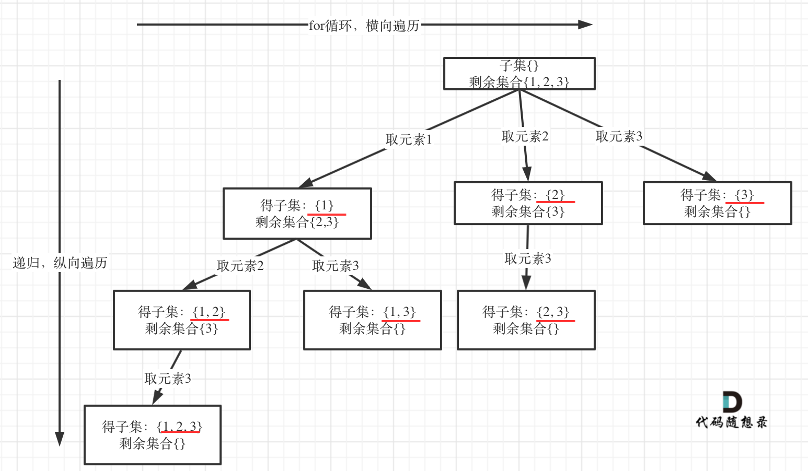

# 焚诀

**回溯的本质是穷举，穷举所有可能，然后选出我们想要的答案**，如果想让回溯法高效一些，可以加一些剪枝的操作，但也改不了回溯法就是穷举的本质。

回溯法解决的问题：

+ **组合**问题：N个数里面按一定规则找出k个数的集合

+ **子集**问题：一个N个数的集合里有多少符合条件的子集
+ **分割**问题：一个字符串按一定规则有几种分割方式
+ **排列**问题：N个数按一定规则全排列，有几种排列方式
+ **棋盘**问题：N皇后，解数独等等

当然回溯算法的用途显然不止这些，因为回溯作为穷举算法，如果原问题可以抽象成**选或不选**的问题，那么大概率都是可以用回溯来做的，如果还满足具有**重叠子问题**和**最优子结构**的特征，那么就可以用动态规划来做。一般而言，如果要**求出所有解的可能，需要使用回溯进行穷举**；而如果是**计数问题**或**子问题的最优解，显然使用动态规划性能更高效**。上面列出的若干种问题类型，都属于要求出所有解的可能，因此属于回溯类型问题，如果要求的是组合数而不是组合，那就要考虑动态规划了。

回溯算法模板框架如下：

```c++
void backtracking(参数) {
    if (终止条件) {
        存放结果;
        return;
    }

    for (选择：本层集合中元素（树中节点孩子的数量就是集合的大小）) {
        处理节点;
        backtracking(路径，选择列表); // 递归
        回溯，撤销处理结果
    }
}
```

> 上面的分类和模板来自代码随想录

一般的回溯，都会有**一个集合存储最终的结果**，**一个变量存储中间的路径**。

对于组合类型的问题，元素排列顺序不影响结果，所以需要去重；对于排列类型的问题，元素排列顺序影响结果，不需要去重。

这个模板很规整也很清晰，算是我的回溯启蒙了，不过现在也算半吊子老手了，给出的解法代码可能就不会这么规整了。


# 组合

## 17.电话号码的字母组合[中等]*

### 链接

+ [17. 电话号码的字母组合 - 力扣（LeetCode）](https://leetcode.cn/problems/letter-combinations-of-a-phone-number/description/)
+ [回溯算法套路①子集型回溯【基础算法精讲 14】](https://www.bilibili.com/video/BV1mG4y1A7Gu)

### 题目

给定一个仅包含数字 `2-9` 的字符串，返回所有它能表示的字母组合。答案可以按 **任意顺序** 返回。

给出数字到字母的映射如下（与电话按键相同）。注意 1 不对应任何字母。


### 思路

求组合，典型的回溯问题。不过这题与[77.组合](#77.组合[中等])还是有较大差别的，这题有多个集合元素（每个数字对应的字母映射视为一个集合），所以for循环遍历时可以直接遍历一个集合中所有的元素，不需要考虑for循环遍历的元素是否之前访问过，而77题组合使用的都是一个集合，所以77题需要用额外的`start_index`去避免重复访问。

### 解法

因为是回溯专题的第一题，所以解法写的详细一点。

```c++
class Solution {
public:
    const string map[10] = {"", "", "abc", "def", "ghi", "jkl", "mno", "pqrs", "tuv", "wxyz"};
    vector<string> letterCombinations(string digits) {
        vector<string> res;
        string s;
        function<void(int)> dfs = [&](int index) {
            if(index == digits.size()){
                res.push_back(s);
                return;
            }
            int digit = digits[index] - '0';
            string letters = map[digit];
            for(int i = 0; i < letters.size(); ++i){
                s.push_back(letters[i]);
                dfs(index + 1);
                s.pop_back();
            }
        };
        dfs(0);
        return res;
    }
};
```

上面的写法很规整，很符合回溯算法模板。或者我们可以直接把`s`改成局部变量，通过作用域自动实现`pop_back`。关键是理解回溯的思想，**先处理，后递归，再撤销。**

```c++
    vector<string> letterCombinations(string digits) {
        vector<string> res;
        function<void(int)> dfs = [&](int index, const string& s) {
            if(index == digits.size()){
                res.push_back(s);
                return;
            }
            int digit = digits[index] - '0';
            string letters = map[digit];
            for(int i = 0; i < letters.size(); ++i){
                dfs(index + 1, s + letters[i]); // 注意这里,隐式回溯
            }
        };
        dfs(0, "");
        return res;
    }
```

这么写性能其实不会太好，考虑到`s`的长度就是`digits`的长度，我们可以一开始就固定好`s`的内存大小，处理过程也只需要修改里面字符即可。

```c++
    vector<string> letterCombinations(string digits) {
        vector<string> res;
        int n = digits.size();
        string s(n, ' ');
        function<void(int)> dfs = [&](int index) {
            if(index == n){
                res.push_back(s);
                return;
            }
            int digit = digits[index] - '0';
            string letters = map[digit];
            for(int i = 0; i < letters.size(); ++i){
				s[index] = letters[i]; // 递归到下一个i时会覆盖掉上一个i的操作，也相当于隐式pop_back了 
                dfs(index + 1);
            }
        };
        dfs(0);
        return res;
    }
```

## 77.组合[中等]*

### 链接

+ [77. 组合 - 力扣（LeetCode）](https://leetcode.cn/problems/combinations/description/)
+ [回溯算法套路②组合型回溯+剪枝【基础算法精讲 15】](https://www.bilibili.com/video/BV1xG4y1F7nC)

### 题目

给定两个整数 `n` 和 `k`，返回范围 `[1, n]` 中所有可能的 `k` 个数的组合。

你可以按 **任何顺序** 返回答案。

**示例 1：**

```
输入：n = 4, k = 2
输出：
[
  [2,4],
  [3,4],
  [2,3],
  [1,2],
  [1,3],
  [1,4],
]
```

### 思路

求组合，典型的回溯问题。和[78.子集](#78.子集[中等])和[131.分割回文串](#131.分割回文串[中等])不同，这里用`path`的长度控制终止条件。**对于组合问题，集合是无序的，元素不能重复取，for循环遍历时需要`start_index`来避免重复访问。**

### 解法

```c++
class Solution {
public:
    vector<vector<int>> combine(int n, int k) {
        vector<vector<int>> res;
        vector<int> path;
        function<void(int)> dfs = [&](int start_index) {
            if(path.size() == k){
                res.push_back(path);
                return;
            }
            for(int i = start_index; i <= n; ++i){
                path.push_back(i);
                dfs(i + 1);
                path.pop_back();
            }
        };
        dfs(1);
        return res;
    }
};
```

### 优化

如果for循环选择的起始位置之后的元素个数**已经不足**我们需要的元素个数了，那么就没有必要搜索了

接下来看一下优化过程如下：

1. 已经选择的元素个数：`path.size()`;
2. 还需要的元素个数为: `k - path.size()`;
3. 在集合n中至多要从该起始位置 : `n - (k - path.size()) + 1`，开始遍历

```c++
class Solution {
public:
    vector<vector<int>> combine(int n, int k) {
        vector<vector<int>> res;
        vector<int> path;
        function<void(int)> dfs = [&](int start_index) {
            if(path.size() == k){
                res.push_back(path);
                return;
            }
            for(int i = start_index; i <= n - (k - path.size()) + 1; ++i){
                path.push_back(i);
                dfs(i + 1);
                path.pop_back();
            }
        };
        dfs(1);
        return res;
    }
};
```

## 216.组合总和 III[中等]*

### 链接

+ [216. 组合总和 III - 力扣（LeetCode）](https://leetcode.cn/problems/combination-sum-iii/)
+ [回溯算法套路②组合型回溯+剪枝【基础算法精讲 15】](https://www.bilibili.com/video/BV1xG4y1F7nC)

### 题目

找出所有相加之和为 n 的 k 个数的组合，且满足下列条件：

+ 只使用数字1到9
+ 每个数字 最多使用一次 

返回 所有可能的有效组合的列表 。该列表不能包含相同的组合两次，组合可以以任何顺序返回。

### 解法

```c++
class Solution {
public:
    vector<vector<int>> combinationSum3(int k, int n) {
        vector<vector<int>> res;
        vector<int> path;
        function<void(int, int)> dfs = [&](int start_index, int sum) {
            if(path.size() == k){
                if(sum == n) res.push_back(path);
                return;
            }
            for(int i = start_index; i <= 9; ++i){
                path.push_back(i);
                dfs(i + 1, sum + i); // sum用的隐式回溯
                path.pop_back();
            }
        };
        dfs(1, 0);
        return res;
    }
};
```

### 优化

假设还需要选`d=k-path.size()`个数字，

剪枝思路有：

+ 剩余数字数目不够 `i < d`
+ 当前和已经大于目标和`sum > n`
+ 剩余数字全部选最小的，和也超过n了。`n < sum + start_index + ... + (start_index + d - 1) = sum + (2 * start_index + d - 1) *d / 2`
+ 剩余数字即使全部选最大的，和也不够。`n > sum + 9 + ... + (10 - d) = sum + (19 - d) * d / 2`

```c++
class Solution {
public:
    vector<vector<int>> combinationSum3(int k, int n) {
        vector<vector<int>> res;
        vector<int> path;
        function<void(int, int)> dfs = [&](int start_index, int sum) { // 这里sum表示当前和
            int d = k - path.size();
            if (sum > n) return;
            if (n > sum + (9 + 9 - d + 1) * d / 2) return; // 剩余数字最大和仍不够
            if (n < sum + (start_index + start_index + d - 1) * d / 2) return; // 剩余数字最小和仍太大
            if(path.size() == k){
                if(sum == n) res.push_back(path);
                return;
            }
            for(int i = start_index; i <= 9 - d + 1; ++i){
                path.push_back(i);
                dfs(i + 1, sum + i); // sum用的隐式回溯
                path.pop_back();
            }
        };
        dfs(1, 0);
        return res;
    }
};
```

## 22.括号生成[中等]*

### 链接

+ [22. 括号生成 - 力扣（LeetCode）](https://leetcode.cn/problems/generate-parentheses/description/)

+ [回溯算法套路②组合型回溯+剪枝【基础算法精讲 15】](https://www.bilibili.com/video/BV1xG4y1F7nC)

### 题目

数字 `n` 代表生成括号的对数，请你设计一个函数，用于能够生成所有可能的并且 **有效的** 括号组合。

**示例 1：**

```
输入：n = 3
输出：["((()))","(()())","(())()","()(())","()()()"]
```

### 思路

求组合，典型的回溯问题。输入`n`，那么输出的字符串长度总共就是`2n`。这个问题其实就等价于在`2n`个位置上是填左括号还是右括号，同时要满足当前位置之前的左括号数量大于右括号数量。

### 解法

```c++
class Solution {
public:
    vector<string> generateParenthesis(int n) {
        vector<string> res;
        string path;
        function<void(int, int)> dfs = [&](int left, int right){ // 目前放入path的左括号和右括号数量
            if(left + right == n * 2){
                res.push_back(path);
                return;
            }
            if(left < n) { // 选(
                path.push_back('(');
                dfs(left + 1, right);
                path.pop_back();
            }
            if(right < n && left > right) { // 选)
                path.push_back(')');
                dfs(left, right + 1);
                path.pop_back();
            }
        };
        dfs(0, 0);
        return res;
    }
};
```

## 39.组合总和[中等]

### 链接

+ [39. 组合总和 - 力扣（LeetCode）](https://leetcode.cn/problems/combination-sum)

### 题目

给你一个 **无重复元素** 的整数数组 `candidates` 和一个目标整数 `target` ，找出 `candidates` 中可以使数字和为目标数 `target` 的 所有 **不同组合** ，并以列表形式返回。你可以按 **任意顺序** 返回这些组合。

`candidates` 中的 **同一个** 数字可以 **无限制重复被选取** 。如果至少一个数字的被选数量不同，则两种组合是不同的。 

对于给定的输入，保证和为 `target` 的不同组合数少于 `150` 个。

### 思路

求组合，典型的回溯问题。和前面几题的区别在于元素可以重复选取，所以`dfs`下一层时起始索引可以和当前层的起始索引一样。

### 解法

```python
class Solution:
    def combinationSum(self, candidates: List[int], target: int) -> List[List[int]]:
        res = []
        path = []
        n = len(candidates)
        def dfs(i, s):
            if s > target:
                return
            elif s == target:
                res.append(path.copy())
                return
            
            for j in range(i, n):
                path.append(candidates[j])
                dfs(j, s + candidates[j])
                path.pop()

        dfs(0, 0)
        return res
```


# 子集

## 78.子集[中等]*

### 链接

+ [78. 子集 - 力扣（LeetCode）](https://leetcode.cn/problems/subsets/)
+ [回溯算法套路①子集型回溯【基础算法精讲 14】](https://www.bilibili.com/video/BV1mG4y1A7Gu)

### 题目

给你一个整数数组 `nums` ，数组中的元素 **互不相同** 。返回该数组所有可能的子集（幂集）。

解集 **不能** 包含重复的子集。你可以按 **任意顺序** 返回解集。

**示例 1：**

```
输入：nums = [1,2,3]
输出：[[],[1],[2],[1,2],[3],[1,3],[2,3],[1,2,3]]
```

### 思路

求子集，典型的回溯问题。

### 解法1

如果把 子集问题、组合问题、分割问题都抽象为一棵树的话，**那么组合问题和分割问题都是收集树的叶子节点，而子集问题是找树的所有节点！**

其实**子集也是一种组合问题**，因为它的集合是无序的。**那么既然是无序，取过的元素不会重复取，写回溯算法的时候，for就要从`start_index`开始，而不是从0开始！**（求排列问题的时候，就要从0开始，因为集合是有序的）



```c++
class Solution {
public:
    vector<vector<int>> subsets(vector<int>& nums) {
        vector<vector<int>> res;
        vector<int> path;
        int n = nums.size();
        function<void(int)> dfs = [&](int start_index) {
            res.push_back(path); // 收集子集，要放在终止添加的上面，否则会漏掉自己
            if(start_index == n){
                return;
            }
            for(int i = start_index; i < n; ++i){
                path.push_back(nums[i]);
                dfs(i + 1);
                path.pop_back();
            }
        };
        dfs(0);
        return res;
    }
};
```

+ 时间复杂度：$O(N \times 2^N)$

+ 空间复杂度：$O(N)$

### 解法2

对于子集问题，我们还可以有另一种视角，对于每个元素，我们都有选和不选两种选择。一共会递归$O(2^N)$次，再加上`push_back`会有$O(N)$的拷贝开销。

```c++
class Solution {
public:
    vector<vector<int>> subsets(vector<int>& nums) {
        vector<vector<int>> res;
        vector<int> path;
        int n = nums.size();
        function<void(int)> dfs = [&](int i) {
            if(i == n){
                res.push_back(path);
                return;
            }
            dfs(i + 1); // 不选nums[i]
            path.push_back(nums[i]);
            dfs(i + 1); // 选nums[i]
            path.pop_back();
        };
        dfs(0);
        return res;
    }
};
```

+ 时间复杂度：$O(N \times 2^N)$。把path拷贝到res是$O(N)$

+ 空间复杂度：$O(N)$


# 分割

## 131.分割回文串[中等]*

### 链接

+ [131. 分割回文串 - 力扣（LeetCode）](https://leetcode.cn/problems/palindrome-partitioning/)
+ [回溯算法套路①子集型回溯【基础算法精讲 14】](https://www.bilibili.com/video/BV1mG4y1A7Gu)

### 题目

给你一个字符串 `s`，请你将 `s` 分割成一些 子串，使每个子串都是 **回文串** 。返回 `s` 所有可能的分割方案。

> **子字符串** 是字符串中连续的 **非空** 字符序列。
>
> **回文** 串是向前和向后读都相同的字符串。

### 思路

求分割，典型的回溯问题。**分割问题本质上也是组合问题，我们只关心切的位置，而不关心切的顺序**。与传统的组合问题不同的点在于，for循环一次性处理多个元素，而传统组合问题一次性只处理一个元素。

### 解法

```c++
class Solution {
public:
    bool isPalindrome(const string& s, int start, int end) {
        for (int i = start, j = end; i < j; i++, j--) {
            if (s[i] != s[j]) {
                return false;
            }
        }
        return true;
    }
    vector<vector<string>> partition(string s) {
        vector<vector<string>> res;
        vector<string> path;
        int n = s.size();
        function<void(int)> dfs = [&](int start_index){
            if(start_index == n){
                res.push_back(path);
                return;
            }
            for(int i=start_index; i < n; ++i){
                if(isPalindrome(s, start_index, i)){ // [start_index, i]是回文串
                    path.push_back(s.substr(start_index, i - start_index + 1));
                    dfs(i + 1);
                    path.pop_back();
                }
            }
        };
        dfs(0);
        return res;
    }
};
```


# 排列

## 46.全排列[中等]*

### 链接

+ [46. 全排列 - 力扣（LeetCode）](https://leetcode.cn/problems/permutations/description/)

+ [回溯算法套路③排列型回溯+N皇后【基础算法精讲 16】](https://www.bilibili.com/video/BV1mY411D7f6)

### 题目

给定一个不含重复数字的数组 `nums` ，返回其 *所有可能的全排列* 。你可以 **按任意顺序** 返回答案。

**示例 1：**

```
输入：nums = [1,2,3]
输出：[[1,2,3],[1,3,2],[2,1,3],[2,3,1],[3,1,2],[3,2,1]]
```

### 思路

求排列，典型的回溯问题。组合、子集、分割三类问题本质都是组合型问题，排列型问题不同之处在于输出的集合是有序的。如果第一个位置选了某个元素，其他结果集中仍然可以在其他位置选该元素，而在组合型问题中则需要排除掉之前结果集中选过的元素。因此，对于这道题，我们可以从每个位置可以选哪些入手。对于第一个位置，自然`nums`中的元素都可以选，对于第二个位置，就要排除掉刚刚选过的第一个元素，再剩下的集合中随便选，以此类推。**注意，这里排除元素是因为在求一个结果集时不能重复使用一个元素，而多个结果集是可以选择一个元素放在不同位置上的。**

因此实现起来也可以有多种方法，一种则直接把可选的集合当做参数传递（当然每次递归都要复制集合，性能并不高，不过用python写起来轻松），另一种是用一个`used`数组记录使用过的元素。

### 解法1

```python
class Solution:
    def permute(self, nums: List[int]) -> List[List[int]]:
        n = len(nums)
        res = []
        path = [0] * n 
        def dfs(i, s):
            if i == n:
                res.append(path.copy())
                return
            for x in s:
                path[i] = x
                dfs(i + 1, s - {x})
        dfs(0, set(nums))
        return res
```

### 解法2

```python
class Solution:
    def permute(self, nums: List[int]) -> List[List[int]]:
        n = len(nums)
        res = []
        path = [0] * n
        used = [False] * n
        def dfs(i):
            if i == n:
                res.append(path.copy())
                return
            for j in range(n):
                if not used[j]:
                    path[i] = nums[j]
                    used[j] = True
                    dfs(i + 1)
                    used[j] = False
        dfs(0)
        return res
```

### 优化

上面两种解法都需要$O(N)$的额外空间，实际上我们可以原地修改`nums`数组，来实现$O(1)$的空间复杂度。排列的本质就是把所有数放到不同的位置上，如果当前递归负责位置`i`，我们可以用`swap`把剩余集合中所有数字放到第`i`位去。

```python
class Solution:
    def permute(self, nums: List[int]) -> List[List[int]]:
        n = len(nums)
        res = []
        def dfs(i):
            if i == n:
                res.append(nums.copy())
                return
            for j in range(i, n):
                nums[i], nums[j] = nums[j], nums[i]
                dfs(i + 1)
                nums[i], nums[j] = nums[j], nums[i]
        dfs(0)
        return res
```

# 棋盘

## 51.N皇后[困难]*

### 链接

+ [51. N 皇后 - 力扣（LeetCode）](https://leetcode.cn/problems/n-queens/description/)
+ [回溯算法套路③排列型回溯+N皇后【基础算法精讲 16】](https://www.bilibili.com/video/BV1mY411D7f6)

### 题目

按照国际象棋的规则，皇后可以攻击与之处在同一行或同一列或同一斜线上的棋子。

**n 皇后问题** 研究的是如何将 `n` 个皇后放置在 `n×n` 的棋盘上，并且使皇后彼此之间不能相互攻击。

给你一个整数 `n` ，返回所有不同的 **n 皇后问题** 的解决方案。

每一种解法包含一个不同的 **n 皇后问题** 的棋子放置方案，该方案中 `'Q'` 和 `'.'` 分别代表了皇后和空位。

**示例 1：**


```
输入：n = 4
输出：[[".Q..","...Q","Q...","..Q."],["..Q.","Q...","...Q",".Q.."]]
解释：如上图所示，4 皇后问题存在两个不同的解法。
```

### 思路

求棋盘中棋子的排列，典型的回溯问题。思路也是非常简单，纵向遍历棋盘的行(dfs)，横向遍历棋盘的列(for)，对于一行内所有列，如果该位置是合法的，就放置棋子然后递归。这道题可以通过一些数学技巧优化合法性判断，具体见灵神视频，我觉得粗暴遍历也是可以接受的，懒得再动脑子了。

### 解法

```c++
class Solution {
public:
    bool isValid(vector<string>& chessboard, int row, int col, int n) {
        for (int i = 0; i < row; ++i) {
            if (chessboard[i][col] == 'Q') {
                return false;
            }
        }
        for (int i = row - 1, j = col - 1; i >= 0 && j >= 0; --i, --j) {
            if (chessboard[i][j] == 'Q') {
                return false;
            }
        }
        for (int i = row - 1, j = col + 1; i >= 0 && j < n; --i, ++j) {
            if (chessboard[i][j] == 'Q') {
                return false;
            }
        }
        return true;
    }
    vector<vector<string>> solveNQueens(int n) {
        vector<vector<string>> res;
        vector<string> chessboard(n, string(n, '.'));
        function<void(int)> dfs = [&](int row) { 
            if (row == n) {
                res.push_back(chessboard);
                return;
            }
            for (int col = 0; col < n; ++col) {
                if (isValid(chessboard, row, col, n)) {
                    chessboard[row][col] = 'Q';
                    dfs(row + 1);
                    chessboard[row][col] = '.';
                }
            }
        };
        dfs(0);
        return res;
    }
};
```


