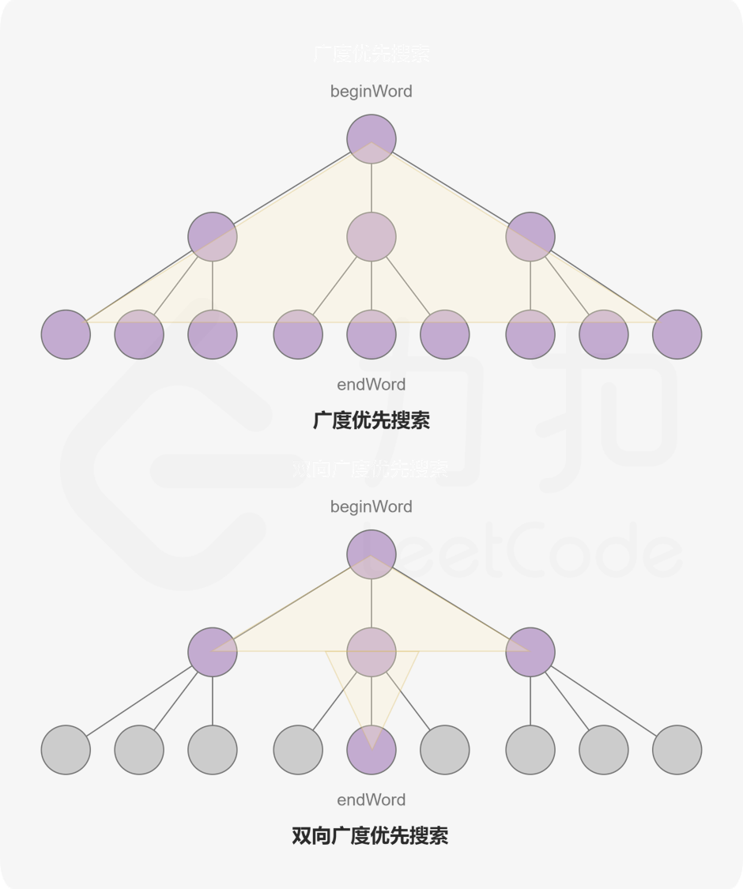

# 基础搜索算法

## 焚诀

大部分图论题目，DFS和BFS都是可以互相转换的，但各自有使用场景

+ DFS（深度优先搜索）
  + **检测环或连通性**
  + **搜索路径或组合**
+ BFS（广度优先搜索）
  + **最短路径或最少操作步数**
  + **搜索整个图，但希望按“距离起点”的顺序**

一般来说，BFS 的优势在于其**按层扩展**的特点，而在不需要分层信息时，DFS 通常更简洁；相比之下，DFS 天生便适合处理**路径相关**的问题。


## 200.岛屿数量[中等]

### 链接

+ [200. 岛屿数量 - 力扣（LeetCode）](https://leetcode.cn/problems/number-of-islands)

### 题目

给你一个由 `'1'`（陆地）和 `'0'`（水）组成的的二维网格，请你计算网格中岛屿的数量。

岛屿总是被水包围，并且每座岛屿只能由水平方向和/或竖直方向上相邻的陆地连接形成。

此外，你可以假设该网格的四条边均被水包围。

### 思路

这个题不需要分层信息，所以用DFS写起来更简洁一点，由于可以把已访问过的陆地标记为水，甚至不需要额外的`visited`数组。

另外DFS（包括二叉树里的DFS）写法一般分为两种，一种是在DFS开头处理当前节点（如下面这种），一种是在准备递归到下一层时提前处理下一个节点，并且这种写法需要在主函数里调用DFS时也在DFS外面提前处理第一个节点。第一种写法更简洁，我喜欢第一种。

对于边界条件判断，也有两种写法，一种是写在DFS开头，一种是在准备递归前。在图的题目中一般用第二种，因为对于一些无效情况可以减少递归次数。在二叉树的题目中，经常会有多个递归，第一种写法把边界条件判断统一写在开头，代码更简洁点。

### 解法：DFS

```python
class Solution:
    def numIslands(self, grid: List[List[str]]) -> int:
        res = 0
        m = len(grid)
        n = len(grid[0])
        dir = [[0, 1], [0, -1], [1, 0], [-1, 0]]
        def dfs(x, y):
            grid[x][y] = '0'
            for dx, dy in dir:
                next_x, next_y = x + dx, y + dy
                if 0 <= next_x < m and 0 <= next_y < n and grid[next_x][next_y] == '1':
                    dfs(next_x, next_y)

        for i in range(m):
            for j in range(n):
                if grid[i][j] == '1':
                    dfs(i, j)
                    res += 1
        return res
```

+ 时间复杂度：$O(MN)$
+ 空间复杂度：$O(MN)$，最坏情况所有节点都是陆地，递归栈开销就是$O(MN)$

## 994.腐烂的橘子[中等]

### 链接

+ [994. 腐烂的橘子 - 力扣（LeetCode）](https://leetcode.cn/problems/rotting-oranges)

### 题目

在给定的 `m x n` 网格 `grid` 中，每个单元格可以有以下三个值之一：

- 值 `0` 代表空单元格；
- 值 `1` 代表新鲜橘子；
- 值 `2` 代表腐烂的橘子。

每分钟，腐烂的橘子 **周围 4 个方向上相邻** 的新鲜橘子都会腐烂。

返回 *直到单元格中没有新鲜橘子为止所必须经过的最小分钟数。如果不可能，返回 `-1`* 。

### 思路

由于腐烂是逐层扩展，所以用BFS。由于可能有多个起始源，所以是多源广度优先搜索，由于上一轮腐烂的橘子到下一轮它的邻居都腐烂了，那么这个橘子在下一轮是不需要再遍历了的，所以可以用BFS。

### 解法：BFS

```python
class Solution:
    def orangesRotting(self, grid: List[List[int]]) -> int:
        fresh = 0
        que = collections.deque()
        res = -1
        m = len(grid)
        n = len(grid[0])
        dir = [[0,1], [0,-1], [1,0], [-1,0]]
        
        for i, row in enumerate(grid):
            for j, val in enumerate(row):
                if val == 1:
                    fresh += 1
                elif val == 2:
                    que.append((i,j))
        
        while que:
            res += 1
            for _ in range(len(queue)):
                x, y = que.popleft()
                for dx, dy in dir:
                    next_x, next_y = x + dx, y + dy
                    if 0 <= next_x < m and 0 <= next_y < n and grid[next_x][next_y] == 1:
                        fresh -= 1
                        grid[next_x][next_y] = 2
                        que.append((next_x, next_y))

        if not fresh and res == -1:
            return 0
            
        return -1 if fresh else res
```

+ 时间复杂度：$O(MN)$
+ 空间复杂度：$O(MN)$

## 433.最小基因变化[中等]

### 链接

+ [433. 最小基因变化 - 力扣（LeetCode）](https://leetcode.cn/problems/minimum-genetic-mutation)

### 题目

基因序列可以表示为一条由 8 个字符组成的字符串，其中每个字符都是 `'A'`、`'C'`、`'G'` 和 `'T'` 之一。

假设我们需要调查从基因序列 `start` 变为 `end` 所发生的基因变化。一次基因变化就意味着这个基因序列中的一个字符发生了变化。

- 例如，`"AACCGGTT" --> "AACCGGTA"` 就是一次基因变化。

另有一个基因库 `bank` 记录了所有有效的基因变化，只有基因库中的基因才是有效的基因序列。（变化后的基因必须位于基因库 `bank` 中）

给你两个基因序列 `start` 和 `end` ，以及一个基因库 `bank` ，请你找出并返回能够使 `start` 变化为 `end` 所需的最少变化次数。如果无法完成此基因变化，返回 `-1` 。

注意：起始基因序列 `start` 默认是有效的，但是它并不一定会出现在基因库中。

### 思路

求最少变化次数，优先考虑使用BFS。当然可以预处理一下来剪枝。

### 解法

```python
class Solution:
    def minMutation(self, startGene: str, endGene: str, bank: List[str]) -> int:
        if startGene == endGene:
            return 0
        bank = set(bank)
        if endGene not in bank:
            return -1
        queue = deque()
        queue.append(startGene)
        step = 0
        while queue:
            for _ in range(len(queue)):
                gene = queue.popleft()
                if gene == endGene:
                    return step
                for i, x in enumerate(gene):
                    for y in "ACGT":
                        if x != y:
                            nxt = gene[:i] + y + gene[i + 1:]
                            if nxt in bank:
                                bank.remove(nxt)
                                queue.append(nxt) 
            step += 1
        return -1
```

+ 时间复杂度：$O(C\times n\times m)$，其中$n$是基因序列长度，$m$是数组`bank`的长度。对于队列中的每个合法的基因序列每次都需要计算 $C\times n$ 种变化，在这里 $C=4$；队列中最多有 $m$ 个元素，因此时间复杂度为 $O(C\times n\times m)$。
+ 空间复杂度：$O(n\times m)$。

## 127.单词接龙[困难]

### 链接

+ [127. 单词接龙 - 力扣（LeetCode）](https://leetcode.cn/problems/word-ladder)

### 题目

字典 `wordList` 中从单词 `beginWord` 到 `endWord` 的 **转换序列** 是一个按下述规格形成的序列 `beginWord -> s1 -> s2 -> ... -> sk`：

- 每一对相邻的单词只差一个字母。
-  对于 `1 <= i <= k` 时，每个 `si` 都在 `wordList` 中。注意， `beginWord` 不需要在 `wordList` 中。
- `sk == endWord`

给你两个单词 `beginWord` 和 `endWord` 和一个字典 `wordList` ，返回 *从 `beginWord` 到 `endWord` 的 **最短转换序列** 中的 **单词数目*** 。如果不存在这样的转换序列，返回 `0` 。

### 思路

求最短操作次数，优先考虑BFS。这道题可以用 [433.最小基因变化](#433.最小基因变化[中等]) 一样的思路做，但是会超时，所以必须得预处理。这里**预处理**的方法也很tricky，不用每次两两比较两个单词的差异，找只有一个字符不一样的邻居，而是把可能不一样的字符改成通配符，把符合这个pattern的单词都放到里面去，这样建图的开销就是$O(L\times N)$了。

第二个tricky点就是**双向BFS**，根据给定字典构造的图可能会很大，广度优先搜索的搜索空间大小依赖于每层节点的分支数量，假如每个节点的分支数量相同，搜索空间会随着层数的增长指数级的增加。考虑一个简单的二叉树，每一层都是满二叉树的扩展，节点的数量会以 2 为底数呈指数增长。

如果使用两个同时进行的广搜可以有效地减少搜索空间。一边从 beginWord 开始，另一边从 endWord 开始。我们每次从两边各扩展一层节点，当发现某一时刻两边都访问过同一顶点时就停止搜索。这就是双向广度优先搜索，它可以可观地减少搜索空间大小，从而提高代码运行效率。



### 解法：双向BFS

```python
class Solution:
    def ladderLength(self, beginWord: str, endWord: str, wordList: list[str]) -> int:
        if endWord not in wordList:
            return 0
        
        L = len(beginWord)
        all_combo_dict = defaultdict(list)
        for word in wordList + [beginWord]:
            for i in range(L):
                # 预处理：构建通用 pattern 映射，比如 "h*t" -> ["hot", "hit"]
                pattern = word[:i] + '*' + word[i+1:]
                all_combo_dict[pattern].append(word)
        
        begin_queue = deque([(beginWord, 1)])
        end_queue = deque([(endWord, 1)])
        begin_visited = {beginWord: 1}
        end_visited = {endWord: 1}

        while begin_queue and end_queue:
            # 总是扩展队列短的那一边
            if len(begin_queue) <= len(end_queue):
                queue, visited, other_visited = begin_queue, begin_visited, end_visited
            else:
                queue, visited, other_visited = end_queue, end_visited, begin_visited
            
            ans = inf
            # 按层处理
            for _ in range(len(queue)):
                word, level = queue.popleft()
                for i in range(L):
                    pattern = word[:i] + '*' + word[i+1:]
                    for next_word in all_combo_dict.get(pattern, []):
                        if next_word in other_visited:
                            ans = min(ans, level + other_visited[next_word])
                        if next_word not in visited:
                            visited[next_word] = level + 1
                            queue.append((next_word, level + 1))
            if ans != inf:
                return ans
        return 0
```

+ 时间复杂度：$O(N\times L^2)$，其中$N$是`wordList`的长度，$L$是单词的长度。双向BFS最坏时间复杂度是$O(N\times L)$，一个单词可以扩展出$O(L)$个`next_word`。
+ 空间复杂度：$O(N\times L^2)$，哈希表总共有$O(N\times L)$个节点，每个节点占用$O(L)$空间。


# 拓扑排序

## 焚诀

拓扑排序是对有向无环图（DAG）的节点进行线性排序，使得每条有向边 `u → v` 都满足 `u` 在 `v` 之前。

+ 验证是否有环：有向图含有一个环当且仅当深度优先搜索过程中探测到一条回边。
+ 以下三个在深度优先搜索中出现的看似不同的性质——**无环性**、**可线性化**以及**无回边性**——实际上是一回事。

什么时候我们要联想到使用拓扑排序呢？

+ **任务调度/依赖处理**（前后依赖，先做A再做B）

求拓扑排序一般有两种方法，分为**逆序输出零入度节点（DFS）**和**顺序输出零入度节点（BFS）**。

+ DFS类似于后序遍历，在子节点都处理完后把当前节点加入栈，最后逆序输出整个栈就是拓扑排序
+ BFS按入度为0的节点逐层输出，每处理完一个就把它从图中删掉（更新子节点的入度），直到所有节点都处理完

## 207.课程表[中等]

### 链接

+ [207. 课程表 - 力扣（LeetCode）](https://leetcode.cn/problems/course-schedule)

### 题目

你这个学期必须选修 `numCourses` 门课程，记为 `0` 到 `numCourses - 1` 。

在选修某些课程之前需要一些先修课程。 先修课程按数组 `prerequisites` 给出，其中 `prerequisites[i] = [ai, bi]` ，表示如果要学习课程 `ai` 则 **必须** 先学习课程 `bi` 。

- 例如，先修课程对 `[0, 1]` 表示：想要学习课程 `0` ，你需要先完成课程 `1` 。

请你判断是否可能完成所有课程的学习？如果可以，返回 `true` ；否则，返回 `false` 。

### 思路

**依赖处理**，非常经典的拓扑排序题目，不过由于只需要判断能否线性化，也就是判断是否无环，所以DFS时到没必要维护栈了，因为不需要拓扑排序，只要检测到回边就可以提前结束了。

### 解法1：DFS

DFS 中的节点通常分三种状态：

- `0`：未访问
- `1`：正在访问（在递归栈中）
- `2`：访问完成（已经出栈）

如果一条边

+ 指向 `1` → 回边 → 有环
+ 指向 `0` → 树边 → 继续 DFS
+ 指向 `2` → 前向边/横向边 → 不影响环检测（相当于有一个节点已经访问过了，现在有一条新边指向旧的这个节点，显然这不算环，因为当前节点的父结点不可能是这个节点）

```python
class Solution:
    def canFinish(self, numCourses: int, prerequisites: List[List[int]]) -> bool:
        graph = [[] for _ in range(numCourses)]
        for to_, from_ in prerequisites:
            graph[from_].append(to_)

        visited = [0] * numCourses
        def dfs(i):
            visited[i] = 1
            for j in graph[i]:
                if visited[j] == 1:
                    return False # 有环
                elif visited[j] == 0:
                    if not dfs(j):
                        return False
            visited[i] = 2
            return True
        
        for i in range(numCourses):
            if not visited[i]:
                if not dfs(i): # dfs为False表示有环
                    return False
        return True
```

### 解法2：BFS

```python
class Solution:
    def canFinish(self, numCourses: int, prerequisites: List[List[int]]) -> bool:
        graph = [[] for _ in range(numCourses)]
        indegree = [0] * numCourses
        for to_, from_ in prerequisites:
            graph[from_].append(to_)
            indegree[to_] += 1

        que = collections.deque([i for i in range(numCourses) if indegree[i] == 0])

        visited = 0
        while que:
            visited += 1
            i = que.popleft()
            for j in graph[i]:
                indegree[j] -= 1
                if indegree[j] == 0:
                    que.append(i)

        return visited == numCourses
```

## 208.课程表 II[中等]

### 链接

+ [210. 课程表 II - 力扣（LeetCode）](https://leetcode.cn/problems/course-schedule-ii)

### 题目

现在你总共有 `numCourses` 门课需要选，记为 `0` 到 `numCourses - 1`。给你一个数组 `prerequisites` ，其中 `prerequisites[i] = [ai, bi]` ，表示在选修课程 `ai` 前 **必须** 先选修 `bi` 。

- 例如，想要学习课程 `0` ，你需要先完成课程 `1` ，我们用一个匹配来表示：`[0,1]` 。

返回你为了学完所有课程所安排的学习顺序。可能会有多个正确的顺序，你只要返回 **任意一种** 就可以了。如果不可能完成所有课程，返回 **一个空数组** 。

### 思路

与上题一样的思路，不过要用栈收集后序遍历的根节点，最后对栈倒序输出。

### 解法

```python
class Solution:
    def findOrder(self, numCourses: int, prerequisites: List[List[int]]) -> List[int]:
        graph = [[] for _ in range(numCourses)]
        for u, v in prerequisites:
            graph[v].append(u)
        visited = [0] * numCourses
        stack = []
        def dfs(u):
            visited[u] = 1
            for v in graph[u]:
                if visited[v] == 1:
                    return False
                elif visited[v] == 0:
                    if not dfs(v):
                        return False
            stack.append(u)
            visited[u] = 2
            return True

        for i in range(numCourses):
            if visited[i] == 0:
                if not dfs(i):
                    return []
        return list(reversed(stack))
```


