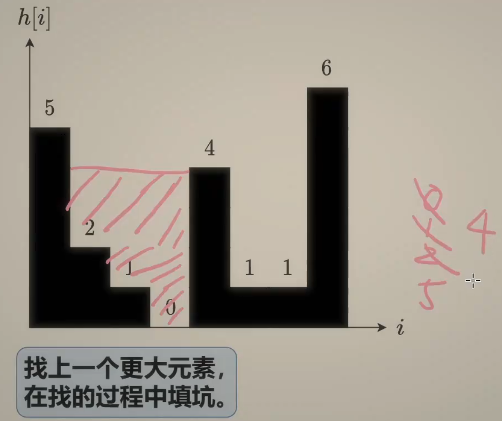
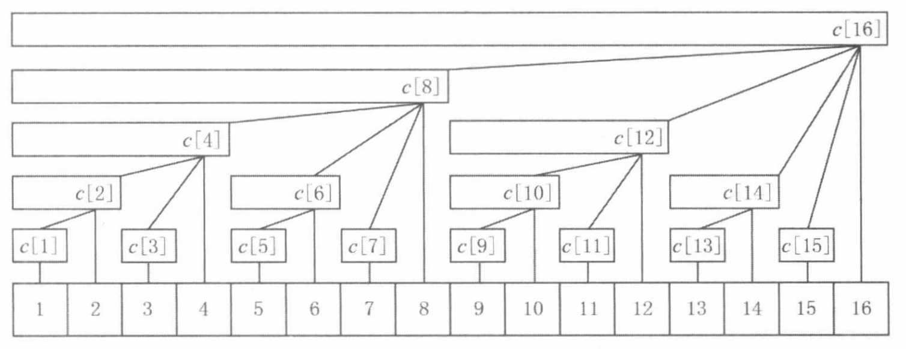

# 优先级队列/堆

## 焚诀

什么时候我们要联想到使用优先级队列呢？

+ **实时获取最大值或最小值**
+ **归并多个数据流**（LSM-Tree的compaction就是这个应用）
+ **找Top-N问题**

C++的`priority_queue`默认是大顶堆，使用`priority_queue<int, vector<int>, greater<int>>`可得到小顶堆。

python轻量级使用可以结合列表和`heapq`工具，或者使用线程安全的`PriorityQueue`类（默认都是小顶堆）


## 215. 数组中的第K个最大元素[中等]

### 链接

+ [215. 数组中的第K个最大元素 - 力扣（LeetCode）](https://leetcode.cn/problems/kth-largest-element-in-an-array)

### 题目

给定整数数组 `nums` 和整数 `k`，请返回数组中第 `k` 个最大的元素。

请注意，你需要找的是数组排序后的第 `k` 个最大的元素，而不是第 `k` 个不同的元素。

### 思路

这道题虽然是用堆解决的经典题目，但考察核心其实是**快速选择**算法。

### 解法1：排序

直接排序，然后取倒数第k个元素。

```c++
class Solution {
public:
    int findKthLargest(vector<int>& nums, int k) {
        sort(nums.begin(), nums.end());
        return nums[nums.size() - k];
    }
};
```

+ 时间复杂度：$O(N\log N)$
+ 空间复杂度：$O(\log N)$，栈开销

### 解法2：大顶堆

原地建一个**大顶堆**，然后再pop k - 1 次去掉前 k - 1 大的元素，然后堆顶就是第 k 大的元素。原地建堆的时间复杂度为$O(N)$，pop的时间复杂度为$O(\log N)$，因此总的时间复杂度为$O(N + k\log N)=O(N\log N)$（因为k < N）

```c++
class Solution {
public:
    int findKthLargest(vector<int>& nums, int k) {
        priority_queue<int> maxHeap(nums.begin(), nums.end());
        while(--k > 0){
            maxHeap.pop();
        }
        return maxHeap.top();
    }
};
```

+ 时间复杂度：$O(N+k\log N)=O(N\log N)$
+ 空间复杂度：$O(N)$

### 解法3：小顶堆

使用一个大小为 k 的**小顶堆**，**保留当前遇到的最大的 k 个元素**，每次新元素进来时，只有比小顶堆里最小的元素更大才换进去。

```c++
class Solution {
public:
    int findKthLargest(vector<int>& nums, int k) {
        priority_queue<int, vector<int>, greater<int>> minHeap; 
        for (auto& num : nums) {
            minHeap.push(num);
            if (minHeap.size() > k) minHeap.pop();
        }
        return minHeap.top();
    }
};
```

或者这样写，可能逻辑更加清楚一点。

```c++
class Solution {
public:
    int findKthLargest(vector<int>& nums, int k) {
        priority_queue<int, vector<int>, greater<int>> minHeap; 
        for (auto& num : nums) {
            if (minHeap.size() < k) minHeap.push(num);
            else if(num > minHeap.top()){
                minHeap.pop();
                minHeap.push(num);
            }
            // num <= minHeap.top() continue
        }
        return minHeap.top();
    }
};
```

+ 时间复杂度：$O(N\log k)$

+ 空间复杂度：$O(k)$

### 解法4：快速选择

ADS课都教过，作为算法题，就记住快选就行了，还有最坏时间复杂度也是$O(N)$的线性选择（把子数组的中位数的中位数作为划分依据）。

和快速排序的原理差不多，首先选取一个基准数，在划分后，比基准数小的都在它左边，比基准数大的都在它右边，如果某次划分后基准数的下标恰好为 k - 1，那么它就是第 k 大的元素。

如果它的下标比 k - 1 小，那么就递归右边，否则递归左边。（**快排需要两边都递归，快选只要递归一边！**）

```c++
class Solution {
public:
    int quickselect(vector<int> &nums, int l, int r, int k) {
        if (l == r)
            return nums[k];
        int partition = nums[l], i = l - 1, j = r + 1;
        while (i < j) {
            do i++; while (nums[i] < partition);
            do j--; while (nums[j] > partition);
            if (i < j)
                swap(nums[i], nums[j]);
        }
        if (k <= j) return quickselect(nums, l, j, k);
        else return quickselect(nums, j + 1, r, k);
    }

    int findKthLargest(vector<int> &nums, int k) {
        int n = nums.size();
        return quickselect(nums, 0, n - 1, n - k);
    }
};
```

+ 时间复杂度：$O(N)$
+ 空间复杂度：$O(\log N)$，栈开销

注意如果用下面的写法会超时，主要是因为测试用例中有一些case，数组中间会有非常多和pivot一样的元素，会导致`i`或者`j`不断往数组两侧逼近，导致每次递归去掉的部分很少。

```c++
while(i < j && nums[j] >= pivot) --j;
nums[i] = nums[j];
while(i < j && nums[i] <= pivot) ++i;
nums[j] = nums[i]; 
```

或者牺牲一点空间，就有更易读的python版本。

```python
class Solution:
    def findKthLargest(self, nums: List[int], k: int) -> int:
        def quick_select(nums, k):
            # 随机选择基准数
            pivot = random.choice(nums)
            big, equal, small = [], [], []
            # 将大于、小于、等于 pivot 的元素划分至 big, small, equal 中
            for num in nums:
                if num > pivot:
                    big.append(num)
                elif num < pivot:
                    small.append(num)
                else:
                    equal.append(num)
            if k <= len(big):
                # 第 k 大元素在 big 中，递归划分
                return quick_select(big, k)
            if len(nums) - len(small) < k:
                # 第 k 大元素在 small 中，递归划分
                return quick_select(small, k - len(nums) + len(small))
            # 第 k 大元素在 equal 中，直接返回 pivot
            return pivot
        
        return quick_select(nums, k)
```

## 23.合并 K 个升序链表[困难]

### 链接

+ [23. 合并 K 个升序链表 - 力扣（LeetCode）](https://leetcode.cn/problems/merge-k-sorted-lists)

### 题目

给你一个链表数组，每个链表都已经按升序排列。

请你将所有链表合并到一个升序链表中，返回合并后的链表。

**示例 1：**

```
输入：lists = [[1,4,5],[1,3,4],[2,6]]
输出：[1,1,2,3,4,4,5,6]
解释：链表数组如下：
[
  1->4->5,
  1->3->4,
  2->6
]
将它们合并到一个有序链表中得到。
1->1->2->3->4->4->5->6
```

### 思路

类似于LSM-Tree中compaction的操作，用一个小顶堆维护每个子数组中的最小值，每次从中取出这些最小值中的最小值（对应全局最小），然后把对应的子数组中下一个元素放到小顶堆中，如此往复。（小顶堆大小始终小于等于子数组的数量）

### 解法

`priority_queue`默认的比较器是`less<T>`，所以我们要重载`<`运算符，**千万记得最后那个`const`**。或者定义时用`priority_queue<poi, vector<poi>, cmppoi>`，其中`cmppoi`是自定义的一个比较器重载函数调用运算符 `operator(const T&, const T&)`。

**小顶堆的话比较器是左大于右，大顶堆是左小于右**（**右边的元素往堆顶冒**）。**排序算法的比较器是升序是左小于右，降序是左大于右**（**右边的元素往后走**）。

```c++
struct poi{
    int val;
    ListNode* ptr;
    bool operator<(const poi& rhs) const{ // 小顶堆
        return val > rhs.val;
    }
};

class Solution {
public:
    ListNode* mergeKLists(vector<ListNode*>& lists) {
        priority_queue<poi> pq;
        for(auto& node : lists){
            if(node) pq.push({node->val, node});
        }
        ListNode head;
        ListNode* tail = &head;
        while(!pq.empty()){
            auto node = pq.top(); pq.pop();
            tail->next = node.ptr;
            tail = tail->next;
            if(node.ptr->next) pq.push({node.ptr->next->val, node.ptr->next});
        }
        return head.next;
    }
};
```

+ 时间复杂度：$O(kn \log k)$

+ 空间复杂度：$O(k)$

## 347.前 K 个高频元素[中等]

### 链接

+ [347. 前 K 个高频元素 - 力扣（LeetCode）](https://leetcode.cn/problems/top-k-frequent-elements)

### 题目

给你一个整数数组 `nums` 和一个整数 `k` ，请你返回其中出现频率前 `k` 高的元素。你可以按 **任意顺序** 返回答案。

### 思路

统计词频用哈希表，求前 k 高元素用堆，小顶堆/大顶堆均可，参考[215. 数组中的第K个最大元素](#215. 数组中的第K个最大元素[中等])，这里用小顶堆维护最大的 k 个元素，最后只要把元素全pop掉就行了。

### 解法

```c++
struct cmp{
    bool operator()(pair<int, int>&lhs, pair<int, int>&rhs){
        return lhs.second > rhs.second;
    }
};

class Solution {
public:
    vector<int> topKFrequent(vector<int>& nums, int k) {
        unordered_map<int, int> cnt;
        for(auto& num : nums){
            cnt[num]++;
        }
        priority_queue<pair<int, int>, vector<pair<int, int>>, cmp> minHeap; // 小顶堆
        for(auto& pair : cnt){
            minHeap.push(pair);
            if(minHeap.size() > k) minHeap.pop();
        }
        vector<int> res;
        while(!minHeap.empty()){
            auto p = minHeap.top(); minHeap.pop();
            res.push_back(p.first);
        }
        return res;
    }
};
```

+ 时间复杂度：$O(N\log k)$
+ 空间复杂度：$O(N)$

## 295.数据流的中位数[困难]

### 链接

+ [295. 数据流的中位数 - 力扣（LeetCode）](https://leetcode.cn/problems/find-median-from-data-stream)

### 题目

**中位数**是有序整数列表中的中间值。如果列表的大小是偶数，则没有中间值，中位数是两个中间值的平均值。

- 例如 `arr = [2,3,4]` 的中位数是 `3` 。
- 例如 `arr = [2,3]` 的中位数是 `(2 + 3) / 2 = 2.5` 。

实现 MedianFinder 类:

- `MedianFinder()` 初始化 `MedianFinder` 对象。
- `void addNum(int num)` 将数据流中的整数 `num` 添加到数据结构中。
- `double findMedian()` 返回到目前为止所有元素的中位数。与实际答案相差 `10-5` 以内的答案将被接受。

### 思路

使用两个堆，一个大顶堆一个小顶堆。**大顶堆维护比中位数小的元素，小顶堆维护比中位数大的元素**，大顶堆的堆头是最大的小元素，小顶堆的堆头是最小的大元素，那么中位数要么是二者其中一个（我们这里选择大顶堆堆顶），要么是二者的平均值。

### 解法1：堆

```c++
class MedianFinder {
    priority_queue<int, vector<int>, less<int>> maxHeap;
    priority_queue<int, vector<int>, greater<int>> minHeap;
public:
    MedianFinder() {}
    
    void addNum(int num) {
        if(maxHeap.empty() || num <= maxHeap.top()){
            maxHeap.push(num);
            if(maxHeap.size() > minHeap.size() + 1){
                minHeap.push(maxHeap.top());
                maxHeap.pop();
            }
        }else{
            minHeap.push(num);
            if(minHeap.size() > maxHeap.size()){
                maxHeap.push(minHeap.top());
                minHeap.pop();
            } 
        }
    }
    
    double findMedian() {
        if(maxHeap.size() > minHeap.size()){
            return maxHeap.top();
        }else{
            return (minHeap.top() + maxHeap.top()) / 2.0;
        }
    }
};
```

+ 时间复杂度：
  + `addNum`：$O(\log N)$
  + `findMedian`：$O(1)$
+ 空间复杂度：$O(N)$

### 解法2：有序集合+双指针

使用`multiset`维护一个有序集合，然后用`left`和`right`指向中间的元素，每次新添加元素时，根据新元素和中间元素的大小关系调整指针位置。特别注意的是，**对于重复的key，`multiset`会将其插入到已有等值元素的末尾**。以`[1,2]`为例，再插入一个`1`，变成`[1(old),1(new),2]`，那么`left`指向`1(old)`，`right`指向`2`，二者没有相邻了，所以要`left=right`。同样的理由，`num >= *right`只能换成`num < *left`，不能写成`num > *right`或`num <= *left`。

```c++
class MedianFinder {
    multiset<int> nums;
    multiset<int>::iterator left, right;
public:
    MedianFinder() {}
    
    void addNum(int num) {
        const size_t n = nums.size();
        nums.insert(num);
        
        if(!n){
            left = right = nums.begin();
        }else if(n & 1){ // 插入前是奇数(left和right指向同一个位置)
            if(num >= *right){
                right++;
            }else{
                left--;
            }
        }else{ // 插入前是偶数(left和right指向中间两个位置)
            if(num > *left && num < *right){ // 刚好在left、right中间
                left++;
                right--;
            }else if(num >= *right){
                left++;
            }else{
                right--;
                left = right; // 关键!对于重复的key,multiset会放到后面,所以left和right不一定相邻了
            }
        }
    }
    
    double findMedian() {
        return (*left + *right) / 2.0;
    }
};
```

+ 时间复杂度：
  + `addNum`：$O(\log N)$
  + `findMedian`：$O(1)$
+ 空间复杂度：$O(N)$

## 373.查找和最小的 K 对数字

### 链接

+ [373. 查找和最小的 K 对数字 - 力扣（LeetCode）](https://leetcode.cn/problems/find-k-pairs-with-smallest-sums)

### 题目

给定两个以 **非递减顺序排列** 的整数数组 `nums1` 和 `nums2` , 以及一个整数 `k` 。

定义一对值 `(u,v)`，其中第一个元素来自 `nums1`，第二个元素来自 `nums2` 。

请找到和最小的 `k` 个数对 `(u1,v1)`, ` (u2,v2)` ...  `(uk,vk)` 。

### 思路

找top K元素，要想到使用堆。最简单的方式是直接两层循环，把所有可能的数对放到小顶堆中，最后pop k下就行了，但时间复杂度是$O(N^2)$。注意到，对于每个数组，只有前面的元素被使用了，后面的元素才能被使用。那么可以先把`nums1`中前k个元素和`nums2[0]`组成的数对放到堆中，然后一边pop的同时，一边把`nums1`最小的元素和`nums2`后面的元素组合放到堆中。

### 解法

```python
class Solution:
    def kSmallestPairs(self, nums1: List[int], nums2: List[int], k: int) -> List[List[int]]:
        pq = []
        m, n = len(nums1), len(nums2)
        for i in range(min(k, m)):
            heapq.heappush(pq, (num1 + nums2[0], i, 0))
        res = []
        while k:
            _, i, j = heapq.heappop(pq)
            res.append([nums1[i], nums2[j]])
            if j + 1 < n:
                heapq.heappush(pq, (nums1[i] + nums2[j + 1], i, j + 1))
            k -= 1
        return res
```

+ 时间复杂度：$(O(k\log k))$，堆中最多有k个元素

+ 空间复杂度：$O(k)$


# 单调栈

## 焚诀

单调栈是一种满足单调性的栈结构，主要用来解决“ **下(上)一个更大(小)元素** ”的问题

+ 单调递增栈：栈底到栈顶元素依次递增（适用于求解“左边/右边第一个比当前小的元素”）。
+ 单调递减栈：栈底到栈顶元素依次递减（适用于求解“左边/右边第一个比当前大的元素”）。


## 739.每日温度[中等]*

### 链接

+ [739. 每日温度 - 力扣（LeetCode）](https://leetcode.cn/problems/daily-temperatures/description/)
+ [单调栈【基础算法精讲 26】](https://www.bilibili.com/video/BV1VN411J7S7)

### 题目

给定一个整数数组 `temperatures` ，表示每天的温度，返回一个数组 `answer` ，其中 `answer[i]` 是指对于第 `i` 天，下一个更高温度出现在几天后。如果气温在这之后都不会升高，请在该位置用 `0` 来代替。

### 思路

求**下一个更大的元素**，需要想到使用单调栈。维护一个存储下标的**单调递减**的单调栈，从栈底到栈顶的下标对应的温度列表中的温度依次递减。对于下一个温度，如果温度比栈顶高，那就把栈清空，再入栈（保证栈中元素越来越小）；如果比栈顶低，那就直接入栈。

### 解法1：从右到左

栈中记录**下一个更大元素的“候选项”的下标**，此时要倒序遍历。假设栈中有一些元素了，现在往前再遍历一个元素，如果发现温度比栈顶高，说明后一天温度下降了，那么要一直pop直到找到下一个更大的元素，此时如果栈不为空，那么`i`这个位置的下一个更高温度就是栈顶了；如果前一个元素比栈顶低，说明后一天温度就比前一天高了，根据下面的代码，用栈顶（也就是后一天）减去当前天结果就是1。

```python
class Solution:
    def dailyTemperatures(self, temperatures: List[int]) -> List[int]:
        n = len(temperatures)
        res = [0] * n
        st = []
        for i in range(n - 1, -1, -1):
            t = temperatures[i]
			# 当栈不为空且当前温度比栈顶温度高时，弹出栈顶元素
            while st and t >= temperatures[st[-1]]:
                st.pop()
            if st:
				# 计算从栈顶元素到当前元素之间的天数
                res[i] = st[-1] - i # 遍历是倒序的
            st.append(i)
        return res
```

### 解法2：从左到右

栈中记录**还没算出下一个更大元素的那些数的下标**。假设栈中已经有一些元素了，根据单调栈的特性，说明这些天的温度都是在单调下降的，如果下一天温度比栈顶低，说明依旧满足递减特性，直接入栈，无法确定栈中任何元素的下一个更高温度；如果下一天温度比栈顶高，那么栈中某些元素的下一个更高温度可能就是下一天这个温度，所以要一直pop，同时把这些比下一天温度低的元素的结果确定下来，最后把下一天入栈，继续维持单调性（初始时栈中有一些天温度比下一天高，有一些比下一天低，经过处理后，比下一天低的都会确定结果，大于等于下一天的继续留在栈中待处理，如果遍历完数组还没有处理，那么就会保留默认值0）

```python
class Solution:
    def dailyTemperatures(self, temperatures: List[int]) -> List[int]:
        n = len(temperatures)
        ans = [0] * n
        st = []  # todolist
        for i, t in enumerate(temperatures):
            while st and t > temperatures[st[-1]]:
                j = st.pop()
                ans[j] = i - j
            st.append(i)
        return ans
```

## 42.接雨水[困难]*

### 链接

+ [42. 接雨水 - 力扣（LeetCode）](https://leetcode.cn/problems/trapping-rain-water/)
+ [单调栈【基础算法精讲 26】](https://www.bilibili.com/video/BV1VN411J7S7)

### 题目

给定 `n` 个非负整数表示每个宽度为 `1` 的柱子的高度图，计算按此排列的柱子，下雨之后能接多少雨水。

### 思路

在前面相向双指针章节，我们是竖着看每一格的，我们也可以横过来看，例如下面的例子，当遍历到4的时候我们才能开始接水，然后把从1到4这个范围内横着的1格接满水，接着从2到4这个横着的2格接满水，接着把5到4这个横着的6格接满水，接下来4比5小了，把4入栈就停下来了。在接水的时候，我们遍历的是右边的柱子，然后从栈上取出一个作为水池底的柱子，接下来我们需要知道上一个比这个池底更高的柱子，这就属于单调栈的应用范畴了。



### 解法

```python
class Solution:
    def trap(self, height: List[int]) -> int:
        res = 0
        st = []
        for i, h in enumerate(height):
            while st and height[st[-1]] <= h:
                bottom_h = height[st.pop()]
                if not st:  # 栈是空的
                    break
                left = st[-1]
                dh = min(height[left], h) - bottom_h  # 面积的高
                res += dh * (i - left - 1)
            st.append(i)
        return res
```

## 84.柱状图中最大的矩形[困难]

### 链接

+ [84. 柱状图中最大的矩形 - 力扣（LeetCode）](https://leetcode.cn/problems/largest-rectangle-in-histogram)

### 题目

给定 *n* 个非负整数，用来表示柱状图中各个柱子的高度。每个柱子彼此相邻，且宽度为 1 。

求在该柱状图中，能够勾勒出来的矩形的最大面积。

**示例 1:**


```
输入：heights = [2,1,5,6,2,3]
输出：10
解释：最大的矩形为图中红色区域，面积为 10
```

### 思路

这种困难题很难一样看出应该用什么方法，不妨从暴力做法出发逐步优化。第一种方法是枚举「宽」，外层循环枚举起点`left`，然后内层循环维护一个`minHeight`，从`left`到`right`之间的最大矩形就是`minHeight * (right - left + 1)`。

第二种方法是枚举「高」，外层循环枚举某一个柱子，矩形的高就是这个柱子的高度`h`，然后从这个柱子出发分别向左和向右去延伸，直到遇到高度小于`h`的柱子，这就确定了矩形的边界。

上面两种方法的复杂度都是$O(N^2)$，会超时。但是看方法二，不就是要高效找**下一个更小元素**的问题吗？所以可以用**单调递增栈**来实现，我这里的实现类似于 [739.每日温度[中等]](#739.每日温度[中等]) 的解法2，栈中记录**尚未确定下一个更小元素的元素的下标**，所以是在pop时记录。但是遍历完时栈中可能有元素没有处理，对于往右找的，如果数组里没有更小的，说明可以一直取到数组末尾去，所以默认值填`n`；同理往左找默认值填`-1`。在算矩形面积时的宽时`left`和`right`相当于是合法矩阵再往左右走了一格，所以合法的宽是`right-left-1`（算中间的间隔）。

官解的写法和我刚好相反，但也用的**单调递减栈**，在顺序遍历数组时，如果下一个元素比上一个元素大，那么会正常入栈，那同时就知道下一个元素往左找的第一个更小的元素了，这样每个元素都处理到，在这个时候根据栈空条件填左边界。

### 解法

```python
class Solution:
    def largestRectangleArea(self, heights: List[int]) -> int:
        n = len(heights)
        # left[i]表示从i往左找第一个比heights[i]小的元素的下标
        left, right = [-1] * n, [n] * n
        mono_stack = [] # 单调递增队列
        for i in range(n):
            while mono_stack and heights[i] < heights[mono_stack[-1]]:
                prev = mono_stack.pop()
                right[prev] = i
            mono_stack.append(i)
        mono_stack.clear()
        for i in range(n - 1, -1, -1):
            while mono_stack and heights[i] < heights[mono_stack[-1]]:
                prev = mono_stack.pop()
                left[prev] = i
            mono_stack.append(i)

        res = 0
        for i, height in enumerate(heights):
            res = max(res, (right[i] - left[i] - 1) * height)
        return res
```

+ 时间复杂度：$O(N)$
+ 空间复杂度：$O(N)$


# 单调队列

## 焚诀

单调队列是一种满足单调性的队列结构，主要用来解决“ **区间最大值/最小值** ”的问题

+ 单调递增队列：队头到队尾元素依次递增（适用于求解“区间最小值”）。
+ 单调递减队列：队头到队尾元素依次递减（适用于求解“区间最大值”）。


## 239.滑动窗口最大值[困难]*

### 链接

+ [239. 滑动窗口最大值 - 力扣（LeetCode）](https://leetcode.cn/problems/sliding-window-maximum/description/)
+ [单调队列 滑动窗口最大值【基础算法精讲 27】](https://www.bilibili.com/video/BV1bM411X72E)

### 题目

给你一个整数数组 `nums`，有一个大小为 `k` 的滑动窗口从数组的最左侧移动到数组的最右侧。你只可以看到在滑动窗口内的 `k` 个数字。滑动窗口每次只向右移动一位。

返回 *滑动窗口中的最大值* 。

### 思路

我们需要在一个区间内维护最大值，同时随着滑动窗口移动，要能更新其值。如果不了解单调队列，可能会想到使用优先级队列/大顶堆，但是大顶堆的问题是它每次出队拿到的是最大值没错，但是随着窗口滑动，这个值不一定在区间内了，所以得用`while`一直出队直到元素位于窗口内。这个做法的时间复杂度是$O(N\log N)$。

**求滑动窗口的最值**属于典型的单调队列应用场景。维护一个单调递减队列，那么队头就是这个区间的最大值。如果看到的下一个值比队尾小，那么直接入队，队列依旧保持单调性；如果看到的下一个值比队尾大，那么队列不满足单调性了，接下来要一直pop队尾元素，直到满足单调性，即队尾元素要大于这个值，然后把这个值入队。

### 解法

```python
class Solution:
    class MyQueue:  # 单调递减队列
        def __init__(self):
            self.que = deque()

        def pop(self, value: int) -> None:
            if self.que and value == self.que[0]:
                self.que.popleft()

        def push(self, value: int) -> None:
            # 从队尾移除所有比当前值小的元素
            while self.que and value > self.que[-1]:
                self.que.pop()
            # 把当前值放入队尾
            self.que.append(value)
        
        def front(self) -> int:
            return self.que[0]

    def maxSlidingWindow(self, nums: List[int], k: int) -> List[int]:
        que = self.MyQueue()
        res = []
        
        # 初始化队列，将前 k 个元素加入队列
        for i in range(k):
            que.push(nums[i])
        res.append(que.front())  # 记录第一个窗口的最大值

        for i in range(k, len(nums)):
            que.pop(nums[i - k])  # 移除窗口最前面元素(如果是区间最大元素,那么就被pop掉了,队列的单调性保证了下一个元素是第二大的;如果不是区间最大元素,那么无事发生)
            que.push(nums[i])  # 加入当前元素
            res.append(que.front())  # 记录当前窗口的最大值

        return res
```


# 树状数组

## 焚诀

**能用树状数组解决的题目，也能用线段树解决（反过来不一定）**。但树状数组实现简单，代码短。


## 307.区域和检索 - 数组可修改[中等]

### 链接

+ [307. 区域和检索 - 数组可修改 - 力扣（LeetCode）](https://leetcode.cn/problems/range-sum-query-mutable)
+ [带你发明树状数组！附数学证明](https://leetcode.cn/problems/range-sum-query-mutable/solutions/2524481/dai-ni-fa-ming-shu-zhuang-shu-zu-fu-shu-lyfll/)

+ [二维前缀和 树状数组原理【力扣周赛 387】](https://www.bilibili.com/video/BV14r421W7oR/?spm_id_from=333.1387.search.video_card.click&vd_source=ae6c7f367ab75f10e3f4dc3f020cac67)

### 题目

给你一个数组 `nums` ，请你完成两类查询。

1. 其中一类查询要求 **更新** 数组 `nums` 下标对应的值
2. 另一类查询要求返回数组 `nums` 中索引 `left` 和索引 `right` 之间（ **包含** ）的nums元素的 **和** ，其中 `left <= right`

实现 `NumArray` 类：

- `NumArray(int[] nums)` 用整数数组 `nums` 初始化对象
- `void update(int index, int val)` 将 `nums[index]` 的值 **更新** 为 `val`
- `int sumRange(int left, int right)` 返回数组 `nums` 中索引 `left` 和索引 `right` 之间（ **包含** ）的nums元素的 **和** （即，`nums[left] + nums[left + 1], ..., nums[right]`）

### 思路

求区间和可以想到前缀和，但前缀和只适用于求静态数组的区间和，因为涉及修改数组元素，那么整个前缀和数组就要重新计算，开销为$O(N)$，计算完后再查询还是$O(1)$。

一个优化的想法是分治，把数组切成多个块，每个块包含$B$个元素且维护一个区间和，这样修改某个元素后只需要修改那一个块的区间和，时间为$O(B)$。查询任意一个区间的区间和时间为$O(N/B)$（最多有这么多个块），取$B=\sqrt N$，那么更新和查询的时间就都是$O(\sqrt N)$了，但仍然不够优秀。

而树状数组对于区间的更新和查询的时间复杂度都可以做到$O(\log N)$。



1. 核心思想

- 用一个辅助数组 `tree` 存储 **部分前缀和**，而不是每个前缀和都存储。
- 利用 **二进制表示的低位（lowbit）** 来确定每个 `tree[i]` 负责的区间长度。
- 这样可以在 `O(log n)` 时间完成：
  1. 单点更新（update）
  2. 前缀和查询（prefixSum）

2. lowbit 的作用

- `lowbit(i) = i & -i`，表示 `i` 的最低位 1 对应的值。
- `tree[i]` 存储的是**长度为 `lowbit(i)` 的区间和，刚好以 `nums[i]` 结尾**。（注意这里要求`tree`和`nums`的索引都从1开始，实际代码实现中`tree`索引依旧从1开始，0号索引无用；但`nums`是从0开始索引，所以对应的元素往左移一位）
- 例如：
  - `i = 6` → 二进制 `110` → lowbit = 2 → `tree[6]` 存储区间长度为 2 的和（`nums[5]` 和 `nums[6]`，即上图所示的`c[6]`）。

3. 操作

   + **更新元素**：`i += lowbit(i)`
     + 更新所有包含该元素的区间和。

   + **前缀和查询**：`i -= lowbit(i)`
     - 累加覆盖区间的和直到 i=0。

### 解法：树状数组

```python
class NumArray:

    def __init__(self, nums: List[int]):
        n = len(nums)
        self.nums = [0] * n  # 使 update 中算出的 delta = nums[i]
        self.tree = [0] * (n + 1) # tree就代表关键区间数组(0号索引无用)
        for i, x in enumerate(nums):
            self.update(i, x)

    def update(self, index: int, val: int) -> None:
        delta = val - self.nums[index]
        self.nums[index] = val
        i = index + 1 # 把i的索引对齐到从1开始
        while i < len(self.tree):
            self.tree[i] += delta # 包含这个元素的所有关键区间都更新
            i += i & -i # lowbit

    def prefixSum(self, i: int) -> int:
        s = 0
        while i:
            s += self.tree[i]
            i &= i - 1  # Brian Kernighan 算法,抹去lowbit,等价于 i -= i & -i
        return s

    def sumRange(self, left: int, right: int) -> int:
        return self.prefixSum(right + 1) - self.prefixSum(left)
```

+ 时间复杂度：
  + 构造：$O(N\log N)$
  + `update`：$O(\log N)$
  + `sumRange`：$O(\log N)$
+ 空间复杂度：$O(N)$

其实可以把这些 `update `操作合并到一起。从 1 开始枚举 `i`，把 `nums[i−1]` 加到 `tree[i] `后，`tree[i]` 就算好了，直接把 `tree[i]` 加到下一个关键区间的元素和中，也就是加到` tree[i+lowbit(i)]` 中。下下一个关键区间的元素和由` tree[i+lowbit(i)]` 来更新，我们只需要继续往后枚举 `i` 就行。

```python
	def __init__(self, nums: List[int]):
        n = len(nums)
        tree = [0] * (n + 1)
        for i, x in enumerate(nums, 1):  # i 从 1 开始
            tree[i] += x
            nxt = i + (i & -i)  # 下一个关键区间的右端点
            if nxt <= n:
                tree[nxt] += tree[i]
        self.nums = nums
        self.tree = tree
```

这样构造的时间就为$O(N)$了。


# 线段树

## 焚诀

线段树是数据结构里非常经典的一个**区间操作结构**，用来高效地处理数组**区间的查询和更新**问题。它常用于求**区间和**、**区间最值**、**区间最大公约数**、**区间懒更新**等。

## 线段树(无区间更新)

### 3479.水果成篮 III[中等]

#### 链接

+ [3479. 水果成篮 III - 力扣（LeetCode）](https://leetcode.cn/problems/fruits-into-baskets-iii)
+ [从线段树二分的角度，带你发明线段树【力扣周赛 440】](https://www.bilibili.com/video/BV15gRaYZE5o)

#### 题目

给你两个长度为 `n` 的整数数组，`fruits` 和 `baskets`，其中 `fruits[i]` 表示第 `i` 种水果的 **数量**，`baskets[j]` 表示第 `j` 个篮子的 **容量**。

你需要对 `fruits` 数组从左到右按照以下规则放置水果：

- 每种水果必须放入第一个 **容量大于等于** 该水果数量的 **最左侧可用篮子** 中。
- 每个篮子只能装 **一种** 水果。
- 如果一种水果 **无法放入** 任何篮子，它将保持 **未放置**。

返回所有可能分配完成后，剩余未放置的水果种类的数量。

#### 思路

在无序数组中求第一个`>=x`的数，由于数组无序，没法直接用二分。但如果硬要二分呢？把数组划成两半，假设第一次查找`>=6`，发现左半区间都小于6，那么下一次查找`>=7`，不就也没必要去查左半区间了。那么我们怎么知道左边或右边区间是否都小于查询的`x`呢？答案就是维护**区间最大值**。如果`x`大于左边区间的最大值，且小于右边区间的最大值，那么二分就可以去右边区间查找，同理我们可以对右边区间递归地二分，最终把整个数组抽象成一棵二叉树，这就是线段树。

```python
# [l,r]:segement_max
    			   [0,7]:9
                 /        \
           [0,3]:5          [4,7]:9
          /      \          /       \
     [0,1]:5    [2,3]:4   [4,5]:9   [6,7]:7
     /    \     /    \    /    \    /    \
[0,0]:2 [1,1]:5 [2,2]:1 [3,3]:4 [4,4]:9 [5,5]:3 [6,6]:7 [7,7]:6
```

#### 解法

```python
class SegmentTree:
    def __init__(self, a: List[int]):
        n = len(a)
        self.max = [0] * (2 << (n - 1).bit_length())
        self.build(a, 1, 0, n - 1)

    def maintain(self, o: int):
        self.max[o] = max(self.max[o * 2], self.max[o * 2 + 1])

    # 初始化线段树
    def build(self, a: List[int], o: int, l: int, r: int):
        if l == r:
            self.max[o] = a[l]
            return
        m = (l + r) // 2
        self.build(a, o * 2, l, m) # 左孩子
        self.build(a, o * 2 + 1, m + 1, r) # 右孩子
        self.maintain(o)

    # 单点更新
    def update(self, o: int, l: int, r: int, i: int, x: int) -> int:
        if l == r:
            self.max[o] = x
            return
        m = (l + r) // 2
        if i <= m:
            self.update(o * 2, l, m, i, x)
        else:
            self.update(o * 2 + 1, m + 1, r, i, x)
        self.maintain(o)
        return i

    def find_first(self, o: int, l: int, r: int, x: int) -> int:
        if self.max[o] < x: # 区间没有 >= x 的数
            return -1
        if l == r:
            return l
        m = (l + r) // 2
        i = self.find_first(o * 2, l, m, x) # 先递归左子树
        if i < 0:
            i = self.find_first(o * 2 + 1, m + 1, r, x) # 再递归右子树
        return i


class Solution:
    def numOfUnplacedFruits(self, fruits: List[int], baskets: List[int]) -> int:
        t = SegmentTree(baskets)
        n = len(baskets)
        res = 0
        for x in fruits:
            i = t.find_first(1, 0, n - 1, x)
            if i < 0:
                res += 1
            else: # 可以放得下
                t.update(1, 0, n - 1, i, -1) # 把容量改成-1
        return res
```

