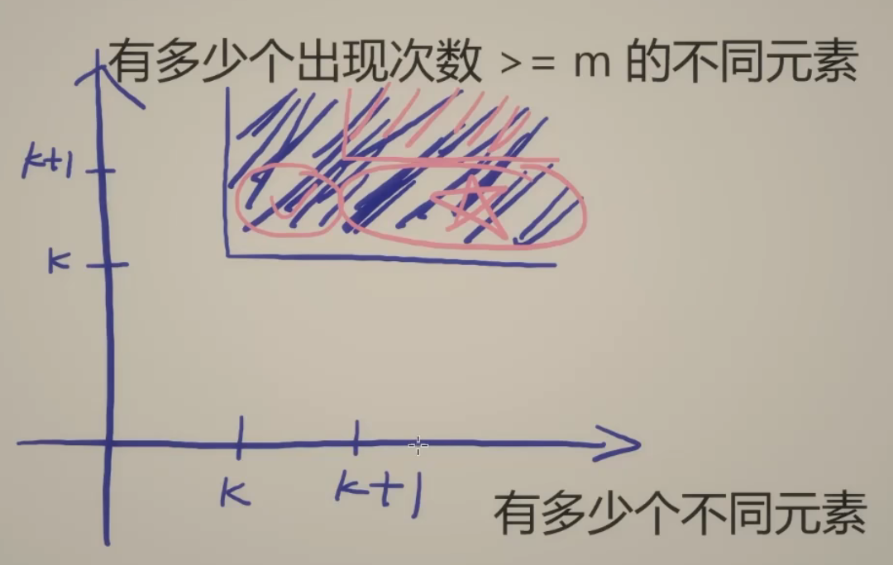
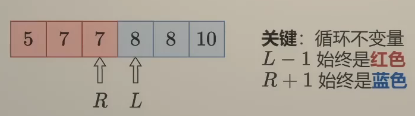
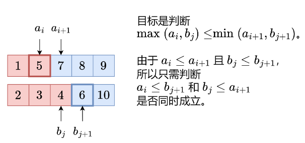

# 哈希表

## 焚诀

什么时候我们要联想到使用哈希表呢？

+ **判断某个元素是否存在**
+ **记录元素出现的次数**
+ **快速查找某个值的位置**
  + 例如某些设计类题型，可以通过哈希表记录元素的位置从而实现$O(1)$的查找性能，比如LRU Cache的节点是用链表串起来的，但又需要快速查找，所以可以建立一个key -> 节点指针的映射关系，先获取节点的指针，再解引用获取节点的值。


## 1.两数之和[简单]*

### 链接

+ [1. 两数之和 - 力扣（LeetCode）](https://leetcode.cn/problems/two-sum/description/)

### 题目

给定一个整数数组 `nums` 和一个整数目标值 `target`，请你在该数组中找出 **和为目标值** *`target`* 的那 **两个** 整数，并返回它们的数组下标。

你可以假设每种输入只会对应一个答案，并且你不能使用两次相同的元素。

你可以按任意顺序返回答案。

### 思路

没学数据结构之前第一次做这个题没做出来 : )。

最朴素的思路就是枚举每个`x`，寻找数组中是否有`target - x`，**当我们使用遍历整个数组的方式寻找 `target - x` 时，需要注意到每一个位于 `x` 之前的元素都已经和 `x` 匹配过，因此不需要再进行匹配。而每一个元素不能被使用两次，所以我们只需要在 `x` 后面的元素中寻找 `target - x`。**很显然时间复杂度是$O(N^2)$。

上面的问题关键点在于在数组中寻找`target - x`是否存在，符合使用哈希表的基本特征。

### 解法

```python
class Solution:
    def twoSum(self, nums: List[int], target: int) -> List[int]:
        map = {}
       
        for i, num in enumerate(nums):
            complement = target - num
            if complement in map:
                return [map[complement], i]
            
            map[num] = i
        
        return [] 
```

时间复杂度：$O(N)$

空间复杂度：$O(N)$

## 242.有效的字母异位词[简单]

### 链接

+ [242. 有效的字母异位词  - 力扣（LeetCode）](https://leetcode.cn/problems/valid-anagram/)

### 题目

给定两个字符串 `s` 和 `t` ，编写一个函数来判断 `t` 是否是 `s` 的 字母异位词。

> 字母异位词是通过重新排列不同单词或短语的字母而形成的单词或短语，并使用所有原字母一次。

### 思路

一个比较简单的思路是对两个字符串排序，然后依次比较每个字符，时间复杂度为$O(N\log N)$。

或者换个思路，两个字符串是字母异位词，等价于两个字符串中字符出现的种类和次数均相等，属于**判断两个哈希表是否相等**。和判断某个元素是否存在略有不同，我们不仅要保证`s`的哈希表中的每个键值对在`t`的哈希表中都存在，还要保证`t`没有多的键值对，即二者的长度是一样的。或者高贵的Python，直接使用`Counter`类即可秒杀。

### 解法

```python
class Solution:
    def isAnagram(self, s: str, t: str) -> bool:
        return Counter(s) == Counter(t)
```

+ 时间复杂度：$O(N)$
+ 空间复杂度：$O(N)$，如果确认字符都是字母，可以使用长为26的数组作为哈希表，空间复杂度就是$O(1)$

## 49.字母异位词分组[中等]

### 链接

+ [49. 字母异位词分组 - 力扣（LeetCode）](https://leetcode.cn/problems/group-anagrams)

### 题目

给你一个字符串数组，请你将 字母异位词 组合在一起。可以按任意顺序返回结果列表。

### 思路

如果刚做完[242.有效的字母异位词](#242.有效的字母异位词[简单])这道题来做这道题，可能还会想到使用`Counter`，但是情况又不同了，如果对每个字符串构造了一个`Counter`，要判断他们是否是一个组的，需要挨个比较其他的`Counter`是否和自己相等，这不又是一个哈希表问题吗？我们要把`Counter`作为第二个哈希表的key，既然如此，不如一开始就排序。

### 解法

```python
class Solution:
    def groupAnagrams(self, strs: List[str]) -> List[List[str]]:
        res = []
        cnt = defaultdict(list)
        for word in strs:
            key = tuple(sorted(word))
            cnt[key].append(word)
        return list(cnt.values())
```

## 128.最长连续序列[中等]

### 链接

+ [128. 最长连续序列 - 力扣（LeetCode）](https://leetcode.cn/problems/longest-consecutive-sequence)

### 题目

给定一个未排序的整数数组 `nums` ，找出数字连续的最长序列（不要求序列元素在原数组中连续）的长度。

请你设计并实现时间复杂度为 `O(n)` 的算法解决此问题。

### 思路

既然要求时间复杂度为$O(N)$，那么就不能先排序再遍历的方式来做了。回归到无序的数组来，假设现在遍历到`x`，我们要求最长序列，自然想要知道数组中`x+1`是否存在？`x+2`是否存在？...如果直到`x+k`不存在了，那么这就是一个长为`k`的连续序列了。回顾这个分析，我们发现问题的关键还是在于**判断某个元素在集合中是否存在**，然后这个集合是输入数组整体，因此我们需要两次遍历，第一次统计数组所有元素是否存在，第二次通过不断取max算出最长连续序列的长度。

### 解法

注意第二次遍历时，遍历对象必须是去重后的元素集合；计算最长连续序列时也必须从序列的第一个元素开始，否则会超时！！！

```python
class Solution:
    def longestConsecutive(self, nums: List[int]) -> int:
        st = set(nums)
        res = 0
        for num in st:
            if num - 1 not in st: # 只有当 num - 1 不在集合中时，才考虑以 num 开头的序列
                k = 1
                while (num + k) in st:
                    k += 1
                res = max(res, k)
        return res
```

+ 时间复杂度：$O(N)$
+ 空间复杂度：$O(N)$

> 小trick：在算法本身不超时的情况下，在开头加入下列Python代码，可以让统计的运行时间变成0，直接击败100%，嘿嘿（前人在这道题偷懒耍滑，被我抓到了吧）
>
> ```python
> import atexit
> atexit.register(lambda: open("display_runtime.txt", "w").write("0"))
> ```

## 41.缺失的第一个正数[困难]

### 链接

+ [41. 缺失的第一个正数 - 力扣（LeetCode）](https://leetcode.cn/problems/first-missing-positive)

### 题目

给你一个未排序的整数数组 `nums` ，请你找出其中没有出现的最小的正整数。

请你实现时间复杂度为 `O(n)` 并且只使用常数级别额外空间的解决方案。

### 思路

如果这个题目不限制常量额外空间，那么就非常简单。把数组中所有的数放入哈希表，然后从1开始依次枚举正整数，判断其是否在哈希表中。时间复杂度和空间复杂度都是$O(N)$。如果这个题不允许修改数组，那么没有满足时间复杂度为$O(N)$且空间复杂度为$O(1)$的算法，感觉像是脑筋急转弯了，亏我还想半天。

所以这道题的核心在于如何利用已有的空间，将数组设计成哈希表的替代品。非常tricky的一点就是——**对于一个长度为 *N* 的数组，其中没有出现的最小正整数只能在 [1,N+1] 中。**这是因为如果[1, N]都出现了，那么答案就是N+1；如果其中有一个没出现，那么答案就是那个数。

由于数组长度恰好也是N，那么每一个位置其实就可以相当于一个哈希桶，用某种特殊的标记来表示这个位置对应的正整数是否在数组中出现过。一个简单的想法就是使用负号来标记，但是原本数组中有可能有负数，为了避免干扰，我们第一次遍历把所有的负数改成N+1（理由前文说了）。然后第二次遍历的时候对于`|x|`位于[1, N]范围的数（取模是因为前面的数可能会修改数组后面的数，如果直接用数组里的值，那么就是一个错误的负数），将数组中第`|x|-1`个元素改成其相反数（注意代码实现中需要将其直接赋值成`-abs`，因为有可能某些数字会重复出现，如果直接乘-1，那么偶数次的操作就抵消了）。第三次遍历就看每个位置的值是否均为负数，如果都是负数，那么答案就是N+1，否则就是第一个正数的位置加1。

### 解法

```python
class Solution:
    def firstMissingPositive(self, nums: List[int]) -> int:
        N = len(nums)
        for i, num in enumerate(nums):
            if num <= 0:
                nums[i] = N + 1
        for i in range(N):
            num = abs(nums[i])
            if num <= N:
                nums[num - 1] = -abs(nums[num - 1])
        for i, num in enumerate(nums):
            if num > 0:
                return i + 1
        return N + 1
```


# 相向双指针

## 焚诀

相向双指针一般是一前一后两个指针，不断往中间靠。

什么时候我们要联想到使用相向双指针呢？

+ **数组有序**
+ **需要找到满足某种条件的两个元素**
+ **字符串处理出现左右端匹配**
+ **使用常量级空间**


## 167.两数之和 II - 输入有序数组[中等]*

### 链接

+ [167. 两数之和 II - 输入有序数组 - 力扣（LeetCode）](https://leetcode.cn/problems/two-sum-ii-input-array-is-sorted/description/)

+ [两数之和 三数之和【基础算法精讲 01】](https://www.bilibili.com/video/BV1bP411c7oJ)

### 题目

给你一个下标从 **1** 开始的整数数组 `numbers` ，该数组已按 **非递减顺序排列** ，请你从数组中找出满足相加之和等于目标数 `target` 的两个数。如果设这两个数分别是 `numbers[index1]` 和 `numbers[index2]` ，则 `1 <= index1 < index2 <= numbers.length` 。

以长度为 2 的整数数组 `[index1, index2]` 的形式返回这两个整数的下标 `index1` 和 `index2`。

你可以假设每个输入 **只对应唯一的答案** ，而且你 **不可以** 重复使用相同的元素。

你所设计的解决方案必须只使用常量级的额外空间。

### 思路

这个题目限定了常量级空间，就不能用哈希表了。**数组是排序的，需要找到满足某种条件的两个元素，使用常量级空间**，这些特征都指向了这道题应该使用双指针。考虑`x + y = target`，那么`x`和`y`必然一大一小，在数组有序时，我们可以极端点，`x`从最小的元素开始，`y`从最大的元素开始，如果二者的和大于`target`，那么我们就减小`y`，如果小于`target`，那么我们就增大`x`。这样前后两个指针会不断向中间逼近，如果相撞了，说明不存在解。

### 解法

```python
class Solution:
    def twoSum(self, numbers: List[int], target: int) -> List[int]:
        left, right = 0, len(numbers) - 1
        
        while left < right:
            total = numbers[left] + numbers[right]
            if total > target:
                right -= 1
            elif total < target:
                left += 1
            else:
                return [left + 1, right + 1]
        
        return []
```

时间复杂度：$O(N)$

空间复杂度：$O(1)$

## 15.三数之和[中等]*

### 链接

+ [15. 三数之和 - 力扣（LeetCode）](https://leetcode.cn/problems/3sum/description/)
+ [两数之和 三数之和【基础算法精讲 01】](https://www.bilibili.com/video/BV1bP411c7oJ)

### 题目

给你一个整数数组 `nums` ，判断是否存在三元组 `[nums[i], nums[j], nums[k]]` 满足 `i != j`、`i != k` 且 `j != k` ，同时还满足 `nums[i] + nums[j] + nums[k] == 0` 。请你返回所有和为 `0` 且不重复的三元组。

**注意：**答案中不可以包含重复的三元组。

### 思路

经验法则：**学会将题目转换成已知问题**。例如对上述公式稍作变形：`nums[i] + nums[j] = -nums[k]`，这不就变成167这道题了吗？所以思路就是排序+双指针。额外需要注意的是，这道题中数组元素可能有重复，答案又要求不能有重复的三元组。在排完序后，对于`[-1, -1, 0, 1]`这么一个例子，如果第一个`-1`和后面的`0`、`1`凑成三元组了，那么我们就跳过第二个`-1`。具体来说，就是**在双指针移动过程中，如果发现下一个元素和上一个元素的值是相同的就跳过**。

### 解法

```python
class Solution:
    def threeSum(self, nums: list[int]) -> list[list[int]]:
        nums.sort()
        n = len(nums)
        res = []
        
        for left in range(n - 2):
            num = nums[left]
            if left > 0 and num == nums[left - 1]:
                continue
            
            mid, right = left + 1, n - 1
            while mid < right:
                total = num + nums[mid] + nums[right]
                if total < 0:
                    mid += 1
                elif total > 0:
                    right -= 1
                else:
                    res.append([num, nums[mid], nums[right]])
                    mid += 1
                    while mid < right and nums[mid] == nums[mid - 1]:
                        mid += 1
                    right -= 1
                    while mid < right and nums[right] == nums[right + 1]:
                        right -= 1
        
        return res
```

+ 时间复杂度：$O(N^2)$
+ 空间复杂度：$O(\log N)$ <- 排序用的栈

### 优化

注意到，对于第一个元素`x`，如果它和它后面**最小**的两个元素之和大于0，那么它与之后任意两个元素之和都会大于0；如果`x`和它后面**最大**的两个元素之和小于0，那么它与它之后任意两个元素之和都会小于0。

```python
class Solution:
    def threeSum(self, nums: list[int]) -> list[list[int]]:
        nums.sort()
        n = len(nums)
        res = []
        
        for left in range(n - 2):
            num = nums[left]
            if left > 0 and num == nums[left - 1]:
                continue
            if num + nums[left + 1] + nums[left + 2] > 0:
                break # 下一个num只会更大,已经没有其他结果了
            if num + nums[n - 2] + nums[n - 1] < 0:
                continue # 现在的num太小了,但是下一个可能够大,所以是continue而不是break
            mid, right = left + 1, n - 1
            while mid < right:
                total = num + nums[mid] + nums[right]
                if total < 0:
                    mid += 1
                elif total > 0:
                    right -= 1
                else:
                    res.append([num, nums[mid], nums[right]])
                    mid += 1
                    while mid < right and nums[mid] == nums[mid - 1]:
                        mid += 1
                    right -= 1
                    while mid < right and nums[right] == nums[right + 1]:
                        right -= 1
        
        return res
```

## 11.盛最多水的容器[中等]*

### 链接

+ [11. 盛最多水的容器 - 力扣（LeetCode）](https://leetcode.cn/problems/container-with-most-water/description/)
+ [盛最多水的容器 接雨水【基础算法精讲 02】](https://www.bilibili.com/video/BV1Qg411q7ia)

### 题目

给定一个长度为 `n` 的整数数组 `height` 。有 `n` 条垂线，第 `i` 条线的两个端点是 `(i, 0)` 和 `(i, height[i])` 。

找出其中的两条线，使得它们与 `x` 轴共同构成的容器可以容纳最多的水。

返回容器可以储存的最大水量。

**说明：**你不能倾斜容器。

**示例 1：**


```
输入：[1,8,6,2,5,4,8,3,7]
输出：49 
解释：图中垂直线代表输入数组 [1,8,6,2,5,4,8,3,7]。在此情况下，容器能够容纳水（表示为蓝色部分）的最大值为 49。
```

### 思路

这道题也符合**需要找到满足某种条件的两个元素**的特征，所以考虑使用双指针。我们随便选择一左一右两个指针，注意到，如果把高的指针往中间挪，首先容器的宽度肯定会变小，同时由于容器高度受限于矮的端点，因此高度不会发生变化，这么操作下来容器的水量只会减小；如果把矮的指针往中间挪，虽然宽度变小了，但是高度存在变高的可能。因此思路就比较清晰了，不断挪动矮的端点，对于产生的所有可能得容量取最大值即可。

### 解法

```python
class Solution:
    def maxArea(self, height: List[int]) -> int:
        left, right = 0, len(height) - 1
        res = 0
        
        while left < right:
            tmp = (right - left) * min(height[left], height[right])
            res = max(res, tmp)
            if height[left] < height[right]:
                left += 1
            else:
                right -= 1
        
        return res 
```

## 42.接雨水[困难]*

### 链接

+ [42. 接雨水 - 力扣（LeetCode）](https://leetcode.cn/problems/trapping-rain-water/description/)
+ [盛最多水的容器 接雨水【基础算法精讲 02】](https://www.bilibili.com/video/BV1Qg411q7ia)

### 题目

给定 `n` 个非负整数表示每个宽度为 `1` 的柱子的高度图，计算按此排列的柱子，下雨之后能接多少雨水。

 

**示例 1：**


```
输入：height = [0,1,0,2,1,0,1,3,2,1,2,1]
输出：6
解释：上面是由数组 [0,1,0,2,1,0,1,3,2,1,2,1] 表示的高度图，在这种情况下，可以接 6 个单位的雨水（蓝色部分表示雨水）。
```

### 思路

我们可以把每个位置看作一个宽度为1的桶，桶左边的高度为左边所有柱子高度的最大值，桶右边的高度为右边所有柱子高度的最大值。因此可以使用前缀最大值和后缀最大值来记录，这个方法官解称为动态规划，但和一般的动态规划感觉又太不一样了。

### 解法

```python
class Solution:
    def trap(self, height: List[int]) -> int:
        n = len(height)
        if n <= 2:
            return 0
        
        prefix_max = [0] * n
        prefix_max[0] = height[0]
        for i in range(1, n):
            prefix_max[i] = max(height[i], prefix_max[i - 1])
        
        suffix_max = [0] * n
        suffix_max[n - 1] = height[n - 1]
        for i in range(n - 2, -1, -1):
            suffix_max[i] = max(height[i], suffix_max[i + 1])
        
        res = 0
        for i in range(n):
            res += min(prefix_max[i], suffix_max[i]) - height[i]
        
        return res
```

+ 时间复杂度：$O(N)$
+ 空间复杂度：$O(N)$

### 优化

像这个题目也是有明显的**两端**特点的，所以可以考虑使用双指针优化空间。现在使用单个变量记录前缀最大值和后缀最大值，然后使用两个指针同时从前后开始遍历，如果前缀最大值比后缀最大值小，那么左指针位置的接水高度就应该由前缀最大值决定（右边缘不可能比左边缘更矮了），而右指针位置的左边缘高度尚不清楚（因为中间可能有更高的柱子），因此我们累加左指针位置的接水容量并且左移左指针；如果前缀最大值比后缀最大值大，那么左指针位置的右边缘高度是不清楚的，但是右指针位置的左边缘高度肯定比右边缘高，后续同理。

```python
class Solution:
    def trap(self, height: List[int]) -> int:
        left, right = 0, len(height) - 1
        prefix_max, suffix_max = 0, 0
        res = 0
        
        while left < right:
            prefix_max = max(prefix_max, height[left])
            suffix_max = max(suffix_max, height[right])
            
            if prefix_max < suffix_max:
                res += prefix_max - height[left]
                left += 1
            else:
                res += suffix_max - height[right]
                right -= 1
        
        return res
```

+ 时间复杂度：$O(N)$
+ 空间复杂度：$O(1)$

## 75.颜色分类[中等]

### 链接

+ [75. 颜色分类 - 力扣（LeetCode）](https://leetcode.cn/problems/sort-colors)

### 题目

给定一个包含红色、白色和蓝色、共 `n` 个元素的数组 `nums` ，**[原地](https://baike.baidu.com/item/原地算法)** 对它们进行排序，使得相同颜色的元素相邻，并按照红色、白色、蓝色顺序排列。

我们使用整数 `0`、 `1` 和 `2` 分别表示红色、白色和蓝色。

必须在不使用库内置的 sort 函数的情况下解决这个问题。

### 思路

由于只有三种颜色，不难想到，只要把0都放到数组前面，2放到数组后面，排序就自动结束了。所以一个指针指向前面用于存放找到的0，一个指针指向后面用于存放找到的2，然后还有一个指针遍历所有的元素（这一点很关键！其实更接近三指针了，如果用双指针，假设有`101`这样的结构，中间的0就遍历不到）

### 解法

```python
class Solution:
    def sortColors(self, nums: List[int]) -> None:
        n = len(nums)
        left, right = 0, n - 1
        i = 0
        while i <= right:
            while i <= right and nums[i] == 2:
                nums[i], nums[right] = nums[right], nums[i]
                right -= 1
            if nums[i] == 0:
                nums[i], nums[left] = nums[left], nums[i]
                left += 1
            i += 1
            
```

+ 时间复杂度：$O(N)$
+ 空间复杂度：$O(1)$

## 31.下一个排列[中等]

### 链接

+ [31. 下一个排列 - 力扣（LeetCode）](https://leetcode.cn/problems/next-permutation)

### 题目

整数数组的一个 **排列** 就是将其所有成员以序列或线性顺序排列。

- 例如，`arr = [1,2,3]` ，以下这些都可以视作 `arr` 的排列：`[1,2,3]`、`[1,3,2]`、`[3,1,2]`、`[2,3,1]` 。

整数数组的 **下一个排列** 是指其整数的下一个字典序更大的排列。更正式地，如果数组的所有排列根据其字典顺序从小到大排列在一个容器中，那么数组的 **下一个排列** 就是在这个有序容器中排在它后面的那个排列。如果不存在下一个更大的排列，那么这个数组必须重排为字典序最小的排列（即，其元素按升序排列）。

- 例如，`arr = [1,2,3]` 的下一个排列是 `[1,3,2]` 。
- 类似地，`arr = [2,3,1]` 的下一个排列是 `[3,1,2]` 。
- 而 `arr = [3,2,1]` 的下一个排列是 `[1,2,3]` ，因为 `[3,2,1]` 不存在一个字典序更大的排列。

给你一个整数数组 `nums` ，找出 `nums` 的下一个排列。

必须**[ 原地 ](https://baike.baidu.com/item/原地算法)**修改，只允许使用额外常数空间。

### 思路

man，what can i say？`nums[i] < nums[i+1]`是我们从右边向左找到的第一个升序对，所以`i+1`右边的子数组肯定是降序的，但是升序的字典序更小，所以步骤3就是把降序的子数组变成降序。

### 解法

```python
class Solution:
    def nextPermutation(self, nums: List[int]) -> None:
        n = len(nums)
        i = n - 2
        # 步骤1：找升序对
        while i >= 0 and nums[i] >= nums[i+1]:
            i -= 1
        if i >= 0:
            # 步骤2：找右边比 nums[i] 大的最小数字
            j = n - 1
            while nums[j] <= nums[i]:
                j -= 1
            nums[i], nums[j] = nums[j], nums[i]
        # 步骤3：反转 i+1 之后的子数组
        left, right = i + 1, n - 1
        while left < right:
            nums[left], nums[right] = nums[right], nums[left]
            left += 1
            right -= 1
```


# 快慢双指针

## 焚诀

快慢双指针一般是一快一慢两个指针，往一个方向走。快指针不停往后走直到找到要处理的元素并处理之后，慢指针再往后走一步。

什么时候我们要联想到使用快慢双指针呢？

+ **数组中高效删除某个元素**
+ **使用常量级空间**


## 283.移动零[简单]

### 链接

+ [283. 移动零 - 力扣（LeetCode）](https://leetcode.cn/problems/move-zeroes)

### 题目

给定一个数组 `nums`，编写一个函数将所有 `0` 移动到数组的末尾，同时保持非零元素的相对顺序。

**请注意** ，必须在不复制数组的情况下原地对数组进行操作。

### 思路

这道题如果一般化，可以联想到**在数组中删除某个元素**的问题。最暴力的做法就是在遍历的过程中，对于每一个要删除的元素，都把后面所有元素往前平移一个位置，这个方法的时间复杂度是$O(N^2)$。

一个优化就是使用快慢双指针，只要快指针的元素不是待删除的元素，就将其赋给慢指针，二者一起往后挪（相当于什么都不做）。如果快指针的元素是待删除的元素，那么快指针会一直往后走，直到碰到有效元素，此时慢指针指向的元素就是待删除元素，通过将快指针的元素赋给慢指针，就覆盖掉了这个待删除元素。

```python
def erase(nums: List[int], x: int) -> None:
    slow = 0
    n = len(nums)
    for fast in range(n):
        if nums[fast] != x:
            nums[slow] = nums[fast]
            slow += 1
```

假设待删除的元素一共有k个，那么最后数组的前n-k的元素就是删除后数组的样子了，后k个元素保持不变，STL的vector.remove用的就是这种方法，最后缩容一下即可。例如

```python
nums = [0,1,0,3,12]
# 删除0之后
nums = [1,3,12,3,12]
```

这个题要求把0放到数组末尾，那么我们只要把上面的覆盖操作改成交换就行了，因为每一次处理时，慢指针指向的就是待删除元素，快指针指向的是下一个有效的元素。

### 解法

```python
class Solution:
    def moveZeroes(self, nums: List[int]) -> None:
        slow = 0
        n = len(nums)
        for fast in range(n):
            if nums[fast] != 0:
                nums[slow], nums[fast] = nums[fast], nums[slow]
                slow += 1
```

+ 时间复杂度：$O(N)$
+ 空间复杂度：$O(1)$

## 287.重复数[中等]

### 链接

+ [287. 寻找重复数 - 力扣（LeetCode）](https://leetcode.cn/problems/find-the-duplicate-number)

### 题目

给定一个包含 `n + 1` 个整数的数组 `nums` ，其数字都在 `[1, n]` 范围内（包括 `1` 和 `n`），可知至少存在一个重复的整数。

假设 `nums` 只有 **一个重复的整数** ，返回 **这个重复的数** 。

你设计的解决方案必须 **不修改** 数组 `nums` 且只用常量级 `O(1)` 的额外空间。

你可以设计一个线性级时间复杂度 `O(n)` 的解决方案吗？

### 思路

找重复数，空间要求$O(1)$，所以不能直接用一个哈希表来统计词频。但是注意到数字都在`[1, n]`范围内，这让我联想到 [41.缺失的第一个正数](#41.缺失的第一个正数[困难]) 这道题，可以把给的数组当哈希表就行，结果**不准修改数组**，所以此路也不通。实在不行，先排序再遍历找重复数，结果进阶要求时间为$O(N)$。好嘛，你干脆直接让我回家等通知得了！

打死我也想不到这道题可以转换成**环形链表找环入口**！首先要把数组建图，`nums[i]=j`，那么就是一条从`i->j`的边，限制`[1, n]`范围其实是这个原因。然后参照 [142.环形链表 II](../链表/fuck链表.md#142.环形链表 II[中等]) 这道题的写法即可。

### 解法

```python
class Solution:
    def findDuplicate(self, nums: List[int]) -> int:
        slow, fast = 0, 0
        while True:
            slow = nums[slow]
            fast = nums[nums[fast]]
            if slow == fast:
                break
        slow = 0 # 从0开始走,再次碰面就在环入口
        while slow != fast:
            slow = nums[slow]
            fast = nums[fast]
        return slow
```

+ 时间复杂度：$O(N)$
+ 空间复杂度：$O(1)$


# 滑动窗口

## 焚诀

滑动窗口本质上就是快慢双指针。

什么时候我们要联想到使用滑动窗口呢？

+ **数组元素为非负数的连续子数组和/积**

+ **连续子数组/子串**
+ **连续区间的最值/和/计数**


## 209.长度最小的子数组[中等]*

### 链接

+ [209. 长度最小的子数组 - 力扣（LeetCode）](https://leetcode.cn/problems/minimum-size-subarray-sum/description/)
+ [滑动窗口【基础算法精讲 03】](https://www.bilibili.com/video/BV1hd4y1r7Gq)

### 题目

给定一个含有 `n` 个正整数的数组和一个正整数 `target` **。**

找出该数组中满足其总和大于等于 `target` 的长度最小的 **子数组** `[numsl, numsl+1, ..., numsr-1, numsr]` ，并返回其长度**。**如果不存在符合条件的子数组，返回 `0` 。

> **子数组** 是数组中连续的 **非空** 元素序列。

### 思路

**数组元素为非负数的连续子数组和**，要想到使用滑动窗口。考虑使用一个滑动窗口来统计窗口内元素的和，由于所有数都是正数，如果和小于`target`，就向右扩展窗口，和就会变大；如果和大于`target`，就不断从左边缩小窗口直至和小于`target`。

### 解法

```python
class Solution:
    def minSubArrayLen(self, target: int, nums: List[int]) -> int:
        n = len(nums)
        left = 0
        res = inf
        sum = 0

        for right in range(n):
            sum += nums[right]
            while sum >= target:
                res = min(res, right - left + 1)
                sum -= nums[left]
                left += 1
        
        return res if res != inf else 0
```

+ 时间复杂度：$O(N)$，虽然有两重循环，但是内层的循环的总次数是$O(N)$次
+ 空间复杂度：$O(1)$

## 713.乘积小于K的子数组[中等]*

### 链接

+ [713. 乘积小于 K 的子数组 - 力扣（LeetCode）](https://leetcode.cn/problems/subarray-product-less-than-k/)
+ [滑动窗口【基础算法精讲 03】](https://www.bilibili.com/video/BV1hd4y1r7Gq)

### 题目

给你一个正整数数组 `nums` 和一个整数 `k` ，请你返回子数组内所有元素的乘积严格小于 `k` 的连续子数组的数目。

### 思路

**数组元素为非负数的连续子数组积**，要想到使用滑动窗口。滑动思路与209题如出一辙，在乘积小于`k`时如何统计子数组的个数呢？考虑`[l, r]`这段区间，如果这个区间的乘积小于`k`，那么右移左端点，`[l+1, r]`的乘积自然也小于`k`，依次类推可以知道以`r`为右端点的连续子数组的个数就是`r-l+1`。

### 解法

```python
class Solution:
    def numSubarrayProductLessThanK(self, nums: List[int], k: int) -> int:
        if k <= 1:
            return 0
        
        left = 0
        res = 0
        prod = 1
        
        for right, num in enumerate(nums):
            prod *= num
            while prod >= k:
                prod //= nums[left]
                left += 1
            res += right - left + 1
        
        return res
```

+ 时间复杂度：$O(N)$
+ 空间复杂度：$O(1)$

## 3.无重复字符的最长子串[中等]*

### 链接

+ [3. 无重复字符的最长子串 - 力扣（LeetCode）](https://leetcode.cn/problems/longest-substring-without-repeating-characters/description/)
+ [滑动窗口【基础算法精讲 03】](https://www.bilibili.com/video/BV1hd4y1r7Gq)

### 题目

给定一个字符串 `s` ，请你找出其中不含有重复字符的 **最长 子串** 的长度。

> **子字符串** 是字符串中连续的 **非空** 字符序列。

### 思路

求**连续子串**，要想到使用滑动窗口。而题目要求不含有重复字符，属于**判断某个元素是否存在**，所以要用到哈希表来记录窗口内的元素。

### 解法

```python
class Solution:
    def lengthOfLongestSubstring(self, s: str) -> int:
        map = [0] * 128  # Since the string contains only ASCII characters
        left = 0
        res = 0
        
        for right, c in enumerate(s):
            map[ord(c)] += 1
            while map[ord(c)] > 1:
                map[ord(s[left])] -= 1
                left += 1
            res = max(res, right - left + 1)
        
        return res
```

+ 时间复杂度：$O(N)$
+ 空间复杂度：$O(128)$/$O(1)$

## 76.最小覆盖子串[困难]

### 链接

+ [76. 最小覆盖子串 - 力扣（LeetCode）](https://leetcode.cn/problems/minimum-window-substring)
+ [两种方法：从 O(52m+n) 到 O(m+n)](https://leetcode.cn/problems/minimum-window-substring/solutions/2713911/liang-chong-fang-fa-cong-o52mn-dao-omnfu-3ezz/)

### 题目

给定两个字符串 `s` 和 `t`，长度分别是 `m` 和 `n`，返回 s 中的 **最短窗口 子串**，使得该子串包含 `t` 中的每一个字符（**包括重复字符**）。如果没有这样的子串，返回空字符串 `""`。

测试用例保证答案唯一。

### 思路

涉及**连续子串**，要想到使用滑动窗口，另外需要判断字符是否存在，要用哈希表。依旧是枚举右端点，如果窗口子串包含`t`了，就一直右移左端点直到不包含为止，在移动过程中因为满足包含关系，所以不停更新最短子串的左右端点。高贵的Python可以直接用`Counter`的重载`>=`来判断包含关系，其他语言可以手写一个辅助函数，遍历所有可能的key（大小写字母），看是否都满足`cnt_s[i]>cnt_t[i]`。

### 解法

```python
class Solution:
    def minWindow(self, s: str, t: str) -> str:
        cnt_s = Counter()
        cnt_t = Counter(t)
        res_left = -1
        res_right = len(s)
        left = 0
        for right, c in enumerate(s):
            cnt_s[c] += 1
            while cnt_s >= cnt_t:
                if right - left < res_right - res_left:
                    res_left, res_right = left, right
                cnt_s[s[left]] -= 1
                left += 1
        return "" if res_left < 0 else s[res_left : res_right + 1]
```

+ 时间复杂度：$O(C|s|+|t|)$，$C$为字符集大小，这里是52。注意窗口左端点 left 只会增加不会减少，left 每增加一次，我们就花费 $O(C)$ 的时间。因为 left 至多增加 $|s|$ 次，所以二重循环的时间复杂度为 $O(C|s|+|t|)$，再算上统计 t 字母出现次数的时间 $O(|t|)$，总的时间复杂度为 $O(C|s|+|t|)$。
+ 空间复杂度：$O(C)$

### 优化

和[438.找到字符串中所有字母异位词](#438.找到字符串中所有字母异位词[中等])的问题类似，我们每次判断包含关系的时间都是$O(|s|)$，可不可以将其优化成$O(1)$呢？

略显复杂，见链接

## 3859.统计包含 K 个不同整数的子数组[困难]

### 链接

+ [3859. 统计包含 K 个不同整数的子数组 - 力扣（LeetCode）](https://leetcode.cn/problems/count-subarrays-with-k-distinct-integers)
+ [恰好型滑动窗口](https://leetcode.cn/problems/count-subarrays-with-k-distinct-integers/solutions/3910806/qia-hao-xing-hua-dong-chuang-kou-pythonj-5mll/)

### 题目

给你一个整数数组 `nums` 和两个整数 `k` 和 `m`。

返回一个整数，表示满足以下条件的 **子数组** 的数量：

- 子数组 **恰好** 包含 `k` 个**不同的** 整数。
- 在子数组中，每个 **不同的** 整数 **至少** 出现 `m` 次。

**子数组** 是数组中一个连续的、**非空** 元素序列。

### ==思路==

**连续子数组**的题目，想到滑动窗口不难，但难在怎么滑。

这个题目对于子数组有一个 **恰好** 的要求这就非常奇怪，一般题目要么是窗口 **越长越符合要求**， 要么是窗口 **越短越符合要求**。

+ 越长越符合要求
  + 移动策略：
    + 右端点不断右移扩张窗口，直到条件满足
    + 左端点不断右移缩小窗口，使条件刚好不成立
  + `while`循环内是**符合要求的最小窗口**，如果`res`是求最小值，那么在`while`循环内收集
  + 把退出循环后窗口左侧的元素加入窗口也是合法的，所以以`right`为右端点的合法子数组数目是`left`
  + 代表题目：[209.长度最小的子数组](#209.长度最小的子数组[中等]*)、[76.最小覆盖子串](#76.最小覆盖子串[困难])

+ 越短越符合要求
  + 移动策略：
    + 右端点不断右移扩张窗口，直到条件不满足
    + 左端点不断右移缩小窗口，使条件刚好成立
  + `while`循环内的窗口不符合要求，退出循环时是**符合要求的最大窗口**
  + 退出循环后继续右移左端点依旧是合法窗口，所以以`right`为端点的合法子数组数目是`right - left + 1`
  + 代表题目：[713.乘积小于K的子数组](#713.乘积小于K的子数组[中等]*)、[3.无重复字符的最长子串](#3.无重复字符的最长子串[中等]*)

从上面我们可以发现，使用滑动窗口时，要么右移左端点时窗口一直是合法的，要么右移右端点时窗口一直是合法的。但这个题，例如`[1,1,2,3,2,3]`，`k=2`，`m=2`，右移右端点我们发现窗口一直是不合法的。所以这道题最tricky的点在于问题转换：

> 问：某班有 10 个人至少 20 岁，3 个人至少 21 岁，那么恰好 20 岁的人有多少个？
>
> 答：「至少 20 岁」可以分成「恰好 20 岁」和「至少 21 岁」，所以「至少 20 岁」的人数减去「至少 21 岁」的人数，就是「恰好 20 岁」的人数，即 10−3=7。
>

根据这个思路，本题可以等价于：

+ 子数组**至少**包含 *k* 个不同整数，且至少有 *k* 个不同整数都至少出现 *m* 次。
+ 子数组**至少**包含 *k*+1 个不同整数，且至少有 *k* 个不同整数都至少出现 *m* 次。（为什么是至少有 *k* 个而不是 *k*+1 个？见下图）

二者相减，所表达的含义就是**恰好**包含 *k* 个不同整数，且至少有 *k* 个不同整数都至少出现 *m* 次。



我们题目要求的搜索空间是图中√部分的区域，如果搜的是(k, k) - (k+1, k+1)，那么会多出来☆的部分，所以下面代码14行`len(cnt)`比较的传入的参数，而`ge_m`是和固定的k比较。

另一个值得注意的就是统计词频，我们没有用哈希表去记录每个词的词频，然后再遍历哈希表看是否每个词的词频都大于等于`m`，这样做的时间复杂度是$O(N)$，很低效。我们可以用一个变量记录词频大于等于`m`的元素个数，这样在累加词频时一旦发现某个词满足条件就加一，减少词频时发现某个词不满足条件了就减一，相当于均摊了遍历的开销。

经过转换，这道题就变成了 **越长越符合要求** 的题目了，在while循环内的窗口都是满足条件的，所以不断右移左端点直到不满足。那么在退出循环的那一刻窗口`[L, R]`是非法的，也就是说`[L-1, R]`、`[L-2, R]`……是合法的，所以`ans`加上`L-1-0+1=L`。

### 解法

```python
class Solution:
    def countSubarrays(self, nums: list[int], k: int, m: int) -> int:
        def calc(distinct_limit: int) -> int:
            cnt = defaultdict(int)
            ge_m = 0  # 窗口中的出现次数 >= m 的元素个数
            ans = left = 0
            for x in nums:
                # 1. 入
                cnt[x] += 1
                if cnt[x] == m:
                    ge_m += 1

                # 2. 出
                while len(cnt) >= distinct_limit and ge_m >= k:
                    out = nums[left]
                    if cnt[out] == m:
                        ge_m -= 1
                    cnt[out] -= 1
                    if cnt[out] == 0:
                        del cnt[out]
                    left += 1

                # 3. 更新答案
                ans += left
            return ans

        return calc(k) - calc(k + 1)
```

+ 时间复杂度：$O(N)$
+ 空间复杂度：$O(N)$

## 438.找到字符串中所有字母异位词[中等]

### 链接

+ [438. 找到字符串中所有字母异位词 - 力扣（LeetCode）](https://leetcode.cn/problems/find-all-anagrams-in-a-string)
+ [两种方法：定长滑窗/不定长滑窗](https://leetcode.cn/problems/find-all-anagrams-in-a-string/solutions/2969498/liang-chong-fang-fa-ding-chang-hua-chuan-14pd/)

### 题目

给定两个字符串 `s` 和 `p`，找到 `s` 中所有 `p` 的 **异位词** 的子串，返回这些子串的起始索引。不考虑答案输出的顺序。

### 思路

涉及**连续子串**，要想到使用滑动窗口，另外需要求异位词，参考[242.有效的字母异位词](#242.有效的字母异位词[简单])，要用哈希表。至于滑动窗口的写法，对于这种有很明显的定长滑动窗口的题目，我喜欢**先创建一个滑动窗口，然后在遍历时直接从窗口的后一个位置开始遍历**。而直接从0开始遍历，需要多次判断窗口是否达到了要求的大小，即使后续达到了定长的大小，也会无效地判断。**在遍历时，先加入右边的新元素，再弹出左边第一个旧元素，再判断**。

### 解法：定长滑窗

```python
class Solution:
    def findAnagrams(self, s: str, p: str) -> List[int]:
        n = len(s)
        res = []
        k = len(p) # 确定滑动窗口大小
        if n < k:
            return res
        cnt_p = Counter(p)
        cnt_s = Counter(s[:k])
        if cnt_s == cnt_p:
            res.append(0)
        for i in range(k, n):
            cnt_s[s[i]] += 1
            cnt_s[s[i-k]] -= 1 # 窗口前一个位置
            if cnt_p == cnt_s:
                res.append(i-k+1) # 窗口第一个元素的位置
        return res
```

### 优化：不定长滑窗

上面的定长滑窗写法，在判断滑窗是否相等时需要每个元素都比一遍，时间复杂度是$O(|p|)$，注意到，如果我们只移动一步，那么下一个滑窗和上一个滑窗其实最多就两个元素是不同的，那中间那些元素又得重比一遍，并不是一个特别优秀的算法。

枚举子串 s ′ 的右端点，**如果发现 s ′ 其中一种字母的出现次数大于 p 的这种字母的出现次数，则右移 s ′ 的左端点（缩小窗口）**。如果发现 s ′ 的长度等于 p 的长度，则说明 s ′ 的每种字母的出现次数，等于 p 的每种字母的出现次数，即 s ′ 是 p 的异位词。（归纳法可以知道s ′ 右端点前面的字母出现次数也是等于p中的出现次数的，且因为二者长度相等，所以不会多字母也不会少字母）

```python
class Solution:
    def findAnagrams(self, s: str, p: str) -> List[int]:
        res = []
        cnt = Counter(p)  # 统计 p 的每种字母的出现次数
        left = 0
        for right, c in enumerate(s):
            cnt[c] -= 1  # 右端点字母进入窗口
            while cnt[c] < 0:  # 字母 c 太多了
                cnt[s[left]] += 1  # 左端点字母离开窗口
                left += 1
            if right - left + 1 == len(p):  # s' 和 p 的每种字母的出现次数都相同（证明见上）
                res.append(left)  # s' 左端点下标加入答案
        return res
```

## 30.串联所有单词的子串[困难]

### 链接

+ [30. 串联所有单词的子串 - 力扣（LeetCode）](https://leetcode.cn/problems/substring-with-concatenation-of-all-words)

### 题目

给定一个字符串 `s` 和一个字符串数组 `words`**。** `words` 中所有字符串 **长度相同**。

 `s` 中的 **串联子串** 是指一个包含 `words` 中所有字符串以任意顺序排列连接起来的子串。

- 例如，如果 `words = ["ab","cd","ef"]`， 那么 `"abcdef"`， `"abefcd"`，`"cdabef"`， `"cdefab"`，`"efabcd"`， 和 `"efcdab"` 都是串联子串。 `"acdbef"` 不是串联子串，因为他不是任何 `words` 排列的连接。

返回所有串联子串在 `s` 中的开始索引。你可以以 **任意顺序** 返回答案。

### 思路

涉及**连续子串**，要想到使用滑动窗口。这道题其实和 [438.找到字符串中所有字母异位词](#438.找到字符串中所有字母异位词[中等]) 很像，所谓的串联子串，不就是字母异位词嘛，不过现在每个字母变成了一个字符串。但这道题也有一点技巧，不然就不是困难题了。题目固定了字符串的长度，所以属于**定长滑窗**题目。

比较朴素的一个思想就是，滑窗大小就是`len(words)*len(words[0])`，例如`s="barfoothefoobarman",words=["foo","bar]`，第一个窗口是`{bar:1,foo:1}`，但是移动一个位置后，窗口内字符串应该是`arfoot`，前一个窗口内的元素就全失效了，应该变成`{arf:1,oot:1}`，所以这种写法会频繁的创建和销毁哈希表，开销很大。

优化的思路也不难想，就是把**每次切进出一个字符**改成**每次只切进出一个单词**，我们把串联子串中的每个小子串当成之前那些滑窗题目中的单个字符，每次窗口切出一个单词，再切入一个单词。然后**外层要遍历多个起点**（从0到`l_w-1`，即每个单词的长度），这样就可以不重复地遍历所有可能的窗口了。

### 解法

```python
class Solution:
    def findSubstring(self, s: str, words: List[str]) -> List[int]:
        n = len(s)
        l_w = len(words[0])
        n_w = len(words)
        w = n_w * l_w
        cnt_words = Counter(words)
        res = []
        for i in range(l_w):
            if i + w > n:
                continue
            cnt_s = Counter()
            # 定长滑窗
            for j in range(n_w):
                cnt_s[s[i + j * l_w : i + (j + 1) * l_w]] += 1
            if cnt_s == cnt_words:
                res.append(i)
            left = i
            for right in range(i + w, n, l_w):
                left_window = s[left: left + l_w]
                right_window = s[right : right + l_w]
                cnt_s[right_window] += 1
                cnt_s[left_window] -= 1
                left += l_w
                if cnt_s[left_window] == 0:
                    cnt_s.pop(left_window)
                if cnt_s == cnt_words:
                    res.append(left)
                
        return res 
```

+ 时间复杂度：$O(N \times l_w)$，$N$是`s`的长度，$l_w$是单个word的长度
+ 空间复杂度：$O(n_w \times l_w)$，$n_w$是words的数量，$l_w$是单个word的长度


# 前缀和

## 焚诀

前缀和是一种预处理技术，通过预先计算并存储数组前 i 个元素的和（或其他累积操作结果），通过$O(N)$的预处理操作，使得可以在$O(1)$时间内查询任意区间的和。

什么时候我们要联想到使用前缀和呢？

+ **频繁查询区间和**
  + 这里频繁指的是要利用前缀和$O(1)$的查找性能，如果就查一两次，那$O(N)$的预处理开销其实就没有均摊多少。如果题目涉及了**多个区间和**就可以用了。
  + `sum(arr[l:r])=prefix[r]-prefix[l]`

+ **静态数组，不涉及元素修改**
  + 如果频繁修改，考虑线段树(Segment Tree)或树状数组(Binary Indexed Tree)

至于后缀和，以及前缀和+后缀和一起使用的题目，参考：

+ [前缀数组和后缀数组 - Thin_time - 博客园](https://www.cnblogs.com/Thin-time/p/18897189)	TODO：还没来得及看


## 560.和为 K 的子数组[中等]

### 链接

+ [560. 和为 K 的子数组 - 力扣（LeetCode）](https://leetcode.cn/problems/subarray-sum-equals-k)

### 题目

给你一个整数数组 `nums` 和一个整数 `k` ，请你统计并返回 *该数组中和为 `k` 的子数组的个数* 。

子数组是数组中元素的连续非空序列。

### 思路

如果看了滑动窗口的焚诀，这里看到求连续子数组的和，肯定会想到使用滑动窗口。但是千万注意，滑动窗口求连续子数组和的前提是**元素非负数**！！！但是这个题目元素可以为负数，就不能使用。滑动窗口的逻辑是“**右边界扩张时，左边界只右移不回退**”，这需要满足**子数组和随窗口扩大而递增，缩小而递减**。

暴力做法是枚举一个右端点，然后倒着遍历所有左端点，看组成的子数组和是否为`k`，时间复杂度为$O(N^2)$。除了最暴力的做法，既然要**求多个子数组和**看是否满足条件，那就要想到试试前缀和，不难想到一个很粗暴的方法，在求出前缀和数组之后，遍历所有的下标对，两两组合就能算出所有子数组的和了。走到这一步，问题就很像[1.两数之和](#1.两数之和[简单])了，在`prefix_sum`数组中看是否有两个元素相减等于某个`k`，因此使用哈希表可以进一步优化，让整个算法变成$O(N)$哩。

### 解法：两次遍历

```python
class Solution:
    def subarraySum(self, nums: List[int], k: int) -> int:
        n = len(nums)
        prefix_sum = [0] * (n + 1)
        for i in range(n):
            prefix_sum[i + 1] = prefix_sum[i] + nums[i]

        cnt = defaultdict(int)
        res = 0
        for x in prefix_sum:
            # x - y = k => y = x - k
            res += cnt[x - k]
            cnt[x] += 1 
        return res
```

### 优化：一次遍历

注意到，我们在遍历前缀和数组的某个元素时，是不会使用这个元素后面的元素的，所以把两个遍历合并也不会影响结果。

```python
class Solution:
    def subarraySum(self, nums: List[int], k: int) -> int:
        cnt = defaultdict(int)
        cnt[0] = 1 # 前缀和为0的元素出现一次
        current_sum = 0
        res = 0
        for num in nums:
            current_sum += num           
            res += cnt[current_sum - k]
            cnt[current_sum] += 1 
        return res
```


## 238.除自身以外数组的乘积[中等]

### 链接

+ [238. 除自身以外数组的乘积 - 力扣（LeetCode）](https://leetcode.cn/problems/product-of-array-except-self)

### 题目

给你一个整数数组 `nums`，返回 数组 `answer` ，其中 `answer[i]` 等于 `nums` 中除 `nums[i]` 之外其余各元素的乘积 。

题目数据 **保证** 数组 `nums`之中任意元素的全部前缀元素和后缀的乘积都在 **32 位** 整数范围内。

请 **不要使用除法，**且在 `O(n)` 时间复杂度内完成此题。

### 思路

非常明显的**前后缀分解**的题目，`pre[i]`表示从`nums[0]`到`nums[i-1]`的乘积，`suf[i]`表示从`nums[n-1]`到`nums[i+1]`的乘积，`answer[i]=pre[i]*suf[i]`。

### 解法

```python
class Solution:
    def productExceptSelf(self, nums: List[int]) -> List[int]:
        n = len(nums)
        pre = [1] * n
        for i in range(1, n):
            pre[i] = pre[i - 1] * nums[i - 1]

        suf = [1] * n
        for i in range(n - 2, -1, -1):
            suf[i] = suf[i + 1] * nums[i + 1]

        return [p * s for p, s in zip(pre, suf)]
```

唯一要注意的就是前后缀数组的大小以及遍历的下标了。一般`pre[i]`代表的都是前`i`个元素的累积操作，如果把长度定为`n`，是没法知道整个数组的累积的，如果把长度设为`n+1`，那么`pre[n]`就是整个数组的累积。这个题不需要整个数组的乘积，所以长度就定为`n`了。

如果正序遍历中下标有`i-1`，那么`range`就要从1开始；倒序遍历中下标有`i+1`，那么`range`就要从`n-2`开始。还有就是前缀和，那么正序累加时用的是前一个的`nums[i-1]`；后缀和同理。

或者酱紫写

```python
class Solution:
    def productExceptSelf(self, nums: List[int]) -> List[int]:
        n = len(nums)
        pre = [1] * n
        for i in range(n - 1):
            pre[i + 1] = pre[i] * nums[i]

        suf = [1] * n
        for i in range(n - 1, 0, -1):
            suf[i - 1] = suf[i] * nums[i]

        return [p * s for p, s in zip(pre, suf)]
```


# 二分查找

## 焚诀

什么时候我们要联想到使用二分查找呢？

+ **数组有序或局部有序**

+ **有序数组查找某个元素**
+ **有序数组查找第一个/最后一个满足条件的元素(lower_bound/upper_bound)**
+ **求比第k大的元素有多少个**
+ **查找元素时间复杂度要求$O(\log N)$**


## 704.二分查找[简单]

### 链接

+ [704. 二分查找 - 力扣（LeetCode）](https://leetcode.cn/problems/binary-search/)

### 题目

给定一个 `n` 个元素有序的（升序）整型数组 `nums` 和一个目标值 `target` ，写一个函数搜索 `nums` 中的 `target`，如果 `target` 存在返回下标，否则返回 `-1`。

你必须编写一个具有 `O(log n)` 时间复杂度的算法。

### 解法1：左闭右闭(一般用这个)

```python
class Solution:
    def search(self, nums: List[int], target: int) -> int:
        left = 0
        right = len(nums) - 1  # 定义target在左闭右闭的区间里，即: [left, right]
        
        while left <= right:  # 当left == right，区间[left, right]依然有效，所以用 <=
            middle = left + ((right - left) // 2)  # 防止溢出 等同于 (left + right) // 2
            if nums[middle] > target:
                right = middle - 1  # target 在左区间，所以 [left, middle - 1]
            elif nums[middle] < target:
                left = middle + 1  # target 在右区间，所以 [middle + 1, right]
            else:  # nums[middle] == target
                return middle  # 数组中找到目标值，直接返回下标
        
        # 未找到目标值
        return -1
```

### 解法2：左闭右开

```python
class Solution:
     def search(self, nums: List[int], target: int) -> int:
        left = 0
        right = len(nums)  # 定义target在左闭右开的区间里，即：[left, right)
        
        while left < right:  # 因为left == right的时候，在[left, right)是无效的空间，所以使用 <
            middle = left + ((right - left) >> 1)  # 使用右移操作代替除法
            if nums[middle] > target:
                right = middle  # target 在左区间，在 [left, middle) 中
            elif nums[middle] < target:
                left = middle + 1  # target 在右区间，在 [middle + 1, right) 中
            else:  # nums[middle] == target
                return middle  # 数组中找到目标值，直接返回下标
        
        # 未找到目标值
        return -1
```

## 34.在排序数组中查找元素的第一个和最后一个位置[中等]*

### 链接

+ [34. 在排序数组中查找元素的第一个和最后一个位置 - 力扣（LeetCode）](https://leetcode.cn/problems/find-first-and-last-position-of-element-in-sorted-array/)
+ [二分查找 红蓝染色法【基础算法精讲 04】](https://www.bilibili.com/video/BV1AP41137w7)

### 题目

给你一个按照非递减顺序排列的整数数组 `nums`，和一个目标值 `target`。请你找出给定目标值在数组中的开始位置和结束位置。

如果数组中不存在目标值 `target`，返回 `[-1, -1]`。

你必须设计并实现时间复杂度为 `O(log n)` 的算法解决此问题。

### 思路

我们只考虑**闭区间**的情况`[L, R]`（其他写法见链接），对于一个数，判断其是否$\ge$ `target`，**红色代表false，蓝色代表true**。如果`M`是红色，那么`[L, M]`都是红色，剩余不确定的区间为`[M+1, R]`，说明`L-1`一定是红色；如果`M`是蓝色，那么`[M, R]`都是蓝色，剩余不确定区间为`[L, M-1]`，说明`R+1`一定是蓝色。



最终算法停下来时，L肯定在R右边一格，`R+1=L`就是我们的答案。如果元素不存在（在上面例如target=11），那么就会返回数组长度。

这道题和704题的区别在于，数组里可能有重复元素，我们要找第一个满足条件的元素的位置，而704题的元素是不重复的，我们要精确找到目标元素。而找第一个满足条件的元素属于$\ge$的问题，实际上还可能有$\textgreater$、$\le$、$\textless$三种情况，而 这三种与$\ge$是可以互相转换的。

+ $\textgreater x \leftrightarrow \ge x + 1$
+ $\textless x \leftrightarrow (\ge x) - 1$（找最后一个满足条件的元素）
+ $\le x \leftrightarrow (\textgreater x) - 1$（找最后一个满足条件的元素）

我们这道题要找的就是$\ge x$第一个位置和$\le x$的最后一个位置，即`lowerbound(x)`和`upperbound(x)`/`lowerbound(x + 1) - 1`

### 解法

```python
class Solution:
    def lower_bound(self, nums: List[int], target: int) -> int:
        # 在nums中找到第一个>=target的位置
        left, right = 0, len(nums) - 1
        
        while left <= right:
            mid = left + (right - left) // 2
            if nums[mid] >= target: # 更新前[mid, right]为蓝色,检查左边
                right = mid - 1
            else: 
                left = mid + 1
        
        return left

    def searchRange(self, nums: List[int], target: int) -> List[int]:
        start = self.lower_bound(nums, target)
        
        if start == len(nums) or nums[start] != target:
            return [-1, -1]
        
        end = self.lower_bound(nums, target + 1) - 1
        return [start, end]
```

+ 时间复杂度：$O(\log N)$
+ 空间复杂度：$O(1)$

## 162.寻找峰值[中等]*

### 链接

+ [162. 寻找峰值 - 力扣（LeetCode）](https://leetcode.cn/problems/find-peak-element/description/)
+ [数组峰值 搜索旋转排序数组【基础算法精讲 05】](https://www.bilibili.com/video/BV1QK411d76w)

### 题目

峰值元素是指其值严格大于左右相邻值的元素。

给你一个整数数组 `nums`，找到峰值元素并返回其索引。数组可能包含多个峰值，在这种情况下，返回 **任何一个峰值** 所在位置即可。

你可以假设 `nums[-1] = nums[n] = -∞` 。

你必须实现时间复杂度为 `O(log n)` 的算法来解决此问题。

### 思路

最简单的思路就是寻找最大值，不做赘述。实际上我们只需要求极大值即可，也就是说可以顺序遍历，如果下一个元素比上一个元素大，就继续往后遍历，如果下一个元素比上一个元素小，那么上一个元素就是极大值了，不过这两种算法的时间复杂度都是$O(N)$。

**查找元素时间复杂度要求$O(\log N)$**，要想到使用二分查找。定义搜索区间为`[L, R]`，**红色代表目标峰顶左侧**，**蓝色代表目标峰顶及其右侧**，最后一个元素必然是蓝色。如果`nums[M] < nums[M + 1]`，说明从`M`往右走是在上坡，所以`[M + 1, R]`内会有峰；如果`nums[M] > nums[M + 1]`，说明从`M`往右走是在下坡，所以`[L, M - 1]`内会有峰。根据循环不变量，最终答案为`L=R+1`。

### 解法

```python
class Solution:
    def findPeakElement(self, nums: List[int]) -> int:
        left, right = 0, len(nums) - 2
        
        while left <= right:
            mid = left + (right - left) // 2
            if nums[mid] > nums[mid + 1]:
                right = mid - 1
            else:
                left = mid + 1
        
        return left
```

+ 时间复杂度：$O(\log N)$
+ 空间复杂度：$O(1)$

## 153.寻找旋转排序数组中的最小值[中等]*

### 链接

+ [153. 寻找旋转排序数组中的最小值 - 力扣（LeetCode）](https://leetcode.cn/problems/find-minimum-in-rotated-sorted-array/description/)
+ [数组峰值 搜索旋转排序数组【基础算法精讲 05】](https://www.bilibili.com/video/BV1QK411d76w)

### 题目

已知一个长度为 `n` 的数组，预先按照升序排列，经由 `1` 到 `n` 次 **旋转** 后，得到输入数组。例如，原数组 `nums = [0,1,2,4,5,6,7]` 在变化后可能得到：

- 若旋转 `4` 次，则可以得到 `[4,5,6,7,0,1,2]`
- 若旋转 `7` 次，则可以得到 `[0,1,2,4,5,6,7]`

注意，数组 `[a[0], a[1], a[2], ..., a[n-1]]` **旋转一次** 的结果为数组 `[a[n-1], a[0], a[1], a[2], ..., a[n-2]]` 。

给你一个元素值 **互不相同** 的数组 `nums` ，它原来是一个升序排列的数组，并按上述情形进行了多次旋转。请你找出并返回数组中的 **最小元素** 。

你必须设计一个时间复杂度为 `O(log n)` 的算法解决此问题。

### 思路

**数组局部有序**、**查找元素要求时间复杂度$O(\log N)$**，要想到使用二分查找。定义搜索区间为`[L, R]`，**红色代表最小值左侧**，**蓝色代表最小值及其右侧**，最后一个元素要么是最小值，要么在最小值右侧，所以必然是蓝色。因此我们想找最小值，也是和最后一个元素比大小。如果`nums[M] < nums[-1]`，说明`[M, -1]`是递增的，那么最小值肯定在`[L, M - 1]`内；如果`nums[M] > nums[-1]`，说明`[M, -1]`之间有一个转折，最小值在`[M + 1, -1]`内。根据循环不变量，最终答案为`L=R+1`。

### 解法

```python
class Solution:
    def findMin(self, nums: List[int]) -> int:
        left, right = 0, len(nums) - 2
        
        while left <= right:
            mid = left + (right - left) // 2
            if nums[mid] < nums[-1]:
                right = mid - 1
            else:
                left = mid + 1
        
        return nums[left]
```

+ 时间复杂度：$O(\log N)$
+ 空间复杂度：$O(1)$

## 33.搜索旋转排序数组[中等]*

### 链接

+ [33. 搜索旋转排序数组 - 力扣（LeetCode）](https://leetcode.cn/problems/search-in-rotated-sorted-array/)
+ [数组峰值 搜索旋转排序数组【基础算法精讲 05】](https://www.bilibili.com/video/BV1QK411d76w)

### 题目

整数数组 `nums` 按升序排列，数组中的值 **互不相同** 。

在传递给函数之前，`nums` 在预先未知的某个下标 `k`（`0 <= k < nums.length`）上进行了 **向左旋转**，使数组变为 `[nums[k], nums[k+1], ..., nums[n-1], nums[0], nums[1], ..., nums[k-1]]`（下标 **从 0 开始** 计数）。例如， `[0,1,2,4,5,6,7]` 下标 `3` 上向左旋转后可能变为 `[4,5,6,7,0,1,2]` 。

给你 **旋转后** 的数组 `nums` 和一个整数 `target` ，如果 `nums` 中存在这个目标值 `target` ，则返回它的下标，否则返回 `-1` 。

你必须设计一个时间复杂度为 `O(log n)` 的算法解决此问题。

### 思路

**数组局部有序**，**查找元素要求时间复杂度$O(\log N)$**符合使用二分查找的特征。与普通的二分查找不同的是，这里数组是局部有序，而非全局有序，如果`nums[M] > target`，我们是没法确定到底是往左搜还是往右搜的，但是参照153题的思路，我们再比较一下和最后一个元素的大小（第一个元素也可以）。如果`nums[M] > nums[-1]`，说明`[M, -1]`这段区间是有转折的，这部分的值要么大于`nums[M]`，要么小于`nums[-1]`，接下里我们只需要根据`nums[M]`、`nums[-1]`、`target`的大小关系即可确定`target`的可能位置了；如果`nums[M] < nums[-1]`，说明`[M, -1]`这段区间的值大于`nums[M]`小于`nums[-1]`。为了简化代码复杂度，**红色代表`target`左侧**，**蓝色代表`targget`及其右侧**，我们不直接分类所有情况来决定到底是往左搜还是往右搜，我们抽象一个`is_blue`函数来判断所有往左搜的情况。（`M`为蓝色了，那么`[M, R]`均为蓝色，下一个要判断的区间在`[L, M - 1]`）

### 解法

```python
class Solution:
    def search(self, nums: List[int], target: int) -> int:
        n = len(nums)

        def is_blue(i):
            end = nums[-1]
            if nums[i] > end:
                return target > end and nums[i] >= target
            else:
                return target > end or nums[i] >= target

        left, right = 0, n - 1

        while left <= right:
            mid = left + (right - left) // 2
            if is_blue(mid):
                right = mid - 1
            else:
                left = mid + 1

        if left == n or nums[left] != target:
            return -1
        return left
```

+ 时间复杂度：$O(\log N)$
+ 空间复杂度：$O(1)$

## 3759. 统计合格元素的数目[中等]

### 链接

+ [3759. 统计合格元素的数目 - 力扣（LeetCode）](https://leetcode.cn/problems/count-elements-with-at-least-k-greater-values/description/)

### 题目

给你一个长度为 `n` 的整数数组 `nums` 和一个整数 `k`。

如果数组 `nums` 中的某个元素满足以下条件，则称其为 **合格元素**：存在 **至少** `k` 个元素 **严格大于** 它。

返回一个整数，表示数组 `nums` 中合格元素的总数。

### 思路

所谓合格元素，其实比第k大的元素还要小的元素。如果这道题是求第k大的元素是谁，那么用小顶堆（或者原地建堆的大顶堆）是更好的，但这里需要求元素的数量（无论是**求第k大的元素有多少个，还是比它小的元素有多少个**），那么就要回归到传统的排序+二分查找了。排完序后，第k大的元素就位于`nums[-k]`的位置，但是因为数组可能有重复元素，所以不能通过计算位置的方式来求解。使用`lowerbound`来找出`nums[-k]`第一次出现的位置，比这个位置的元素还小的元素就是合格元素（关键：比`nums[-k]`这个元素要小的元素，而不是`[0,-k]`这个范围内所有的元素，因为`nums[-k-1]`可能和`nums[-k]`是一样的）。

| 需求                       | 写法                     |
| -------------------------- | ------------------------ |
| $\textless$x 的元素个数    | lowerBound(nums,x)       |
| $\le$x 的元素个数          | lowerBound(nums,x+1)     |
| $\ge$x 的元素个数          | n−lowerBound(nums,x)     |
| $\textgreater$x 的元素个数 | n−lowerBound(nums,*x*+1) |

### 解法

```python
class Solution:
    def countElements(self, nums: List[int], k: int) -> int:
        n = len(nums)
        if k == 0:
            return n
        nums.sort()
        return bisect_left(nums, nums[-k])
```

+ 时间复杂度：$O(N\log N)$
+ 空间复杂度：$O(\log N)$，栈开销

## 4.寻找两个正序数组的中位数[困难]

### 链接

+ [4. 寻找两个正序数组的中位数 - 力扣（LeetCode）](https://leetcode.cn/problems/median-of-two-sorted-arrays)
+ [【图解】循序渐进：从双指针到二分](https://leetcode.cn/problems/median-of-two-sorted-arrays/solutions/2950686/tu-jie-xun-xu-jian-jin-cong-shuang-zhi-z-p2gd)

### 题目

给定两个大小分别为 `m` 和 `n` 的正序（从小到大）数组 `nums1` 和 `nums2`。请你找出并返回这两个正序数组的 **中位数** 。

算法的时间复杂度应该为 `O(log (m+n))` 。

### 思路

这道题最暴力的做法，就是归并两个有序数组，然后取中位数即可，时间复杂度为$O(M+N)$，空间复杂度为$O(M+N)$。而题目要求$O(\log(M+N))$，不难想到用二分进行优化。那么该怎么二分呢？

不如从暴力做法入手，本质上是均分数组，把数组分成两半。例如`[1,5,7,8,9]`和`[2,3,4,6,10]`，那么划分后`[1,2,3,4,*5*]`和`[*6*,7,8,9,10]`，那么中位数就是**前半部分的最大值**和**后半部分的最小值**的平均值。那么可以在两个数组枚举双指针`i`和`j`，表示第一个数组划分给前半部分`i`个元素，第二个数组划分给后半部分`j`个元素（写法和链接的题解不一样哦）。对于所有满足`i+j=(m+n+1)/2`（+1是为了兼容奇数）的划分，看是否满足**前半部分的最大值$\le$后半部分的最小值**，这个例子的话`i=2`、`j=3`，前半部分数组为`[1,5|2,3,4]`，后半部分数组为`[7,8,9|6,10]`。

记题目给的两个数组分别为 $a$ 和 $b$，$i$ 从 $a$ 的前面往后走，$j$ 从 $b$ 的后面往前走，由于两个数组都是递增的，$a_i$会比它左边的元素都大，那么从 $a$ 中选给前半部分的最大值就是当前遍历到的 $a_{i-1}$，$b_{j-1}$ 就是从 $b$ 中选给前半部分的最大值，那么前半部分的最大值就是二者之间的最大值。那么目标就是找到 $\max(a_{i-1},b_{j-1})\le \min(a_{i}, b_{j})$。

我们约定 $a$ 的长度 $m$ 要小于 $b$ 的长度 $n$（不满足就交换）

+ 如果 $m+n$ 为偶数，中位数为 $\max(a_{i-1}, b_{j-1})$ 和 $\min(a_{i},b_{j})$ 的平均值。

+ 如果 $m+n$ 为奇数，中位数为 $\max(a_{i-1}, b_{j-1})$



> 上图来自灵神题解，他那里增加了哨兵节点，所以索引从1开始不会有问题，所以$a_1$代表数组的第一个元素$nums[0]$。但是使用哨兵会导致空间复杂度变成$O(M+N)$，了解二分思想后，可以一步到位。

临界点就是 $a_{i-1} \le b_{j}$和 $b_{j-1} \le a_{i}$，并且这个临界点唯一。我们可以用双指针枚举遍历整个数组（时间为$O(M+N)$），但实际上只有临界点`i`才是我们需要的，另外由于**数组有序**，所以我们可以用二分查找来优化这个过程。注意在**闭区间写法中如果是搜索`>=x`，那么是两条分支；而如果是搜索`=x`，那么会有三条分支**。（开区间可以两条分支）

### 解法

```python
class Solution:
    def findMedianSortedArrays(self, nums1: List[int], nums2: List[int]) -> float:
        if len(nums1) > len(nums2):
            nums1, nums2 = nums2, nums1

        m, n = len(nums1), len(nums2)
        left, right = 0, m

        while left <= right:
            i = (left + right) // 2
            j = (m + n + 1) // 2 - i

            # 临界点: nums1_left <= nums2_right and nums2_left <= nums1_right
            nums1_left = float('-inf') if i == 0 else nums1[i - 1]
            nums1_right = float('inf') if i == m else nums1[i]
            nums2_left = float('-inf') if j == 0 else nums2[j - 1]
            nums2_right = float('inf') if j == n else nums2[j]

            if nums1_left > nums2_right:  # i 偏右，需要左移
                right = i - 1
            elif nums2_left > nums1_right:  # i 偏左，需要右移
                left = i + 1
            else:  # 找到正确分割
                max_left = max(nums1_left, nums2_left)
                min_right = min(nums1_right, nums2_right)
                return max_left if (m + n) % 2 == 1 else (max_left + min_right) / 2
```

+ 时间复杂度：$O(\log(\min(M, N)))$，在短的数组上二分
+ 空间复杂度：$O(1)$


# 堆

## 焚诀

什么时候我们要联想到使用堆呢？

+ **实时获取最大值或最小值**
+ **归并多个数据流**（LSM-Tree的compaction就是这个应用）
+ **找Top-N问题**

C++的`priority_queue`默认是大顶堆，使用`priority_queue<int, vector<int>, greater<int>>`可得到小顶堆。

python轻量级使用可以结合列表和`heapq`工具，或者使用线程安全的`PriorityQueue`类（默认都是小顶堆）


## 215. 数组中的第K个最大元素[中等]

### 链接

+ [215. 数组中的第K个最大元素 - 力扣（LeetCode）](https://leetcode.cn/problems/kth-largest-element-in-an-array)

### 题目

给定整数数组 `nums` 和整数 `k`，请返回数组中第 `k` 个最大的元素。

请注意，你需要找的是数组排序后的第 `k` 个最大的元素，而不是第 `k` 个不同的元素。

### 思路

这道题虽然是用堆解决的经典题目，但考察核心其实是**快速选择**算法。

### 解法1：排序

直接排序，然后取倒数第k个元素。

```c++
class Solution {
public:
    int findKthLargest(vector<int>& nums, int k) {
        sort(nums.begin(), nums.end());
        return nums[nums.size() - k];
    }
};
```

+ 时间复杂度：$O(N\log N)$
+ 空间复杂度：$O(\log N)$，栈开销

### 解法2：大顶堆

原地建一个**大顶堆**，然后再pop k - 1 次去掉前 k - 1 大的元素，然后堆顶就是第 k 大的元素。原地建堆的时间复杂度为$O(N)$，pop的时间复杂度为$O(\log N)$，因此总的时间复杂度为$O(N + k\log N)=O(N\log N)$（因为k < N）

```c++
class Solution {
public:
    int findKthLargest(vector<int>& nums, int k) {
        priority_queue<int> maxHeap(nums.begin(), nums.end());
        while(--k > 0){
            maxHeap.pop();
        }
        return maxHeap.top();
    }
};
```

+ 时间复杂度：$O(N+k\log N)=O(N\log N)$
+ 空间复杂度：$O(N)$

### 解法3：小顶堆

使用一个大小为 k 的**小顶堆**，**保留当前遇到的最大的 k 个元素**，每次新元素进来时，只有比小顶堆里最小的元素更大才换进去。

```c++
class Solution {
public:
    int findKthLargest(vector<int>& nums, int k) {
        priority_queue<int, vector<int>, greater<int>> minHeap; 
        for (auto& num : nums) {
            minHeap.push(num);
            if (minHeap.size() > k) minHeap.pop();
        }
        return minHeap.top();
    }
};
```

或者这样写，可能逻辑更加清楚一点。

```c++
class Solution {
public:
    int findKthLargest(vector<int>& nums, int k) {
        priority_queue<int, vector<int>, greater<int>> minHeap; 
        for (auto& num : nums) {
            if (minHeap.size() < k) minHeap.push(num);
            else if(num > minHeap.top()){
                minHeap.pop();
                minHeap.push(num);
            }
            // num <= minHeap.top() continue
        }
        return minHeap.top();
    }
};
```

+ 时间复杂度：$O(N\log k)$

+ 空间复杂度：$O(k)$

### 解法4：快速选择

ADS课都教过，作为算法题，就记住快选就行了，还有最坏时间复杂度也是$O(N)$的线性选择（把子数组的中位数的中位数作为划分依据）。

和快速排序的原理差不多，首先选取一个基准数，在划分后，比基准数小的都在它左边，比基准数大的都在它右边，如果某次划分后基准数的下标恰好为 k - 1，那么它就是第 k 大的元素。

如果它的下标比 k - 1 小，那么就递归右边，否则递归左边。（**快排需要两边都递归，快选只要递归一边！**）

```c++
class Solution {
public:
    int quickselect(vector<int> &nums, int l, int r, int k) {
        if (l == r)
            return nums[k];
        int partition = nums[l], i = l - 1, j = r + 1;
        while (i < j) {
            do i++; while (nums[i] < partition);
            do j--; while (nums[j] > partition);
            if (i < j)
                swap(nums[i], nums[j]);
        }
        if (k <= j) return quickselect(nums, l, j, k);
        else return quickselect(nums, j + 1, r, k);
    }

    int findKthLargest(vector<int> &nums, int k) {
        int n = nums.size();
        return quickselect(nums, 0, n - 1, n - k);
    }
};
```

+ 时间复杂度：$O(N)$
+ 空间复杂度：$O(\log N)$，栈开销

注意如果用下面的写法会超时，主要是因为测试用例中有一些case，数组中间会有非常多和pivot一样的元素，会导致`i`或者`j`不断往数组两侧逼近，导致每次递归去掉的部分很少。

```c++
while(i < j && nums[j] >= pivot) --j;
nums[i] = nums[j];
while(i < j && nums[i] <= pivot) ++i;
nums[j] = nums[i]; 
```

或者牺牲一点空间，就有更易读的python版本。

```python
class Solution:
    def findKthLargest(self, nums: List[int], k: int) -> int:
        def quick_select(nums, k):
            # 随机选择基准数
            pivot = random.choice(nums)
            big, equal, small = [], [], []
            # 将大于、小于、等于 pivot 的元素划分至 big, small, equal 中
            for num in nums:
                if num > pivot:
                    big.append(num)
                elif num < pivot:
                    small.append(num)
                else:
                    equal.append(num)
            if k <= len(big):
                # 第 k 大元素在 big 中，递归划分
                return quick_select(big, k)
            if len(nums) - len(small) < k:
                # 第 k 大元素在 small 中，递归划分
                return quick_select(small, k - len(nums) + len(small))
            # 第 k 大元素在 equal 中，直接返回 pivot
            return pivot
        
        return quick_select(nums, k)
```

## 23.合并 K 个升序链表[困难]

### 链接

+ [23. 合并 K 个升序链表 - 力扣（LeetCode）](https://leetcode.cn/problems/merge-k-sorted-lists)

### 题目

给你一个链表数组，每个链表都已经按升序排列。

请你将所有链表合并到一个升序链表中，返回合并后的链表。

**示例 1：**

```
输入：lists = [[1,4,5],[1,3,4],[2,6]]
输出：[1,1,2,3,4,4,5,6]
解释：链表数组如下：
[
  1->4->5,
  1->3->4,
  2->6
]
将它们合并到一个有序链表中得到。
1->1->2->3->4->4->5->6
```

### 思路

类似于LSM-Tree中compaction的操作，用一个小顶堆维护每个子数组中的最小值，每次从中取出这些最小值中的最小值（对应全局最小），然后把对应的子数组中下一个元素放到小顶堆中，如此往复。（小顶堆大小始终小于等于子数组的数量）

### 解法

`priority_queue`默认的比较器是`less<T>`，所以我们要重载`<`运算符，或者定义时用`priority_queue<poi, vector<poi>, cmppoi>`，其中`cmppoi`是自定义的一个比较器重载函数调用运算符 `operator()`。

**小顶堆的话比较器是左大于右，大顶堆是左小于右**（**右边的元素往堆顶冒**）。**排序算法的比较器是升序是左小于右，降序是左大于右**（**右边的元素往后走**）。

```c++
struct poi{
    int val;
    ListNode* ptr;
    bool operator<(const poi& rhs) const{ // 小顶堆
        return val > rhs.val;
    }
};

class Solution {
public:
    ListNode* mergeKLists(vector<ListNode*>& lists) {
        priority_queue<poi> pq;
        for(auto& node : lists){
            if(node) pq.push({node->val, node});
        }
        ListNode head;
        ListNode* tail = &head;
        while(!pq.empty()){
            auto node = pq.top(); pq.pop();
            tail->next = node.ptr;
            tail = tail->next;
            if(node.ptr->next) pq.push({node.ptr->next->val, node.ptr->next});
        }
        return head.next;
    }
};
```

+ 时间复杂度：$O(kn \log k)$

+ 空间复杂度：$O(k)$

## 347.前 K 个高频元素[中等]

### 链接

+ [347. 前 K 个高频元素 - 力扣（LeetCode）](https://leetcode.cn/problems/top-k-frequent-elements)

### 题目

给你一个整数数组 `nums` 和一个整数 `k` ，请你返回其中出现频率前 `k` 高的元素。你可以按 **任意顺序** 返回答案。

### 思路

统计词频用哈希表，求前 k 高元素用堆，小顶堆/大顶堆均可，参考[215. 数组中的第K个最大元素](#215. 数组中的第K个最大元素[中等])，这里用小顶堆维护最大的 k 个元素，最后只要把元素全pop掉就行了。

### 解法

```c++
struct cmp{
    bool operator()(pair<int, int>&lhs, pair<int, int>&rhs){
        return lhs.second > rhs.second;
    }
};

class Solution {
public:
    vector<int> topKFrequent(vector<int>& nums, int k) {
        unordered_map<int, int> cnt;
        for(auto& num : nums){
            cnt[num]++;
        }
        priority_queue<pair<int, int>, vector<pair<int, int>>, cmp> minHeap; // 小顶堆
        for(auto& pair : cnt){
            minHeap.push(pair);
            if(minHeap.size() > k) minHeap.pop();
        }
        vector<int> res;
        while(!minHeap.empty()){
            auto p = minHeap.top(); minHeap.pop();
            res.push_back(p.first);
        }
        return res;
    }
};
```

+ 时间复杂度：$O(N\log k)$
+ 空间复杂度：$O(N)$

## 295.数据流的中位数[困难]

### 链接

+ [295. 数据流的中位数 - 力扣（LeetCode）](https://leetcode.cn/problems/find-median-from-data-stream)

### 题目

**中位数**是有序整数列表中的中间值。如果列表的大小是偶数，则没有中间值，中位数是两个中间值的平均值。

- 例如 `arr = [2,3,4]` 的中位数是 `3` 。
- 例如 `arr = [2,3]` 的中位数是 `(2 + 3) / 2 = 2.5` 。

实现 MedianFinder 类:

- `MedianFinder()` 初始化 `MedianFinder` 对象。
- `void addNum(int num)` 将数据流中的整数 `num` 添加到数据结构中。
- `double findMedian()` 返回到目前为止所有元素的中位数。与实际答案相差 `10-5` 以内的答案将被接受。

### 思路

使用两个堆，一个大顶堆一个小顶堆。**大顶堆维护比中位数小的元素，小顶堆维护比中位数大的元素**，大顶堆的堆头是最大的小元素，小顶堆的堆头是最小的大元素，那么中位数要么是二者其中一个（我们这里选择大顶堆堆顶），要么是二者的平均值。

### 解法1：堆

```c++
class MedianFinder {
    priority_queue<int, vector<int>, less<int>> maxHeap;
    priority_queue<int, vector<int>, greater<int>> minHeap;
public:
    MedianFinder() {}
    
    void addNum(int num) {
        if(maxHeap.empty() || num <= maxHeap.top()){
            maxHeap.push(num);
            if(maxHeap.size() > minHeap.size() + 1){
                minHeap.push(maxHeap.top());
                maxHeap.pop();
            }
        }else{
            minHeap.push(num);
            if(minHeap.size() > maxHeap.size()){
                maxHeap.push(minHeap.top());
                minHeap.pop();
            } 
        }
    }
    
    double findMedian() {
        if(maxHeap.size() > minHeap.size()){
            return maxHeap.top();
        }else{
            return (minHeap.top() + maxHeap.top()) / 2.0;
        }
    }
};
```

+ 时间复杂度：
  + `addNum`：$O(\log N)$
  + `findMedian`：$O(1)$
+ 空间复杂度：$O(N)$

### 解法2：有序集合+双指针

使用`multiset`维护一个有序集合，然后用`left`和`right`指向中间的元素，每次新添加元素时，根据新元素和中间元素的大小关系调整指针位置。特别注意的是，**对于重复的key，`multiset`会将其插入到已有等值元素的末尾**。以`[1,2]`为例，再插入一个`1`，变成`[1(old),1(new),2]`，那么`left`指向`1(old)`，`right`指向`2`，二者没有相邻了，所以要`left=right`。同样的理由，`num >= *right`只能换成`num < *left`，不能写成`num > *right`或`num <= *left`。

```c++
class MedianFinder {
    multiset<int> nums;
    multiset<int>::iterator left, right;
public:
    MedianFinder() {}
    
    void addNum(int num) {
        const size_t n = nums.size();
        nums.insert(num);
        
        if(!n){
            left = right = nums.begin();
        }else if(n & 1){ // 插入前是奇数(left和right指向同一个位置)
            if(num >= *right){
                right++;
            }else{
                left--;
            }
        }else{ // 插入前是偶数(left和right指向中间两个位置)
            if(num > *left && num < *right){ // 刚好在left、right中间
                left++;
                right--;
            }else if(num >= *right){
                left++;
            }else{
                right--;
                left = right; // 关键!对于重复的key,multiset会放到后面,所以left和right不一定相邻了
            }
        }
    }
    
    double findMedian() {
        return (*left + *right) / 2.0;
    }
};
```

+ 时间复杂度：
  + `addNum`：$O(\log N)$
  + `findMedian`：$O(1)$
+ 空间复杂度：$O(N)$


# 单调栈

## 焚诀

单调栈是一种满足单调性的栈结构，主要用来解决“ **下(上)一个更大(小)元素** ”的问题

+ 单调递增栈：栈底到栈顶元素依次递增（适用于求解“左边/右边第一个比当前小的元素”）。
+ 单调递减栈：栈底到栈顶元素依次递减（适用于求解“左边/右边第一个比当前大的元素”）。


## 739.每日温度[中等]*

### 链接

+ [739. 每日温度 - 力扣（LeetCode）](https://leetcode.cn/problems/daily-temperatures/description/)
+ [单调栈【基础算法精讲 26】](https://www.bilibili.com/video/BV1VN411J7S7)

### 题目

给定一个整数数组 `temperatures` ，表示每天的温度，返回一个数组 `answer` ，其中 `answer[i]` 是指对于第 `i` 天，下一个更高温度出现在几天后。如果气温在这之后都不会升高，请在该位置用 `0` 来代替。

### 思路

求**下一个更大的元素**，需要想到使用单调栈。维护一个存储下标的**单调递减**的单调栈，从栈底到栈顶的下标对应的温度列表中的温度依次递减。对于下一个温度，如果温度比栈顶高，那就把栈清空，再入栈（保证栈中元素越来越小）；如果比栈顶低，那就直接入栈。

### 解法1：从右到左

栈中记录**下一个更大元素的“候选项”的下标**，此时要倒序遍历。假设栈中有一些元素了，现在往前再遍历一个元素，如果发现温度比栈顶高，说明后一天温度下降了，那么要一直pop直到找到下一个更大的元素，此时如果栈不为空，那么`i`这个位置的下一个更高温度就是栈顶了；如果前一个元素比栈顶低，说明后一天温度就比前一天高了，根据下面的代码，用栈顶（也就是后一天）减去当前天结果就是1。

```python
class Solution:
    def dailyTemperatures(self, temperatures: List[int]) -> List[int]:
        n = len(temperatures)
        res = [0] * n
        st = []
        for i in range(n - 1, -1, -1):
            t = temperatures[i]
			# 当栈不为空且当前温度比栈顶温度高时，弹出栈顶元素
            while st and t >= temperatures[st[-1]]:
                st.pop()
            if st:
				# 计算从栈顶元素到当前元素之间的天数
                res[i] = st[-1] - i # 遍历是倒序的
            st.append(i)
        return res
```

### 解法2：从左到右

栈中记录**还没算出下一个更大元素的那些数的下标**。假设栈中已经有一些元素了，根据单调栈的特性，说明这些天的温度都是在单调下降的，如果下一天温度比栈顶低，说明依旧满足递减特性，直接入栈，无法确定栈中任何元素的下一个更高温度；如果下一天温度比栈顶高，那么栈中某些元素的下一个更高温度可能就是下一天这个温度，所以要一直pop，同时把这些比下一天温度低的元素的结果确定下来，最后把下一天入栈，继续维持单调性（初始时栈中有一些天温度比下一天高，有一些比下一天低，经过处理后，比下一天低的都会确定结果，大于等于下一天的继续留在栈中待处理，如果遍历完数组还没有处理，那么就会保留默认值0）

```python
class Solution:
    def dailyTemperatures(self, temperatures: List[int]) -> List[int]:
        n = len(temperatures)
        ans = [0] * n
        st = []  # todolist
        for i, t in enumerate(temperatures):
            while st and t > temperatures[st[-1]]:
                j = st.pop()
                ans[j] = i - j
            st.append(i)
        return ans
```

## 42.接雨水[困难]*

### 链接

+ [42. 接雨水 - 力扣（LeetCode）](https://leetcode.cn/problems/trapping-rain-water/)
+ [单调栈【基础算法精讲 26】](https://www.bilibili.com/video/BV1VN411J7S7)

### 题目

给定 `n` 个非负整数表示每个宽度为 `1` 的柱子的高度图，计算按此排列的柱子，下雨之后能接多少雨水。

### 思路

在前面相向双指针章节，我们是竖着看每一格的，我们也可以横过来看，例如下面的例子，当遍历到4的时候我们才能开始接水，然后把从1到4这个范围内横着的1格接满水，接着从2到4这个横着的2格接满水，接着把5到4这个横着的6格接满水，接下来4比5小了，把4入栈就停下来了。在接水的时候，我们遍历的是右边的柱子，然后从栈上取出一个作为水池底的柱子，接下来我们需要知道上一个比这个池底更高的柱子，这就属于单调栈的应用范畴了。


### 解法

```python
class Solution:
    def trap(self, height: List[int]) -> int:
        res = 0
        st = []
        for i, h in enumerate(height):
            while st and height[st[-1]] <= h:
                bottom_h = height[st.pop()]
                if not st:  # 栈是空的
                    break
                left = st[-1]
                dh = min(height[left], h) - bottom_h  # 面积的高
                res += dh * (i - left - 1)
            st.append(i)
        return res
```

## 84.柱状图中最大的矩形[困难]

### 链接

+ [84. 柱状图中最大的矩形 - 力扣（LeetCode）](https://leetcode.cn/problems/largest-rectangle-in-histogram)

### 题目

给定 *n* 个非负整数，用来表示柱状图中各个柱子的高度。每个柱子彼此相邻，且宽度为 1 。

求在该柱状图中，能够勾勒出来的矩形的最大面积。

**示例 1:**


```
输入：heights = [2,1,5,6,2,3]
输出：10
解释：最大的矩形为图中红色区域，面积为 10
```

### 思路

这种困难题很难一样看出应该用什么方法，不妨从暴力做法出发逐步优化。第一种方法是枚举「宽」，外层循环枚举起点`left`，然后内层循环维护一个`minHeight`，从`left`到`right`之间的最大矩形就是`minHeight * (right - left + 1)`。

第二种方法是枚举「高」，外层循环枚举某一个柱子，矩形的高就是这个柱子的高度`h`，然后从这个柱子出发分别向左和向右去延伸，直到遇到高度小于`h`的柱子，这就确定了矩形的边界。

上面两种方法的复杂度都是$O(N^2)$，会超时。但是看方法二，不就是要高效找**下一个更小元素**的问题吗？所以可以用**单调递增栈**来实现，我这里的实现类似于 [739.每日温度[中等]](#739.每日温度[中等]) 的解法2，栈中记录**尚未确定下一个更小元素的元素的下标**，所以是在pop时记录。但是遍历完时栈中可能有元素没有处理，对于往右找的，如果数组里没有更小的，说明可以一直取到数组末尾去，所以默认值填`n`；同理往左找默认值填`-1`。在算矩形面积时的宽时`left`和`right`相当于是合法矩阵再往左右走了一格，所以合法的宽是`right-left-1`（算中间的间隔）。

官解的写法和我刚好相反，但也用的**单调递减栈**，在顺序遍历数组时，如果下一个元素比上一个元素大，那么会正常入栈，那同时就知道下一个元素往左找的第一个更小的元素了，这样每个元素都处理到，在这个时候根据栈空条件填左边界。

### 解法

```python
class Solution:
    def largestRectangleArea(self, heights: List[int]) -> int:
        n = len(heights)
        # left[i]表示从i往左找第一个比heights[i]小的元素的下标
        left, right = [-1] * n, [n] * n
        mono_stack = [] # 单调递增队列
        for i in range(n):
            while mono_stack and heights[i] < heights[mono_stack[-1]]:
                prev = mono_stack.pop()
                right[prev] = i
            mono_stack.append(i)
        mono_stack.clear()
        for i in range(n - 1, -1, -1):
            while mono_stack and heights[i] < heights[mono_stack[-1]]:
                prev = mono_stack.pop()
                left[prev] = i
            mono_stack.append(i)

        res = 0
        for i, height in enumerate(heights):
            res = max(res, (right[i] - left[i] - 1) * height)
        return res
```

+ 时间复杂度：$O(N)$
+ 空间复杂度：$O(N)$


# 单调队列

## 焚诀

单调队列是一种满足单调性的队列结构，主要用来解决“ **区间最大值/最小值** ”的问题

+ 单调递增队列：队头到队尾元素依次递增（适用于求解“区间最小值”）。
+ 单调递减队列：队头到队尾元素依次递减（适用于求解“区间最大值”）。


## 239.滑动窗口最大值[困难]*

### 链接

+ [239. 滑动窗口最大值 - 力扣（LeetCode）](https://leetcode.cn/problems/sliding-window-maximum/description/)
+ [单调队列 滑动窗口最大值【基础算法精讲 27】](https://www.bilibili.com/video/BV1bM411X72E)

### 题目

给你一个整数数组 `nums`，有一个大小为 `k` 的滑动窗口从数组的最左侧移动到数组的最右侧。你只可以看到在滑动窗口内的 `k` 个数字。滑动窗口每次只向右移动一位。

返回 *滑动窗口中的最大值* 。

### 思路

我们需要在一个区间内维护最大值，同时随着滑动窗口移动，要能更新其值。如果不了解单调队列，可能会想到使用优先级队列/大顶堆，但是大顶堆的问题是它每次出队拿到的是最大值没错，但是随着窗口滑动，这个值不一定在区间内了，所以得用`while`一直出队直到元素位于窗口内。这个做法的时间复杂度是$O(N\log N)$。

**求滑动窗口的最值**属于典型的单调队列应用场景。维护一个单调递减队列，那么队头就是这个区间的最大值。如果看到的下一个值比队尾小，那么直接入队，队列依旧保持单调性；如果看到的下一个值比队尾大，那么队列不满足单调性了，接下来要一直pop队尾元素，直到满足单调性，即队尾元素要大于这个值，然后把这个值入队。

### 解法

```python
class Solution:
    class MyQueue:  # 单调递减队列
        def __init__(self):
            self.que = deque()

        def pop(self, value: int) -> None:
            if self.que and value == self.que[0]:
                self.que.popleft()

        def push(self, value: int) -> None:
            # 从队尾移除所有比当前值小的元素
            while self.que and value > self.que[-1]:
                self.que.pop()
            # 把当前值放入队尾
            self.que.append(value)
        
        def front(self) -> int:
            return self.que[0]

    def maxSlidingWindow(self, nums: List[int], k: int) -> List[int]:
        que = self.MyQueue()
        res = []
        
        # 初始化队列，将前 k 个元素加入队列
        for i in range(k):
            que.push(nums[i])
        res.append(que.front())  # 记录第一个窗口的最大值

        for i in range(k, len(nums)):
            que.pop(nums[i - k])  # 移除窗口最前面元素(如果是区间最大元素,那么就被pop掉了,队列的单调性保证了下一个元素是第二大的;如果不是区间最大元素,那么无事发生)
            que.push(nums[i])  # 加入当前元素
            res.append(que.front())  # 记录当前窗口的最大值

        return res
```


​	
